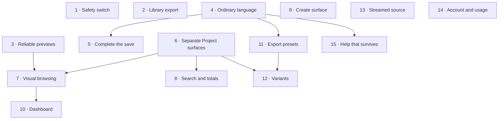

# Implementation roadmap

Fifteen incremental steps, each with one primary objective, each independently reviewable, each
preserving existing behaviour unless it explicitly changes it.

**All fifteen steps have since been implemented on `develop`** — one commit per step, from
`371b22e` (step 1) to `628fa22` (step 15), plus a bug-fix pass (`d19c0a7`), a simplification pass
(`21ca458`) and the code-review findings (`80d0fd1`). The per-step sections below are the
specification each step was built against, not a description of the code as it stands now. Where the
two disagree, the code wins. The one-per-step implementation prompts that used to sit in
`prompts/` were removed once every step landed; each step's commit is now its record.

## Why this order

1. **Protect what exists first** (1–2). One is a release gate the code itself flags; the other is
   the only unbounded data-loss path. Both are small and neither blocks anything else.
2. **Make the product legible before adding to it** (3–5). Previews, ordinary language and a
   finished save moment are cheap, low-risk, and every later step is easier to review once the
   product says what it means.
3. **Reduce regression risk before three consecutive edits to the same file** (6). Steps 7, 8 and 12
   all edit `ProjectRouteSurface.tsx`. Splitting it first is the only refactor in this roadmap and
   it earns its place by removing risk from the three steps that follow — not by being tidier.
4. **Make the work findable** (7–8). Visual browsing depends on step 3's reliable previews; search
   is independent but reads better against cards than rows.
5. **Fix the surfaces where users start** (9–10). Create and Dashboard.
6. **Finish the deliverable** (11–12). Export presets are the largest value in the roadmap and the
   most disruptive, so they land after the product is legible and after the surfaces they touch have
   been separated. Variants build directly on export.
7. **Then reliability and completeness** (13–15).

Deviations from the generic "critical → flows → friction → capability" sequence, and why:

- **Step 6 (a refactor) is early.** Justified only by the three steps that immediately follow it.
- **Step 11 (export, the biggest capability gap) is late.** It writes `exportSpecification`, adds a
  render path and changes the save contract. Doing it before the vocabulary and surface work would
  bake today's language into tomorrow's most important feature.

## Dependency graph

Steps 1, 2, 3, 4, 6, 9, 13 and 14 have no upstream dependency and can be reordered freely.

---

## Step 1 — Make the provider safety switch configurable

**User problem** None directly; the operator is one environment change away from an unclosed
release gate the repository itself flags.
**User value** The product can be shown to someone else without an unreviewed content-filtering
decision travelling with it.
**Current** `apps/api/src/providers/pruna/video-replace-provider.ts:239` hard-codes
`disable_safety_checker: true` with `//TODO Before making project public, change to false…`.
**Desired** An environment variable, validated in `apps/api/src/config/environment.ts`, defaulting
to filtering **enabled**. The current behaviour stays available by explicit opt-in.
**Scope** The config schema, the provider call site, `.env.example`, the privacy guide, the TODO.
**Out of scope** Other providers; any UI; the reference-image model choice.
**Dependencies** None.
**Architecture** Follow the existing `strictBooleanSchema` pattern; the provider must not read
`process.env` directly — pass it through `RuntimeConfig` like every other provider setting.
**UX** None.
**Flow** Unchanged.
**Acceptance**

- A new boolean environment variable controls the submitted value.
- Omitting it results in filtering **enabled**.
- Setting it to the permissive value reproduces today's behaviour exactly.
- `.env.example` documents it; the TODO is gone.
  **Regression risk** Very low. Only risk is inverting the flag's sense — cover both values in tests.
  **Validation** `vitest run apps/api/src/providers/pruna apps/api/src/config`
  **Complexity** XS

---

## Step 2 — Give the creative library an export, and tell the truth about where it lives

**User problem** Characters, Outfits, Wardrobe variants and prompts can vanish with a browser data
clear, with no warning and no way to get them back. The reference images behind them cost money.
**User value** Work that took real effort and real provider spend stops being one click from gone.
**Current** In `DATABASE_MODE=local` (the default) the creative-library routes are never registered
and the store exists only in IndexedDB. No export, no import, no warning.
**Desired** Export the creative store to a file and import it back, plus an honest durability
statement wherever these libraries are presented.
**Scope** Export/import actions in the Assets ▸ Characters and Outfits libraries (or the hub);
serialize through the existing `sanitizeCreativeAssetStore`; import validates and replaces through
the existing repository; a short durability line on the Characters and Outfits hub cards.
**Out of scope** Reference-image bytes (export references, not images); changing the sync model;
merge semantics; automatic backup.
**Dependencies** None.
**Architecture** Reuse `CreativeAssetRepository` and `sanitizeCreativeAssetStore` — do not invent a
second serialization. Import must reject a store that `sanitize` reports as recovered or lossy,
exactly as `PUT /api/creative-library` does. Note in the export file which reference-image asset ids
it depends on.
**UX** Export downloads immediately. Import is destructive and must go through `ConfirmationDialog`
with the same directness as the existing sync resolutions. State plainly what is and is not included.
**Flow** Assets ▸ Characters ▸ Export → file saved. Import → confirm → library replaced → counts
update.
**Acceptance**

- Export produces a file containing every saved character, variant, outfit and prompt.
- Import of that file restores them; import of a malformed file is refused with a clear message.
- Import is confirmed before it replaces anything.
- The Characters and Outfits cards state where the library is stored in the current mode.
  **Regression risk** Low — additive. The import path touches the same repository the sync uses;
  verify sync still behaves after an import.
  **Validation** `vitest run apps/web/src/features/creative-assets apps/web/src/features/account-library`
  **Complexity** S

---

## Step 3 — Give every saved video a reliable preview

**User problem** Some saved videos show _"Preview unavailable"_ forever. The operator cannot
recognise their own work.
**User value** The library becomes scannable, and a failure becomes recoverable.
**Current** `useSaveVideo.ts:48-60` swallows every thumbnail failure. There is no retry, no backfill
and no operator action. Thumbnails render 480×270 `fit: 'cover'`, centre-cropping portrait video.
**Desired** Generation retries; failures are visible and fixable; existing records can be repaired;
thumbnails respect the source aspect.
**Scope** A bounded retry in `saveThumbnailWhenAvailable`; a "Generate preview" action on records
without one, calling the existing `PUT …/versions/:versionId/thumbnail`; preserve source aspect in
`thumbnailClient.ts`; a distinguishable card state for "no preview yet".
**Out of scope** Server-side thumbnail generation; animated previews; changing the storage format.
**Dependencies** None.
**Architecture** Generation stays client-side — the source blob is already in memory at save time.
The repair action must fetch the version content through the existing bounded reader, not a raw
`fetch`. Respect `VIDEO_RESULT_MAX_BYTES`.
**UX** A card without a preview should look deliberate, not broken, and offer the repair action
inline. Announce success politely.
**Flow** Videos library → a card shows "No preview" with **Generate preview** → progress → the
poster appears.
**Acceptance**

- A transient generation failure at save time is retried at least once.
- Records without a thumbnail offer a repair action that succeeds.
- A 9:16 source produces a portrait thumbnail, not a centre crop.
- Failure states never render as a broken image.
  **Regression risk** Low. Do not make save failure conditional on thumbnail success — saving must
  still succeed when a preview cannot be produced.
  **Validation** `vitest run apps/web/src/features/saved-videos apps/web/src/features/video-gallery`
  **Complexity** S

---

## Step 4 — Say it in ordinary language

**User problem** The interface speaks the domain model: `Revision 5`, `immutable Video Version`,
`working media`, `presented media`, `Project provenance`, and a library banner opening
_"These legacy or independently saved videos have no trustworthy producing Project"_.
**User value** The largest single reduction in cognitive load available, for copy-only work.
**Current** Internal vocabulary is rendered verbatim across the Dashboard, Projects, the workspace,
the Save tab, Assets and the Videos library.
**Desired** Every user-facing string uses ordinary words. The domain types, contracts and comments
are untouched.
**Scope** User-facing strings only. Remove the "Unassigned Content" banner. Remove `Revision N` from
page headers (keep it in History). Rename in the UI: source → _original video_, working media →
_current cut_, presented media → _what you're viewing_, checkpoint / save creative setup →
_save progress_, attached Assets → _used in this project_. Rewrite the Project Assets disclaimer and
the Save tab copy. Shorten the capture-settings reassurances.
**Out of scope** Domain types, contract field names, code comments, database columns, any behaviour.
**Dependencies** None. Step 5 and step 11 read better after it.
**Architecture** None. If a string is asserted by a test or a `data-*` selector, update the test; do
not keep a stale string alive to protect an assertion.
**UX** Keep precision. "Version 3" is fine; "immutable Video Version" is not. Never trade accuracy
for friendliness — say the true thing in fewer, more common words.
**Flow** Unchanged.
**Acceptance**

- No user-facing surface renders "immutable", "provenance", "presented media" or "Unassigned
  Content".
- `Revision N` no longer appears in the Project overview or workspace headers.
- Every renamed concept uses one term consistently across every surface.
- No domain type, contract field or database column changed.
  **Regression risk** Medium — tests and E2E specs assert on visible text. Expect to update
  `ProjectRouteSurface.test.tsx`, `VideoGallery` tests and several E2E specs.
  **Validation** `vitest run apps/web/src`, then `playwright test e2e/successful-studio-journeys.spec.ts`
  **Complexity** M

---

## Step 5 — Complete the save moment inside a Project

**User problem** Saving a Project output ends with a technical confirmation and no file. The
standalone Studio path ends with Download · View in Assets · Create another.
**User value** The moment of completion produces the thing the operator wanted.
**Current** `ProjectOutputSaveSection` has no download link; the title defaults to the Project title,
producing duplicate "Untitled Project" records.
**Desired** Parity with the standalone save: the file is one click away, and the record is named
something distinguishable.
**Scope** Mount the existing `SavedVideoSuccessActions` on the Save tab after success; improve the
default title (project title plus a date or ordinal) and make the field prominent before saving.
**Out of scope** Export presets (step 11); changing the save contract; the standalone Studio path.
**Dependencies** Step 4, so the new copy is written once.
**Architecture** Reuse `SavedVideoSuccessActions` and `downloadSavedVideoUrl`. Do not add a second
download implementation. Preserve the idempotency receipt and reconciliation behaviour exactly.
**UX** Success should read as an outcome, not a receipt: name the video, name the version, offer the
file.
**Flow** Project ▸ Save → Save as new Video → success names it and offers **Download** ·
**View in Assets**.
**Acceptance**

- A successful Project output save offers Download without leaving the tab.
- The default title distinguishes successive saves from one Project.
- Reload-mid-save reconciliation still produces exactly one Version.
  **Regression risk** Low–medium. The save path is the most concurrency-sensitive surface in the
  product; change presentation only.
  **Validation** `vitest run apps/web/src/features/projects/ProjectOutputSaveSection.test.tsx apps/web/src/features/saved-videos`
  **Complexity** S

---

## Step 6 — Separate the three Project surfaces

**User problem** None directly. This exists to make steps 7, 8 and 12 safe.
**User value** Indirect: three consecutive changes to a 1 350-line module holding three unrelated
surfaces is the largest avoidable regression risk in this roadmap.
**Current** `ProjectRouteSurface.tsx` holds the Projects list, the Project overview, the Project
workspace, the source section, notices and four dialog mounts, with a 968-line style module beside it.
**Desired** Three modules with one surface each, plus their own styles. **No behaviour change of any
kind.**
**Scope** Extract the list, the overview and the workspace into sibling modules; split the styles to
match; keep `ProjectRouteSurface` as the thin router-facing entry point.
**Out of scope** Any behaviour, copy, markup, `data-*` attribute or accessibility semantic. Do not
touch `StudioApp.tsx` or the repositories.
**Dependencies** Best done after step 4 so the extraction moves final copy.
**Architecture** A pure move. The latched active task, the `location.key` guards, the roving
`tabIndex`, the `?task=` handling and the `onSessionChange` reporting must all behave identically.
If a shared helper is needed by two extracted modules, co-locate it; do not invent an abstraction.
**UX** None.
**Flow** Unchanged.
**Acceptance**

- The rendered DOM, `data-*` attributes and accessibility tree are unchanged on all three surfaces.
- Every existing test passes **without modification** except for import paths.
- No file among the three exceeds roughly 600 lines.
- `bun run check:modules` and `bun run check:dead-code` stay clean.
  **Regression risk** Medium — it is a large move. Mitigated by the "tests unchanged" rule: if a test
  needs a behavioural edit, the extraction is wrong.
  **Validation** `vitest run apps/web/src/features/projects`, then
  `playwright test e2e/successful-studio-journeys.spec.ts`
  **Complexity** M

---

## Step 7 — Show the work, not a description of it

**User problem** The Projects list, the Campaigns list, the Dashboard's recent work and the Assets
hub are text rows. A video product that cannot be scanned visually.
**User value** Recognition instead of reading.
**Current** Thumbnails appear only inside the Videos overlay and the Project Assets strip. The hub
shows counts for Characters and Outfits only, read from IndexedDB with no loading state.
**Desired** Poster-backed cards wherever work is listed, and counts on all four hub cards.
**Scope** Project rows and Dashboard recent-work rows become cards with a poster derived from the
Project's presented media or most recent output; Campaign cards show a small stack of their
Projects' posters; all four Assets hub cards show a count with a loading and error state.
**Out of scope** New endpoints for thumbnails; changing the Videos overlay; animated previews.
**Dependencies** Step 3 (previews must be reliable first). Step 6 (the list lives in its own module).
**Architecture** Reuse `ProjectAssetThumbnail` and `savedVideoThumbnailUrl`. Resolve posters from
data the list response already carries or from one additional bounded query — **do not introduce a
per-row request.** Keep list pagination and cursors unchanged.
**UX** A card without a poster must look intentional, using the same treatment as step 3. Keep the
existing row actions reachable; do not bury Open behind a hover state. Preserve keyboard order and
the 200 %-text reflow behaviour that `accessibility-responsive.spec.ts` guards.
**Flow** Projects → a grid of recognisable cards → Open.
**Acceptance**

- Projects, Dashboard recent work and Campaigns show a visual representation where one exists.
- No additional network request per row.
- All four Assets hub cards show a count, a loading state and an error state with retry.
- Existing accessibility and responsive specs pass unchanged.
  **Regression risk** Medium — layout change across four surfaces with visual baselines.
  **Validation** `vitest run apps/web/src/features/projects apps/web/src/features/campaigns apps/web/src/features/dashboard apps/web/src/features/assets`, then
  `playwright test --config playwright.visual.config.ts`
  **Complexity** M

---

## Step 8 — Find anything by name

**User problem** There is no text search for Videos, Projects or Campaigns. Lists say "1 loaded",
never a total. Past one page, retrieval is scrolling.
**User value** The libraries become usable rather than write-only.
**Current** The list contracts carry `cursor`, `pageSize`, filters and sort. No search parameter
exists anywhere.
**Desired** One search input per list surface, matching on title/name, with real totals.
**Scope** A bounded, sanitized `search` parameter added to the saved-video, project and campaign
list contracts; implemented in both the file and Drizzle repositories; a debounced input on each
surface; replace "N loaded" with a total.
**Out of scope** Full-text search across prompts or transcripts; fuzzy matching; search across
Characters/Outfits (they already have one in Wardrobe); saved searches.
**Dependencies** Step 6. Reads better after step 7.
**Architecture** **Both** Project repositories must be updated together — this is exactly the
duplication the audit flags, and a divergence here is a silent bug. Bound the term (length, trim,
case-insensitive contains) in the contract, not in the repositories. Totals must not become an
unbounded count on every keystroke: return a total alongside the page, or an explicit
"more than N" ceiling. Keep cursor pagination correct under an active search.
**UX** Debounced, clearable, with the term reflected in the empty state ("No Projects match
'launch'"). Announce result counts politely.
**Flow** Projects → type "launch" → the list narrows → clear → the list restores.
**Acceptance**

- Each of the three lists filters by a typed term and clears cleanly.
- Search composes with the existing filters and sort.
- Counts show a real total, not "N loaded".
- File and Drizzle repositories return identical results for the same term.
- Pagination remains correct while a search is active.
  **Regression risk** Medium — three contracts, two repository implementations, three surfaces.
  **Validation** `vitest run packages/contracts apps/api/src/features/projects apps/api/src/features/campaigns apps/api/src/features/saved-videos apps/web/src/features/projects apps/web/src/features/campaigns apps/web/src/features/video-gallery`
  **Complexity** M

---

## Step 9 — Make the create surface start creating

**User problem** `/studio/create` spends roughly a third of the desktop width on camera-device
configuration before the operator has any media, and the rail is unmarked while in Studio.
**User value** The first surface a creating user sees is about creating.
**Current** `CaptureSettingsPanel` is permanently docked on desktop with long implementation-detail
copy. Creative tools advertise themselves before any media exists. `activeDestination` resolves to
`'studio'`, which no navigation item matches.
**Desired** The stage and the two primary actions dominate. Capture settings are one click away.
Tools that cannot act say why. The rail shows where the operator is.
**Scope** Collapse capture settings behind a control on desktop by default, preserving auto-apply
and permission recovery; shorten its copy; give the creative tool rail a clear disabled state before
media exists; mark a navigation destination active in Studio.
**Out of scope** Recording, device enumeration, permission handling, the mobile overlay, aspect
ratios (step 11).
**Dependencies** None. Reads better after step 4.
**Architecture** Do not change `CapturePreferencesController` semantics — auto-apply on draft change
and the blocked-permission recovery path must behave identically. The panel must remain reachable
when a session error points at it: `openCaptureSettingsForRecovery` must still open it on desktop.
**UX** Preserve the existing focus behaviour (`focusDesktopCaptureSettings`) when the panel is
opened for recovery. A disabled tool must state its condition, not just grey out.
**Flow** Studio → stage, **Record New Video**, **Upload Video**, and a **Capture settings** control.
**Acceptance**

- On desktop, capture settings are collapsed by default and open on request.
- A session error that points at capture settings still opens and focuses them.
- Creative tools are visibly unavailable, with a reason, until media exists.
- A navigation item carries `aria-current="page"` while in Studio.
- Recording, device selection and permission recovery are unchanged.
  **Regression risk** Medium–high — the most layout-sensitive surface, with visual baselines.
  **Validation** `vitest run apps/web/src/features/recording apps/web/src/studio`, then
  `playwright test --config playwright.visual.config.ts` and `e2e/successful-studio-journeys.spec.ts`
  **Complexity** M

---

## Step 10 — Make the dashboard lead with the work

**User problem** The first two blocks above the fold are an explanation of Projects versus Campaigns
and an empty Processing Queue.
**User value** Home shows what the operator has made and what to do next.
**Current** greeting → onboarding card → Processing Queue → Continue Work → Recent Work.
**Desired** Continue and Recent Work first, as visual cards; the queue collapses to a status
indicator when empty.
**Scope** Reorder the Dashboard; make the queue a compact indicator that expands only with active
jobs; use the step 7 cards for recent work; keep every existing action reachable.
**Out of scope** New Dashboard data; changing the job-queue API or the abandon flow; onboarding
content (step 15).
**Dependencies** Step 7.
**Architecture** Keep the `refetchInterval` behaviour — polling only while jobs are active. Do not
change the abandon confirmation or its honest provider-cost warning.
**UX** The empty queue should be a single line, not a section. Preserve the live regions.
**Flow** Log in → recent work → continue, or create.
**Acceptance**

- Recent and continue work appear above the processing queue.
- An empty queue occupies one line; an active queue expands with its existing actions.
- Every action currently reachable from the Dashboard is still reachable.
- Polling behaviour is unchanged.
  **Regression risk** Low–medium — a visual baseline exists for `dashboard-overview`.
  **Validation** `vitest run apps/web/src/features/dashboard`, then
  `playwright test --config playwright.visual.config.ts`
  **Complexity** S

---

## Step 11 — Export for a placement

**User problem** Output is one MP4 in whatever shape the source happened to be. There is no 9:16 for
Reels, no 1:1 for a feed, no 4:5, no resolution choice.
**User value** The largest single increase in delivered value: one source becomes the right file for
a real destination.
**Current** `ProjectExportSpecification` — `aspect: 'source' | '16:9' | '9:16' | '1:1' | '4:5'`,
`resolution`, `includeAudio` — is modelled in `packages/domain/src/projects/types.ts` and written by
nothing but tests. `workflowPhase: 'export'` is never reached.
**Desired** Before saving or downloading, choose a placement. The chosen specification is recorded
on the revision and applied to the produced file.
**Scope** An export-shape control at the Project save step and in the standalone save dialog;
write `exportSpecification` into the revision; apply the transform through the existing
`WebCodecs` render worker; name the file after the placement.
**Out of scope** Multiple simultaneous exports (step 12); text or captions; server-side rendering;
changing capture aspect ratios; new providers.
**Dependencies** Step 4 (vocabulary), step 5 (the save moment). Independent of steps 7–10.
**Architecture** Reuse `renderVideoEdit` and `VideoEditSpec` — an aspect change is a crop plus a
scale, which the worker already does. Do **not** add a second render path. The specification is part
of the revision snapshot, so it must go through `appendProjectRevision`, respecting
`expectedRevisionNumber`. Respect `VIDEO_RESULT_MAX_BYTES` and the memory policy in
[`RECORDING_MEMORY_POLICY.md`](../RECORDING_MEMORY_POLICY.md). Reject unsupported combinations in a
domain rule, not in the component.
**UX** Ask "where is this going?", not "what aspect ratio?". Preview the crop before committing.
Default to `source` so existing behaviour is the default. Show what will be cropped away.
**Flow** Project ▸ Save → choose a placement → preview the crop → Save → Download the placement file.
**Acceptance**

- A placement can be chosen at save and at download; `source` remains the default.
- The chosen specification is persisted on the revision and visible in History.
- The produced file matches the chosen aspect and resolution.
- Audio is preserved unless explicitly excluded.
- Existing saves with no specification behave exactly as they do today.
- A browser without `WebCodecs` degrades to `source` with an explanation, as the editor does.
  **Regression risk** Medium–high — new render path, revision snapshot change, save contract change.
  Mitigate by making `source` a true no-op that takes the current code path unchanged.
  **Validation** `vitest run packages/domain/src/projects packages/contracts apps/web/src/features/video-editor apps/web/src/features/projects apps/api/src/features/projects`, then
  `playwright test e2e/successful-studio-journeys.spec.ts`
  **Complexity** L

---

## Step 12 — Make another version

**User problem** There is no duplicate, no variant, no re-run. A second cut means a new Project, a
re-chosen source, a re-selected creative stack and a new paid job.
**User value** Turns one asset into a set — the core repeated task of marketing production.
**Current** No endpoint and no surface. `ProjectRevision` already captures the whole creative intent.
**Desired** Duplicate a Project into a new one seeded from the current revision, reusing the same
source, ready to change one thing.
**Scope** A duplicate command on the Project overview and the Projects list; an API endpoint that
creates a new Project whose first revision is copied from the source Project's current revision;
reuse the source asset rather than copying bytes; a clear default name.
**Out of scope** Batch variants; templates; automatic provider re-submission; copying outputs,
history or processing jobs.
**Dependencies** Step 6, step 11 (a duplicate is most useful when it can differ by placement).
**Architecture** Implement in `packages/domain/src/projects/rules.ts` as a rule that derives a new
Project and first revision from an existing snapshot — do **not** duplicate media bytes; reuse
`sourceAssetId` or the saved-video-version reference. Both repositories must implement it. Never
carry over `lastSuccessfulOutput`, processing state or output links: a duplicate has produced
nothing. Duplication must never start provider work.
**UX** Name it recognisably (`"<title> (copy)"` or a placement suffix), open the new Project on the
step it is ready for, and state plainly that no provider work has started.
**Flow** Project ▸ Duplicate → confirm the name → the new Project opens with the same source and
creative setup → change the outfit → Save.
**Acceptance**

- Duplicating produces a new Project with the same source and creative selections.
- No bytes are copied and no provider work starts.
- Output links, processing state and history are **not** carried over.
- The duplicate is independently archivable and deletable.
- File and Drizzle repositories behave identically.
  **Regression risk** Medium — a new domain rule and a new endpoint touching the most invariant-heavy
  aggregate. Retention and asset-lifecycle behaviour must account for two Projects referencing one
  source.
  **Validation** `vitest run packages/domain/src/projects apps/api/src/features/projects apps/web/src/features/projects`
  **Complexity** M

---

## Step 13 — Open a Project without waiting for the whole video

**User problem** Opening a Project with a source downloads the entire video — up to 300 MB — before
the workspace is usable.
**User value** Resuming work becomes immediate rather than a wait that looks like a hang.
**Current** `useProjectSourceController.ts:176` reads the full source through `readBoundedBlob` and
constructs a `File` before presenting anything.
**Desired** The stage plays from the ranged content route; full bytes are fetched only when an
operation needs them.
**Scope** Present the stage from the content URL using the existing `sendRangedAsset` support;
defer full-blob acquisition to the operations that require it (local edit, provider submission,
save); keep a visible, cancellable state for that deferred fetch.
**Out of scope** Changing the byte store, the size caps, or the memory policy; server-side
transcoding.
**Dependencies** Step 6.
**Architecture** The single hardest constraint is media ownership: the runtime's artifact lifecycle
assumes an owned `Blob`. Introduce a representation that can be either a URL-backed presentation or
an owned blob, and make every consumer state which it needs. Do not weaken
[`RECORDING_MEMORY_POLICY.md`](../RECORDING_MEMORY_POLICY.md) — the point is to fetch **later**, not
to hold more.
**UX** The stage should be interactive as soon as the first frames are available. When an operation
needs full bytes, say so with progress and a cancel.
**Flow** Open a Project with a source → the video plays almost immediately → Edit → "Preparing
video…" with progress → the editor opens.
**Acceptance**

- A Project with a large source becomes interactive without a full download.
- Local editing, provider submission and save all still receive complete, validated bytes.
- The deferred fetch is cancellable and its failure is recoverable.
- Byte caps and validation are unchanged.
  **Regression risk** High — touches the artifact ownership model that the exit guard, the editor and
  the save path all depend on. Do this step alone, and do not combine it with any other change.
  **Validation** `vitest run apps/web/src/features/projects apps/web/src/features/video-editor apps/web/src/orchestration`, then
  `playwright test e2e/successful-studio-journeys.spec.ts`
  **Complexity** M (high risk for its size)

---

## Step 14 — Show the account, the capabilities and the usage

**User problem** The account menu contains only **Log out**. `entitlements` are returned by the API
and rendered nowhere. Provider cost is always a warning and never a number.
**User value** The operator can see who they are, what is configured, and what they have run.
**Current** `AccountMenu` has one item. `StatusMenu` shows capability states but not entitlements or
history.
**Scope** An account panel showing identity, `entitlements` from `/api/auth/me`, configured provider
capabilities from `/api/capabilities`, and a count of processing jobs run — derived from the
existing processing-job history, not new metering.
**Out of scope** Billing, credits, quotas, preferences, profile editing, cost estimation.
**Dependencies** None.
**Architecture** Read-only. Reuse the existing session and capability queries — do not add a polling
loop. If job counts need a query, bound it and cache it; do not add a per-render aggregate.
**UX** Plain and factual. Where a capability is unavailable, say what would enable it in the same
words the status menu already uses.
**Flow** Account ▸ Account → identity, plan, what is configured, what has been run.
**Acceptance**

- The panel shows identity, entitlements and configured capabilities.
- A job count is shown, derived from existing data.
- Nothing new is polled.
- Log out behaves exactly as before.
  **Regression risk** Low — additive and read-only.
  **Validation** `vitest run apps/web/src/features/account apps/web/src/studio`
  **Complexity** S

---

## Step 15 — Teach through the product, not through one dismissible card

**User problem** Once the Dashboard onboarding card is dismissed, nothing ever explains Projects,
Campaigns or Assets again. Empty states are text and a button.
**User value** A user who forgot, or who returns after a month, can re-learn without leaving.
**Current** `dashboardOnboarding.ts` stores one boolean per owner. There is no help, tour or
glossary.
**Scope** A persistent "How Lightframe works" panel reachable from the rail, covering when to use a
Project, when a Campaign helps, and what each Asset library holds; enrich each empty state with a
visual and one worked example; move the Outfits create button inside its empty state.
**Out of scope** An interactive tour; sample content generation; contextual tooltips everywhere;
video help.
**Dependencies** Step 4 — the explanations must use the final vocabulary.
**Architecture** Static content in an existing `OverlayPanel`. No new persistence beyond the
dismissal boolean that already exists.
**UX** Answer "when would I use this?", not "what is this?". Keep it to a screen.
**Flow** Any surface → Help → a short explanation of the four concepts and when each is worth using.
**Acceptance**

- The explanation is reachable after onboarding has been dismissed.
- Each list empty state shows a visual and a concrete example.
- The Outfits create button sits inside its empty state.
- Nothing new is stored per user beyond the existing boolean.
  **Regression risk** Very low.
  **Validation** `vitest run apps/web/src/features/dashboard apps/web/src/features/account-library apps/web/src/features/assets`
  **Complexity** S

---

## Sequence at a glance

| #   | Step                      | Priority      | Effort | Depends on | Landed in |
| --- | ------------------------- | ------------- | ------ | ---------- | --------- |
| 1   | Provider safety switch    | P0            | XS     | —          | `371b22e` |
| 2   | Creative library export   | P0            | S      | —          | `e75c518` |
| 3   | Reliable previews         | P1            | S      | —          | `d2ce0a5` |
| 4   | Ordinary language         | P1            | M      | —          | `019f132` |
| 5   | Complete the save moment  | P2            | S      | 4          | `8a4b419` |
| 6   | Separate Project surfaces | P3 (enabling) | M      | 4          | `a743c1e` |
| 7   | Visual browsing           | P1            | M      | 3, 6       | `67b11c4` |
| 8   | Search and totals         | P1            | M      | 6          | `e59ee59` |
| 9   | Create surface            | P1            | M      | —          | `eddffdc` |
| 10  | Dashboard                 | P2            | S      | 7          | `066a195` |
| 11  | Export presets            | P1            | L      | 4, 5       | `a086261` |
| 12  | Variants                  | P1            | M      | 6, 11      | `3b7f5a8` |
| 13  | Streamed Project source   | P3            | M      | 6          | `788885d` |
| 14  | Account and usage         | P2            | S      | —          | `9f34956` |
| 15  | Help that survives        | P2            | S      | 4          | `628fa22` |

Steps 1–5 are roughly one week and change how the product feels. Steps 6–10 are roughly two weeks
and change how it works. Steps 11–12 are the product's next real capability. Steps 13–15 close out
reliability and completeness.
