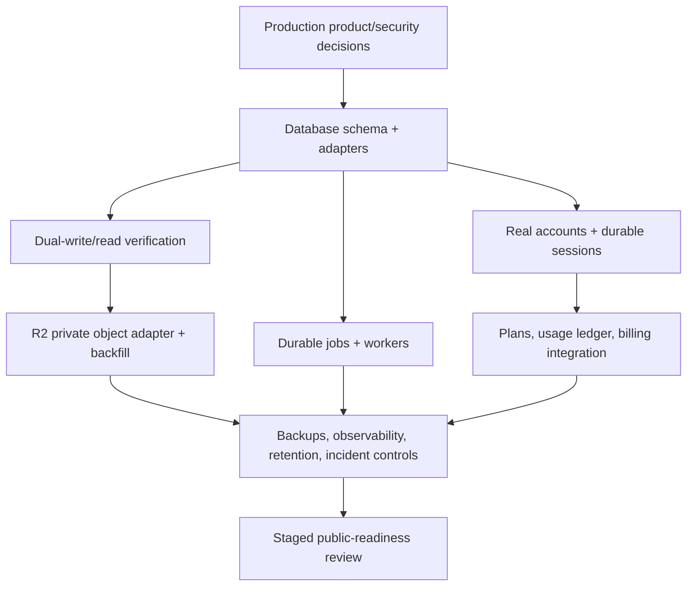

# Deferred account and infrastructure roadmap

Status: partially implemented infrastructure roadmap; public-product phases remain deferred

Original planning date: 2026-08-07

Prerequisite: every completion requirement in
[`user-accounts-phase-1-audit-and-plan.md`](archived/user-accounts-phase-1-audit-and-plan.md) must pass.

## Purpose and boundary

This roadmap separates the implemented persistence foundation from the work required for a real
multi-user service. Drizzle/Neon repositories, private Cloudflare R2 storage, backfill, durable
sessions, creative sync, accepted-job recovery, and admission limits are now configuration-gated
current behavior. Signup, billing, public deployment, cloud ownership policy, a worker fleet, and
multi-tenant authorization remain deferred.

This is the service-readiness roadmap, not the product capability roadmap. Campaigns, user-facing
Projects, multi-format content, distribution, and collaboration direction are maintained in the
[Product Roadmap](PRODUCT_ROADMAP.md).

Phase 2 requires a separately approved public-product security and operations design. The current
loopback Host/Origin boundary is not authentication for a remotely accessible product. Do not add a
tunnel, LAN binding, proxy, public hostname, or cloud deployment merely because the storage and
repository ports exist.

## Phase 1 seams that Phase 2 should preserve

| Phase 1 seam                     | Local implementation                           | Phase 2 replacement                                                               | Feature code impact                        |
| -------------------------------- | ---------------------------------------------- | --------------------------------------------------------------------------------- | ------------------------------------------ |
| `UserRepository`                 | One seeded server user                         | Database user/credential/profile records or an approved identity provider mapping | None outside account service/composition   |
| `SessionRepository`              | Process-memory or Neon `jti` registry          | Rotating multi-device session design for real accounts                            | Auth service only                          |
| `EntitlementService`             | Equal Free/Plus/Pro matrix                     | Database-backed plan/feature/limit evaluation                                     | Call sites keep consuming snapshots        |
| Feature repositories             | Atomic files or transactional Drizzle adapters | Multi-tenant policy, quotas, and operations                                       | Feature services keep business ports       |
| `AssetByteStore`                 | Private local filesystem or Cloudflare R2      | Direct grants only if later required and reviewed                                 | Feature services keep byte operations      |
| `AssetAccessService`             | Protected same-origin content route            | Server proxy or short-lived R2 read grant                                         | Gallery/Studio keep feature URLs/contracts |
| User-scoped browser repositories | IndexedDB caches/drafts/journals               | Remain local caches; durable records sync through APIs                            | React keeps repository/API ports           |
| `ProcessingJobRepository`        | File trace or Neon job/restart state           | Durable queue, leases, attempts, reconciliation workers                           | Provider services keep job lifecycle calls |
| `SavedVideoRepository`           | File aggregate or Drizzle rows/transactions    | Operational scaling and policy only                                               | Save/Gallery contracts stay stable         |

Do not preserve incidental Phase 1 details such as JSON aggregate paths, the seeded demo UUID, the
local cookie `Secure=false` exception, process-memory sessions, or server-proxied large uploads when
a reviewed cloud design replaces them.

## Ordered future-phase sequence

## Cross-phase prerequisite — Product, privacy, and threat-model gate

Decide and document before infrastructure work:

- public/local/desktop deployment topology and trust boundaries;
- account signup eligibility, email verification, password reset/recovery, optional social login,
  MFA/passkeys, session/device management, and account suspension;
- tenant model (individual only, organizations, or both) and whether resources can ever be shared;
- creator ownership, export/portability, account deletion, legal hold, retention, regional storage,
  subprocessors, and provider data terms;
- moderation/reporting requirements for user-generated/generated content;
- Free/Plus/Pro product capabilities, storage quotas, credits, overages, concurrency, and refunds;
- rate limits, abuse controls, cost caps, provider budget controls, and support tooling;
- backup/restore objectives, recovery point/time objectives, and incident response ownership.

Deliverables are an approved threat model, data inventory/flow, retention schedule, tenancy model,
security acceptance criteria, and staged launch plan. Until approved, the server remains loopback-only.

## Phase 2 — Real database and Cloudflare R2

Implementation checkpoint (2026-08-07): the schema/migrations, Neon adapters, private R2 adapter,
startup modes, non-destructive backfill, SQL gallery paging, browser-library revision sync,
durable sessions, accepted-job recovery, and admission controls are implemented. Real staging
migration/restore evidence, retention approval, R2 inventory/backup drills, production metrics,
and a distributed queue/worker deployment remain launch gates. See
[the persistence runbook](CLOUD_PERSISTENCE.md).

### Phase 2A — Transactional database

The implemented choice is Drizzle with Neon PostgreSQL, using a bounded pooled serverless driver so
interactive transactions remain available. Environment selection, regional/data-residency review,
PITR, connection limits, cost, observability, and tested restore portability still require the
deployment owner. Database adapters stay behind the existing business repository interfaces.

Initial normalized schema should cover:

- `users`, normalized unique logins, status, plan ID, profile timestamps;
- password credential records or identity-provider subject mappings; never embed password hashes
  in public user rows/DTOs;
- `sessions` with `jti`, rotation family, issue/expiry/revoke metadata, device-safe description;
- `saved_prompts`, `characters`, `character_variants`, and `saved_voices` with immutable owner IDs;
- `media_assets` with provider/key/checksum/status/deletion metadata;
- `saved_videos`, `video_versions`, and explicit source/parent lineage;
- `processing_jobs`, safe status, provider-private fields, input/output relationships, and retries;
- `resource_references` or purpose-built foreign keys/ref tables sufficient for deletion safety;
- `entitlement_assignments`, append-only usage ledger, and later billing-customer/subscription
  mappings;
- idempotency receipts, migration versions, audit events, and outbox records.

Plan indexes from actual access paths: unique normalized login and provider-subject mappings;
active sessions by user/expiry/rotation family; every resource by `(owner_user_id, id)`; gallery by
`(owner_user_id, deleted_at, created_at desc, id desc)`; versions by `(video_id, version_number)`;
saved voices by `(owner_user_id, provider, provider_voice_id)`; jobs by owner/status/created time and
lease state; assets by owner/status/checksum; idempotency by owner/scope/key; outbox by unprocessed
time. Verify query plans and bounded pagination rather than adding speculative indexes.

Use database constraints, not only application checks:

- immutable owner ID after creation;
- unique user-scoped provider voice relationship;
- unique `(video_id, version_number)` and current version owned by the same video/user;
- child/parent owner equality enforced transactionally;
- asset/reference owners consistent;
- unique owner-scoped idempotency keys;
- bounded status transitions and tombstones;
- foreign keys/restrict behavior that prevent deleting referenced outputs.

Migration sequence:

1. Create schema and adapters in shadow mode; keep file repositories authoritative.
2. Backfill safe metadata from Phase 1 JSON/sidecars with deterministic IDs and checksums.
   Migrate Phase 1 user-scoped IndexedDB characters, variants, outfits/prompts, drafts selected for
   sync, and saved metadata through an authenticated, idempotent API: server derives owner, validates
   each record, returns a receipt/revision, and never trusts a browser owner. After verification,
   IndexedDB becomes a bounded cache/draft store rather than authority.
3. Compare counts, per-owner aggregates, relationships, and random read samples.
4. Dual-write through one service transaction/outbox path; do not scatter dual writes in features.
5. Read from database in shadow and compare results without affecting responses.
6. Switch reads by feature, then make database authoritative.
7. Keep file metadata read-only for a defined rollback window; never dual-write indefinitely.
8. Archive/export and remove compatibility code only after restore drills and reconciliation pass.

The database transaction commits logical records; object storage is not part of that transaction.
Use pending asset states plus an outbox/saga so interrupted byte promotion can be reconciled.

### Phase 2B — Cloudflare R2 object storage adapter

`R2AssetByteStore` is implemented behind the byte-store port. Keep the bucket private and store
only opaque, server-generated object keys such as `media/v1/<prefix>/<asset-uuid>`. Do not place
email, login, title, prompt, original filename, provider ID, or other user data in a key.

Cloudflare R2 currently offers an S3-compatible API, including multipart operations, and private
object access can use short-lived presigned operations. Treat every presigned URL as a bearer token;
scope it to one object and operation with a short expiry. Refer to Cloudflare's current official
documentation before implementation:

- [R2 S3 API compatibility](https://developers.cloudflare.com/r2/api/s3/api/)
- [R2 object uploads and multipart behavior](https://developers.cloudflare.com/r2/objects/upload-objects/)
- [R2 presigned URLs](https://developers.cloudflare.com/r2/api/s3/presigned-urls/)
- [R2 consistency model](https://developers.cloudflare.com/r2/reference/consistency/)

The adapter must implement:

- single-part and multipart streaming upload with abort;
- head/existence and app-owned checksum verification;
- range reads or a safe read grant;
- conditional/idempotent promotion or copy where supported;
- deletion with tombstone/retry rather than assumed immediate application success;
- content type/disposition metadata without trusting original filenames;
- metrics for bytes, latency, retry, orphaned multipart uploads, and failures;
- bounded retries only for non-billable storage operations and only when idempotency is proven.

Store thumbnails and other derivatives as ordinary owned `MediaAsset` rows/objects with
`sourceAssetId`, purpose, checksum, and lifecycle status. Never derive a public thumbnail key from
the source filename. Database references, not object listing, determine whether a derivative is
current or deletable.

Do not let feature services import an S3 SDK or inspect R2 ETags. Multipart ETags are not a
portable full-object checksum; retain the app-owned SHA-256 in `media_assets` and verify content
through the adapter.

#### R2 migration and cutover

1. Inventory Phase 1 assets by database record, owner, size, checksum, and local storage key. Never
   list the filesystem and infer ownership without metadata.
2. Upload to a temporary opaque R2 key; verify size/checksum/head; promote to final key.
3. Record the R2 provider/key and migration receipt transactionally while preserving the local
   provider/key as rollback location.
4. Enable dual-read (`R2` first, verified local fallback) per asset record, not globally by path.
5. Run full count/byte/checksum reconciliation and sampled end-to-end playback/range tests.
6. Switch new writes to R2; retain local fallback for the approved rollback window.
7. Stop local writes, then quarantine local copies. Permanently delete only under the approved
   retention policy after backup/restore evidence.

For initial cloud deployment, keep browser upload/download server-mediated if capacity permits; it
is simpler to authorize and inspect. If direct browser transfer is later necessary, the backend:

- authenticates and checks entitlement/quota before issuing a grant;
- creates a pending owned `MediaAsset` and random exact key;
- returns a short-lived, single-operation PUT grant with required content type/size expectations;
- never exposes R2 API credentials;
- finalizes only after server-side HEAD/inspection/checksum verification;
- expires/aborts abandoned multipart state and pending records;
- issues separate short-lived read grants only after resource authorization.

CORS is a storage transport control, not authorization. Public buckets and permanent object URLs
are not appropriate for private creator media.

### Phase 2C — Durable asynchronous processing (partial)

Neon now retains safe state for jobs that have already been accepted by a provider. Restart resumes
status/retrieval and never repeats the initial submission; global, per-provider, and per-owner
admission are enforced. Moving execution to a durable queue and worker deployment remains future
work after database authority and operational policy are proven.

Requirements:

- transactional job creation/outbox and idempotent worker claim/lease;
- per-user and per-provider concurrency/cost admission;
- explicit job state machine and attempt records;
- no automatic retry of an initial billable provider submission unless the provider/app
  idempotency contract proves no second charge;
- webhook authenticity/replay protection where used; bounded polling otherwise;
- cancellation propagation and late-result generation guards;
- input/output MediaAsset relationships and immutable operation snapshots;
- provider job IDs/errors private; safe public codes only;
- temp object lifecycle, multipart abort, output validation, and atomic publish;
- dead-letter/reconciliation tooling and operator-safe retry controls;
- usage ledger write only after defined billable/complete events.

The browser continues to own browser-only capture/editor resources. It may reconnect to a durable
server job by app job ID but must not adopt provider IDs or worker credentials.

**Why the remaining Phase 2 work is deferred.** Local tests do not prove staging credentials,
restore/PITR, retention, backup expiry, cost budgets, observability, or public security. The
implemented database/R2 seams do not authorize remote deployment or automatic local-data deletion.

**Phase 1 preparation.** Immutable `ownerUserId`; repository ports; `AssetByteStore` and
`AssetAccessService`; provider-neutral storage keys; checksums; `MediaAsset`; SavedVideo/version;
ProcessingJob; idempotency receipts; tombstones; migration/reconciliation journals.

**Anticipated models/interfaces.** The schema/ports above plus `OutboxEvent`, `JobAttempt`,
`ObjectMigrationReceipt`, `ResourceReference`, and environment-specific storage/database/queue
configuration. Business services continue using their Phase 1 interfaces.

**Major migration risks.** Cross-system non-atomic commits, owner reassignment, duplicate/missing
objects, multipart residue, checksum assumptions, dual-write drift, rollback after local deletion,
bad indexes/connection exhaustion, public grants, runaway storage/provider cost, and incomplete
backup restores.

**Suggested order.** Product/threat gate → database schema/shadow backfill → constraints/indexes and
restore drill → database dual-read/write and authority → R2 adapter/shadow copy → checksum/Range
reconciliation → R2 new-write authority → durable queue/workers → quarantine local stores after the
approved rollback window.

## Phase 3 — Full account lifecycle

Replace the seeded repository while preserving the safe `User` and Auth API projections.

Required capabilities before public signup:

- user signup, unique normalized username/login, verified email, and duplicate/race behavior;
- modern password hashing parameters with rehash-on-login policy, breached-password controls,
  password change, safe reset/recovery tokens, and account recovery proof;
- profile editing, avatar upload through MediaAssetService, username changes, and email changes with
  reverification/notification and anti-takeover delay where appropriate;
- optional social login and passkey/MFA strategy with explicit account-link/unlink and recovery
  codes; external identity subjects map to the immutable app user ID;
- durable multi-device sessions, refresh-token/session rotation, reuse detection, bounded
  absolute/idle expiry, per-device/global revocation, and a session-management UI;
- account disable/suspend/reactivate, administrative account support with separate roles/permissions
  from plans, and audited impersonation only if separately approved;
- account deletion with dependency/retention workflow, creator data export, cancellation/recovery
  window, and provider/object/database completion status;
- CSRF protection appropriate to the final same-site/cross-site topology, in addition to SameSite
  and Origin checks;
- rate limiting and abuse controls on Login, reset, signup, media, provider starts, and grants;
- account status and authorization checked on every session/bootstrap, not frozen in JWT claims;
- secure cookies over HTTPS only, HSTS, CSP compatible with the reviewed provider SDKs, and
  production secret management/rotation;
- user export and account deletion workflows tied to resource retention/dependency policy;
- audit events for security-sensitive state changes without content/secrets.

If an external identity provider is selected, its subject maps to the app's immutable user ID. Do
not use provider subject, email, device ID, cookie, Host hash, storage key, or JWT as the permanent
resource owner.

**Why deferred.** Phase 1 is a single configured operator with no email service, identity provider,
admin policy, public listener, shared-device policy, or approved lifecycle/retention UX. Fake
signup/recovery would create insecure dead ends.

**Phase 1 preparation.** Stable immutable user ID; safe public `User` projection; login/me/logout
contracts; session-specific JWT + `jti`; `UserRepository`/`SessionRepository`; profile-independent
resource owner; media-backed avatar-capable asset service; centralized logout cleanup; entitlements
separate from roles.

**Anticipated models/interfaces.** `UserCredential`, `VerifiedEmail`, `ExternalIdentity`,
`PasswordReset`, `AccountRecovery`, `UserProfile`, `AvatarAsset`, `SessionDevice`, `SessionFamily`,
`MfaMethod`, `AccountStatusTransition`, `DataExport`, `AccountDeletion`, `AdminRole`, and security
audit events behind account/session services.

**Major migration risks.** Seeded-demo identity collision, changing login/email mistaken for owner,
account-link takeover, refresh-token replay, orphaned assets on delete, export incompleteness,
admin/plan confusion, and existing demo data assignment to the wrong real account.

**Suggested order.** Import/claim seeded user explicitly → verified email + signup → password
change/reset/recovery → durable rotating multi-device sessions + UI → profile/avatar and
username/email changes → social identity/linking and MFA → disable/admin support → export/delete
with retention/recovery drills.

## Phase 4 — Billing and subscriptions

Keep the central `EntitlementService` and replace the equal Phase 1 matrix with server-evaluated
snapshots. Do not expose product limits until billing and failure semantics are approved.

Required scope:

- billing-provider selection based on country/currency/tax/subscription/portal/webhook/reporting,
  support, lock-in, and cost requirements;
- approved Free, Plus, and Pro definitions independent from admin/security roles;
- hosted or reviewed Checkout and subscription creation;
- upgrades/downgrades, proration, effective dates, storage/job impact, and entitlement cache
  invalidation;
- cancellations, cancellation-at-period-end, reactivation, trials, trial conversion/abuse, and
  renewal behavior;
- failed payments, retry/dunning, grace periods, past-due/paused/unpaid state, and service access;
- invoices/receipts, payment methods, payment history, and self-service billing portal;
- signed webhook verification, replay/deduplication, ordering, recovery, and event audit;
- tax collection/identity, supported currency/rounding, refunds, partial refunds, and chargebacks;
- support/operator tooling with least privilege and audited billing adjustments.

Plans, monthly credits, pricing, refunds, taxes, and storage overages are product/legal decisions,
not values to infer from the Phase 1 placeholders.

**Why deferred.** There is no public customer, approved product catalog, legal/tax policy, billing
provider, currency, or support process. Phase 1 equal plan labels are structural placeholders only.

**Phase 1 preparation.** `User.planId` is separate from roles; `EntitlementService` is centralized;
provider starts/jobs are owner-scoped/idempotent; no component enforces plan differences; no credit
is deducted.

**Anticipated models/interfaces.** `BillingCustomer`, `ProductPrice`, `Subscription`,
`SubscriptionChange`, `InvoiceSummary`, `PaymentMethodSummary`, `BillingEventReceipt`,
`RefundRecord`, `ChargebackRecord`, `TaxProfile`, and `BillingAuditEvent` behind a billing provider
adapter and entitlement projector.

**Major migration risks.** Incorrect plan mapping, webhook replay/order, entitlement lag, duplicate
customers/subscriptions, proration surprises, access loss during grace, currency/tax mistakes,
refund-credit mismatch, chargeback handling, and leaking provider billing payloads.

**Suggested order.** Product/legal catalog → provider evaluation/sandbox → customer/subscription
schema → webhook inbox/idempotency → entitlement projection in shadow → hosted Checkout/portal →
upgrade/downgrade/cancel/trial/renewal → failed-payment/grace → invoices/payment history →
refund/chargeback/tax/support reconciliation → staged live validation.

## Phase 5 — Credits, tokens, and usage

Build usage accounting only after billing identities and the entitlement contract are stable.

Required scope:

- append-only credit/usage ledger and idempotent event IDs;
- signup/trial/purchase/promotional/monthly credit grants with grant source and expiry policy;
- credit packages/purchases only after billing/legal approval;
- reservations before a provider job starts, with expiration/cancellation;
- final settlement after defined completion/billable events;
- automatic release/refund for failed/cancelled jobs under explicit provider-cost rules;
- provider-cost accounting separate from customer-facing credits/tokens;
- monthly allotment renewal, carryover/expiry, plan change, and proration rules;
- user-facing balance, usage report/history, limits, and overage behavior;
- administrative adjustments with actor/reason/audit event;
- ledger-to-provider and ledger-to-billing reconciliation;
- concurrency/idempotency protection against double reservation/settlement/refund;
- abuse prevention, anomaly/cost caps, and operator alerts.

Do not use one mutable balance as the source of truth. Derive balance from immutable ledger entries
or a transactionally maintained projection that can be rebuilt. Backend entitlement/admission owns
enforcement before provider contact; frontend balances are informational.

**Why deferred.** Phase 1 has no approved pricing, credit value, provider cost allocation, refunds,
or public customers. Guessing creates financial/security liabilities.

**Phase 1 preparation.** `EntitlementService`, owner-scoped ProcessingJob, safe `usage` placeholder,
idempotency keys, explicit provider starts, and no automatic billable retry.

**Anticipated models/interfaces.** `CreditLedgerEntry`, `CreditGrant`, `CreditReservation`,
`UsageEvent`, `UsageSettlement`, `ProviderCostEvent`, `BalanceProjection`, `UsageReport`, and
`UsageReconciliationRun` behind usage/ledger services.

**Major migration risks.** Double charging/crediting, ambiguity after provider unknown outcomes,
plan-cycle time zones, retroactive provider costs, ledger corruption, and abuse through retries.

**Suggested order.** Define units/rules → immutable ledger → reservations/settlement → job/provider
integration in shadow mode → reports/reconciliation → balances/limits → purchases/overages/admin.

## Phase 6 — Production security and operations

Before supported public deployment, create and approve `docs/THREAT_MODEL.md`
and `docs/RUNBOOK.md`. The threat model must cover multi-tenant authorization,
CSRF and deployed-origin policy, SSRF and remote imports, malicious media,
provider-cost abuse and rate limiting, and presigned-upload abuse. The runbook
must cover backups and restore, job recovery, R2 cleanup, key rotation,
monitoring and incident response, and retention, export, and deletion. These
documents are deferred while the product remains loopback-oriented; the current
local and cloud-persistence guides are not substitutes for public operations.

Before public traffic, add:

- layered rate limiting for IP/session/user/tenant/provider/cost scopes, Login brute-force
  protection, credential-stuffing detection, and bot/challenge controls with accessibility paths;
- final CSRF protection for the deployed origin topology, advanced session theft/replay controls,
  security headers/CSP/HSTS, key/secret rotation, and least-privilege service identities;
- upload malware/scanning/quarantine and validated derivative pipeline; documented content
  moderation ownership records, decisions, appeals, and provider-policy boundaries;
- structured content-free logs with request/user/job correlation via opaque IDs;
- metrics for auth, authorization denial, provider starts/outcomes/cost, queue age, upload/download,
  R2/database health, reconciliation, storage bytes, cache behavior, and rate limits;
- traces with secrets, prompts, URLs, filenames, media, provider bodies, and cookies redacted;
- alerts and runbooks for auth spikes, cost spikes, queue stalls, missing/orphan assets, migration
  drift, failed backups, and provider incidents;
- database point-in-time recovery/restore drills and object inventory/checksum reconciliation;
- separate development/staging/production credentials, buckets, databases, and callback domains;
- data retention/erasure jobs, legal holds if required, account export, and subprocessor inventory;
- vulnerability/dependency scanning, secret scanning, penetration testing, and incident exercises;
- staged canary rollout, rollback, schema compatibility, maintenance-mode, and support procedures.
- privacy controls/consent and account data views; legal retention/compliance mapping; least-
  privilege administrative tools with immutable audit logs and approval for destructive actions;
- monitoring, alerts, on-call ownership, incident response/notification, post-incident review,
  backups, disaster recovery, and end-to-end data deletion workflows across database, R2, queues,
  providers, caches, logs, and backups.

Do not log presigned URLs: they are temporary bearer credentials. Do not make metrics labels from
user IDs, asset IDs, prompts, filenames, or provider error bodies.

**Why deferred.** These controls depend on the approved public topology, vendors, data residency,
support/on-call staffing, legal obligations, traffic/cost profiles, and real account/billing flows.
They cannot be proven against a loopback demo alone.

**Phase 1 preparation.** Deny-by-default auth/ownership, safe errors/logging, explicit provider
intent, validated uploads, private controlled content, immutable IDs/snapshots, centralized cleanup,
processing traces, reconciliation hooks, canonical privacy/testing/manual QA docs, and continued
loopback-only binding.

**Anticipated models/interfaces.** `RateLimitDecision`, `SecurityEvent`, `ModerationCase`,
`AdminAction`, `AuditEvent`, `RetentionPolicy`, `DeletionWorkflow`, `LegalHold`, `BackupSnapshot`,
`RestoreDrill`, `Incident`, `Alert`, and `PrivacyRequest`, with vendor-neutral service ports and
content-free observability schemas.

**Major migration risks.** Locking out legitimate/accessibility users, storing sensitive audit or
moderation content, incomplete erasure across backups/providers, excessive admin privilege, missing
alerts, untested restore, CSP/provider regressions, false-positive upload quarantine, and exposing
private media during CDN/storage changes.

**Suggested order.** Threat model/data inventory → secret/IAM/environment separation → baseline
headers/session/CSRF/rate/brute-force/bot controls → upload scan/moderation → audit/admin/privacy/
retention workflows → metrics/logs/traces/alerts/runbooks → backups/restore/DR → incident and
deletion drills → load/cost/security testing → staged canary/public launch review.

## Deferred data synchronization strategy

Phase 1 IndexedDB is a user-scoped local cache/draft store, not the cloud database. When real
multi-device accounts arrive:

- server records become authoritative for saved characters, variants, outfits/prompts, saved
  voices, videos, assets, and jobs;
- IndexedDB keeps bounded query caches, unsaved drafts, migration/sync cursors, and explicitly
  local work;
- mutations use server-issued revisions/ETags and deterministic idempotency; offline conflicts are
  surfaced, not last-write-wins by accident;
- drafts need a product decision: device-local, synchronized single draft, or multiple named
  drafts. Do not silently merge rich media/draft graphs;
- media bytes upload once to object storage; IDB never mirrors canonical cloud videos;
- logout closes repositories and removes in-memory data, while durable cache retention follows the
  shared-device privacy policy.

## Deferred sharing and organizations

Do not overload `ownerUserId` to implement teams. If sharing is approved later, retain one immutable
owner and add explicit tenant/membership/grant models:

- organization/tenant ID and membership roles;
- resource ownership by user or tenant according to an approved invariant;
- per-resource grants or share records with actor, scope, expiry, and revoke;
- authorization service that evaluates current membership/grant, never a client owner field;
- audit trail for invite, access, transfer, share, revoke, and delete;
- storage/data migration for ownership transfer with explicit consent and rollback.

Public share links require separate opaque bearer-token, expiry, revocation, download, indexing,
moderation, and privacy decisions. They are not ordinary authenticated content URLs.

## Deferred deletion, retention, and portability

Before Phase 1 tombstones can become a cloud erasure system, define:

- user-visible trash/recovery window and permanent-delete semantics;
- dependency behavior for hidden source lineage and completed outputs;
- provider-side deletion obligations and limitations;
- database tombstone, outbox, object delete, backup expiry, and cache invalidation sequence;
- orphan and missing-object reconciliation ownership;
- account export format, media packaging, signed-link expiry, and resource snapshots;
- account closure cooling-off, legal hold, billing record retention, and audit-event retention.

Use idempotent deletion workflows with visible state. A database row deletion and R2 object deletion
cannot be one transaction; retries and reconciliation are required.

## Phase 2 validation gates

Each infrastructure cutover needs its own go/no-go evidence:

1. **Database shadow gate:** schema constraints, repository parity, backfill counts, restore drill.
2. **Database authority gate:** dual-write/read comparison, idempotency, rollback window, no file
   metadata drift.
3. **R2 shadow gate:** byte counts/checksums, Range/playback, abort/multipart cleanup, private access,
   local fallback.
4. **R2 authority gate:** new writes/read grants, reconciliation, cost metrics, rollback drill.
5. **Real account gate:** signup/recovery/session/CSRF/rate-limit/IDOR/security tests and privacy docs.
6. **Durable worker gate:** lease/retry/cancel/late result/dead-letter/provider-cost tests.
7. **Billing gate:** webhook replay, ledger reconciliation, failure/refund/grace behavior, legal and
   support approval.
8. **Public launch gate:** threat model closed, backup/restore and incident drills, load/cost tests,
   staged rollback, manual device/accessibility/provider evidence.

Passing Phase 1 tests is necessary but not evidence for any of these gates.

## Items explicitly deferred beyond Phase 1

- Real signup, email verification, password reset, MFA/passkeys, social login, organizations, and
  resource sharing.
- Production database operations, any additional session infrastructure, durable queues/workers,
  and multi-region design. Configuration-gated PostgreSQL/Neon persistence and durable sessions
  already exist.
- CDN/custom-domain delivery and public links. Private R2 storage and direct multipart browser
  transfer for authoritative PostgreSQL/R2 Saved Video writes already exist.
- Billing/payment processing, real plan restrictions, credit deduction, overages, taxes, and refunds.
- Production rate limiting/abuse systems, moderation enforcement, public support/admin tooling.
- Multi-device sync/conflict UX, account export/deletion, legal hold, and formal retention automation.
- Public deployment, external auth/authorization/tenancy guarantees, and production SLA claims.

Each deferred item requires explicit approval and must extend the Phase 1 owner, repository,
storage, media, version, job, and cleanup contracts rather than bypass them.
