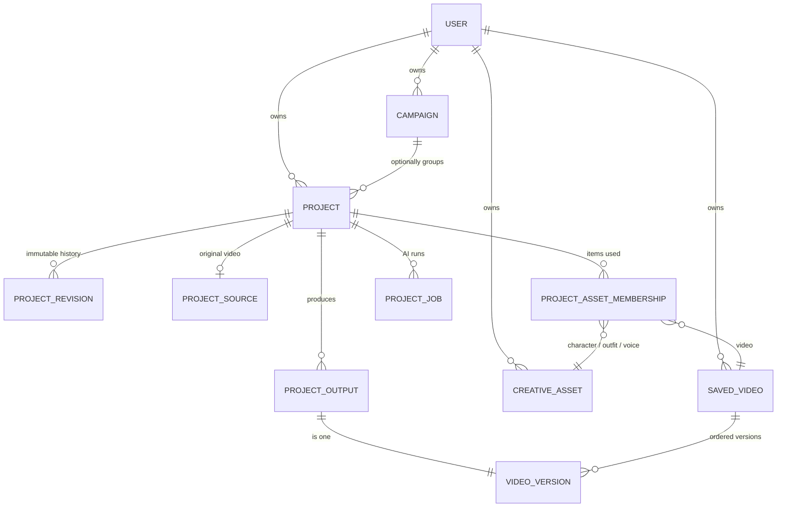

# Current product map

What exists today, read from the code and confirmed against the running application.

## Workspaces

| Workspace            | Runtime                                      | Owns                                              |
| -------------------- | -------------------------------------------- | ------------------------------------------------- |
| `apps/web`           | React 19, Vite, Emotion, TanStack Query      | Presentation, orchestration, browser adapters     |
| `apps/api`           | Bun + Elysia wrapped as `ApplicationRuntime` | Auth, services, persistence, storage, providers   |
| `packages/domain`    | Pure TypeScript                              | Product policy and invariants                     |
| `packages/contracts` | Zod                                          | HTTP request/response schemas shared by both apps |

532 source files in `apps/web/src` (153 test files), 230 in `apps/api/src` (91 test files).

## Routes

Every authenticated destination is registered once, in `PROTECTED_ROUTES`
(`apps/web/src/app/paths.ts`), and asserted by two oracles — `app/route-inventory.test.ts` and
`paths.test.ts`, the latter forcing each route to declare whether it mounts the Studio runtime.

| Path                                         | Surface                      | Mounts capture runtime |
| -------------------------------------------- | ---------------------------- | ---------------------- |
| `/`                                          | Entry / login                | —                      |
| `/dashboard`                                 | Dashboard                    | no                     |
| `/studio/create`                             | Studio create                | **yes**                |
| `/studio/create/live`                        | Live AI Beta entry           | no                     |
| `/studio/:videoId`                           | Saved video in Studio        | **yes**                |
| `/projects`                                  | Projects list                | no                     |
| `/projects/:id`                              | Project overview             | no                     |
| `/projects/:id/workspace`                    | Project workspace (`?task=`) | **yes**                |
| `/campaigns`, `/campaigns/:id`               | Campaigns list and detail    | no                     |
| `/assets/{videos,characters,outfits,voices}` | Asset libraries (overlays)   | no                     |

Thirteen retired pathnames redirect to canonical ones through a single table, preserving query and
fragment. Asset libraries are **overlays keyed on `location.pathname`**, not pages — which is why
the compact bottom navigation carries four destinations and the desktop rail carries five.

## Data model

29 tables in `apps/api/src/infrastructure/database/schema.ts`, 22 migrations.

**Project** is the real aggregate. Each mutation writes an immutable `projectRevisions` row carrying
a full `ProjectSnapshot`: source asset, working media, presented media, selected character/outfit/
voice, visual treatment, local edit spec, `exportSpecification`, last successful output, and
workflow phase. Optimistic concurrency (`expectedVersion`, `expectedRevisionNumber`) and idempotency
receipts guard every write.

**Campaign** is `{ id, ownerUserId, name, brief, status, version, timestamps }`. That is the whole
table and the whole contract (`packages/contracts/src/campaigns.ts`). Its only functional
relationship to anything is `projects.campaignId`.

**Saved Video** is the durable output: a title plus ordered immutable `videoVersions`, each with
bytes, dimensions, duration, checksum and a WebP thumbnail.

## HTTP surface

87 endpoints, enumerated and asserted by `apps/api/src/route-inventory.test.ts`. Registration is
**conditional**: Project source, working-media, output and creative-library routes only exist in
certain `DATABASE_MODE` configurations, and `503 feature_unavailable` is a legitimate response.

Security, verified live:

- Non-loopback `Host` → `421`.
- Cross-origin request → `403 forbidden_origin` ("Open Studio through one loopback URL and do not
  mix localhost with 127.0.0.1"). Confirmed by `curl`.
- Ownership derives from the verified session subject only.

## Capabilities

`GET /api/capabilities` drives what the UI offers. In the audited configuration it returned:

| Capability                 | State                                             |
| -------------------------- | ------------------------------------------------- |
| Character Swap             | available; Decart (default) and Pruna             |
| Virtual Try-On             | available                                         |
| ElevenLabs voice           | available, `eleven_multilingual_sts_v2`           |
| Reference images           | available via Wiro, `seedream-v5-lite-uncensored` |
| Realtime video (Live Beta) | provider ready, **beta flag off**                 |
| Saved videos               | direct multipart upload                           |
| Creative library           | cloud mirror on                                   |

## Where creative work actually happens

This matters more than the route table, and is not obvious from it.

| The operator wants to…          | They actually go to…                                             |
| ------------------------------- | ---------------------------------------------------------------- |
| Record or upload                | `/studio/create` — stage plus "Start camera" / "Upload Video"    |
| Trim, crop, relight, filter     | "Edit Video" → **overlay** "Use existing video" → "Adjust video" |
| Character Swap / Virtual Try-On | "Edit Video" → **the same overlay** → "Choose your edits"        |
| Replace the voice               | the same overlay → "Voice"                                       |
| Choose a placement and save     | Project workspace → **Save** tab                                 |
| Re-frame and download later     | Assets → Videos → **Export video** panel                         |

The Project's own **Create** tab holds a creative-setup checkpoint, current-cut management, and a
processing _status_ panel. It contains no control that starts provider work
(`ProjectWorkspaceSurface.tsx:318-343`).

## Intended but unfinished

| Thing                                 | State                                                                            |
| ------------------------------------- | -------------------------------------------------------------------------------- |
| Export placement as a stored artifact | Specification is recorded on the revision; bytes are never re-framed server-side |
| Live AI Beta                          | Route and surface exist; `REALTIME_VIDEO_BETA_ENABLED` defaults false            |
| Campaign as creative direction        | Table and UI exist; carry nothing beyond a name and a brief                      |
| Provider usage accounting             | Limits are shown; consumption is not recorded anywhere                           |
| Sharing / publishing                  | Absent by design; placements name TikTok, Instagram and YouTube                  |
