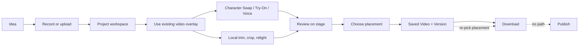

# Creative workflow audit

How naturally an operator moves through
**idea → source media → creation → editing → transformation → review → save → organize → export**.

## The loop as it exists

The dotted lines are where it breaks: the placement has to be chosen twice, and there is no exit
beyond the local filesystem.

## What the workflow gets right

**Nothing is lost.** This is the product's strongest creative property and it is unusual.

- Editing is non-destructive by construction. The original video is a separate, immutable
  `projectSources` record; the current cut is working media adopted onto a revision; every mutation
  writes a new `projectRevisions` row carrying a full snapshot. The UI says so plainly: _"Your
  original video is kept separately and never changes."_
- An interrupted save survives a reload. A pending output operation is persisted and reconciled on
  return — _"Checking the save that was already started. No second save will be created."_
- An exit guard refuses to lose in-memory work, and the session-teardown hold is owned by the shell,
  so it protects work on every route rather than only in Studio.
- Removing an asset from a Project is explicitly reversible and says so.
- The creative library has export and import, and warns you to take a backup when account sync is
  unavailable.

**Versions are honest.** A Saved Video is a title plus ordered immutable Versions. Adding a Version
is a distinct choice from creating a new Video, and the save panel makes the operator choose.

**Provenance is recorded.** Each revision records what it was for, and History shows every change,
saved version and AI run, including the placement each change carried.

**Processing state is legible.** Explicit reconciliation when acceptance is unknown, cancel, retry,
and no automatic paid retry anywhere.

## Where the workflow breaks

### 1. The export is not an artifact

The single most important finding in this audit. Full evidence in
[02, F11](02-user-flow-audit.md).

The operator answers "Where is this going?", the answer is stored, the panel states _"This frame and
the selected placement are what the saved video will use"_ — and the bytes written are the current
cut in its original shape. Re-framing is a browser-side render performed later, at download, only
from particular buttons.

For a product whose purpose is marketing assets, the placement is the deliverable. Today it is a
label attached to a decision, and a rendering step the operator can miss.

Consequences that follow from this one fact:

- The video in Assets is not the video that was specified.
- A second placement of the same cut requires re-rendering by hand each time, in the browser.
- Nothing can ever be shared or published in the right shape, because the right shape is not stored.
- On a browser without WebCodecs, the specified output cannot be produced at all.

### 2. The placement does not travel

`VideoExportPanel` starts from `null`. The producing Project's `exportSpecification` is never read.
The decision is discarded at the boundary between Project and Asset.

### 3. Creating is not where creation is

The Create step holds a checkpoint, current-cut management and a status panel. The transforms are
behind a button named for the editor. See [02, F8](02-user-flow-audit.md).

The deeper cost is conceptual: **AI transformation feels bolted on rather than part of editing.**
The overlay treats Character Swap, Virtual Try-On, Voice and local adjustment as four peers in a
"Choose your edits" row, which is right — but that row is two navigational hops from the step that
is supposed to own it.

### 4. Variation is manual

Duplicating a Project is well built and opens on the correct step. But the marketing loop is not
"make another Project" — it is _"same cut, four placements"_ and _"same script, three characters"_.
Neither has a path. The export model is one step away from supporting the first.

### 5. Campaigns organize but do not help

A Campaign carries no target placements, no shared direction, no aggregate of what it produced. It
cannot even adopt an existing Project from its own surface. The layer that exists to make the second
video cheaper than the first currently makes it exactly as expensive.

## Media metadata

Good where it exists: dimensions, duration, checksum, container, codec, audio presence, size, and a
WebP thumbnail per Version. The Videos library filters on character used and video format, and
reports when no video has character attribution yet.

Missing: nothing records the _placement_ of a stored Version, because no stored Version has one.

## Processing states

Clear and well-differentiated — queued, active, finalizing, reconciling, cancelled, failed — with a
live elapsed timer and a queue panel that does not close under the reader. Cost is stated before
submission ("1 visual-processing submission"), and consent is requested explicitly.

The wording is technical in places ("durable current or accepted earlier-revision operation"), and
there is no account-level total of what has been spent.

## Download and export experience

- From the Project save moment: "Download for phone", with a secondary "Download the original shape
  instead", plus an honest warning when the browser cannot re-frame.
- From Assets: an "Export video" panel that is candid that re-framing is local and the saved version
  is unchanged.

Both are well built. Both are compensating for the fact that the server never produced the file the
operator asked for.

## Judgement

The creative workflow is **safe, resumable and honest about history** — better than most tools of
this size. It fails at the last mile: the thing it hands back is not the thing it was asked for, and
the organizing layer above it does not reduce the cost of the next one.

Fix the export artifact, then make the Campaign carry placements, and the loop closes.
