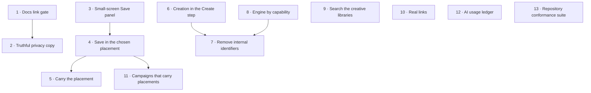

# Implementation roadmap

Thirteen incremental steps. Each has one primary objective, clear boundaries, and can be reviewed
and shipped on its own. Each preserves existing behaviour unless it explicitly changes it.

A standalone coding-agent prompt for every step is in [`prompts/`](prompts/README.md).

**Nothing here has been implemented.** This is a proposal for review.

## Why this order

1. **Unblock validation first (1).** `bun run check:docs` is red. Until it is green, every later step
   validates against a failing gate and its implementer cannot tell their own breakage from the
   pre-existing kind.
2. **Stop saying untrue things (2).** One sentence, XS effort, and it is a privacy claim.
3. **Repair the surface that step 4 will rewrite (3).** The small-screen defects are on the Save
   panel. Fixing the layout before changing the behaviour means step 4 lands on a sound surface, and
   the two changes stay independently reviewable.
4. **Make the deliverable real (4–5).** The largest value in this roadmap, and the prerequisite for
   Campaigns, variants and any future publishing. Step 5 finishes it by carrying the decision into
   Assets.
5. **Fix the last navigational confusion (6).** Deliberately after the export work: doing it first
   would restructure a surface whose most important control is about to change meaning.
6. **Finish the language (7–8).** Cheap, low-risk, and every later review is easier once the product
   stops showing its own bookkeeping.
7. **Close the retrieval gap (9).**
8. **Restore a standard web affordance (10).** Touches many files, changes no behaviour — best done
   when the surfaces it touches have stopped moving.
9. **Then leverage and accountability (11–12).**
10. **Then the one piece of debt that earns its place (13).**

Two deviations from the generic "critical → flows → friction → capability" sequence, and why:

- **Step 3 (polish) is early.** It is XS–S, it is on the surface step 4 rewrites, and doing it after
  would mean re-doing it.
- **Step 6 (a significant UX restructure) is mid-roadmap, not first.** The Create tab's problem is
  real, but the Save tab's problem is that it lies. Truth before tidiness.

## Dependency graph

Steps 1, 2, 3, 6, 8, 9, 10, 12 and 13 have no upstream dependency and can be reordered freely.
Only 4 → 5, 4 → 11 and 3 → 4 are real constraints.

---

## Step 1 — Repair the documentation link gate

**User problem** None directly. Every contributor's validation gate is red for a reason they did not
cause.

**User value** Indirect: the next twelve steps can be validated honestly.

**Current behaviour** `bun run check:docs` fails with thirteen broken links. `LightFrameUXAudit.md`,
`LightFrameUXImplementationPlan.md` and `LightFrameSuperdesignPrompts.md` have been moved into
`docs/archived/` in the working tree; six documents still link to their old locations, and the two
moved documents contain relative links that no longer resolve from their new depth.

**Desired behaviour** `bun run check:docs` exits 0.

**Scope** Update the referrers in `docs/README.md` (two tables), `docs/product-audit/README.md`,
`docs/product-audit/03-ui-ux-audit.md` and `docs/user-flows/gaps-and-usability-audit.md`; fix the two
relative links inside the moved documents. Mark the three as archived where they are listed.

**Out of scope** Moving anything else. Rewriting the content of the archived documents. Touching
`docs/product-audit/2026-08-26/`.

**Dependencies** None.

**Architectural considerations** None. `scripts/check-doc-links.mjs` validates relative links and
heading anchors across `README.md`, `AGENTS.md` and all of `docs/`.

**UI/UX requirements** None.

**Acceptance criteria**

- `bun run check:docs` exits 0.
- Every previously broken link resolves to the document's real location.
- No document is moved, renamed or deleted by this step.

**Regression risks** Very low. A wrong path replaces one broken link with another; the gate catches it.

**Validation** `bun run check:docs`, `bun run format:check`.

**Complexity** XS

---

## Step 2 — Say where the media actually goes

**User problem** The idle stage promises _"Nothing leaves this browser in Local mode"_ in a
configuration where media is uploaded to object storage and the creative library is mirrored to an
account.

**User value** A privacy claim that is true wherever it appears.

**Current behaviour** `MediaStage.tsx:171`. `emptyCopy(mode)` branches on `StudioMode` — the creative
mode — and returns the sentence unconditionally for the `local` creative mode, regardless of
persistence.

**Desired behaviour** The stage states the correct posture for the running configuration: local-only
when media genuinely stays in the browser, and an accurate short statement when it does not.

**Scope** Derive the persistence posture from `/api/capabilities` (`savedVideos`,
`creativeLibrary.cloudMirror`) — or from a dedicated field if one reads better — and select the
sentence from it. Cover both branches with tests.

**Out of scope** Changing what is actually stored or where. Rewriting
`docs/PRIVACY_AND_TEMPORARY_DATA.md`. Any other stage copy.

**Dependencies** Step 1 (so validation is honest).

**Architectural considerations** The capability response already reaches the client and is already
the mechanism for conditioning UI. Do not add a new `VITE_*` variable; do not infer from the origin.

**UI/UX requirements** Both sentences must be short enough for the idle stage at 375 px. The
camera-and-microphone half of the sentence is unconditional and must not change. Do not introduce a
warning tone — this is a statement of fact, not an alert.

**User flow** Unchanged. Only the sentence differs by configuration.

**Acceptance criteria**

- With cloud persistence, the stage does not claim media stays in the browser.
- With local-only persistence, the existing sentence is preserved verbatim.
- Both are covered by a test that fixes the capability response.
- The camera/microphone assurance appears in both.

**Regression risks** Low. `MediaStage` renders on every Studio route; a thrown error while reading
capabilities must not blank the stage — treat unknown as the more conservative wording.

**Validation** `vitest run apps/web/src/features/live-stage`.

**Complexity** XS

---

## Step 3 — Repair the small-screen Save panel

**User problem** At 375 px the Save panel's own explanation is painted over by the fixed action bar,
two labels break or truncate, and three nested scroll regions make touch scrolling ambiguous.

**User value** The most important surface in the product is legible on a phone.

**Current behaviour**

- Paragraph at y 632–670; action bar `position: fixed`, `z-index: 5`, `rgba(9,13,18,0.96)` at
  y 656–728. `elementFromPoint` at 85 % down the paragraph returns the bar.
- The panel sets `padding-bottom: 104px`, which only clears the bar at the bottom of the innermost
  scroll.
- `main#studio-main` (756 px, `overflow-y: auto`) → `aside` (543 px) → inner `div` (473 px) holding a
  1,224 px panel.
- "Campaigns" renders as "Campai / gns"; "New Character 01" clips to "New Charact".

**Desired behaviour** No panel content is ever occluded at any scroll position. One scroll owner per
surface on small screens. No label breaks mid-word.

**Scope** Anchor the action bar to the scroll container it belongs to, or reserve its height in the
region that actually scrolls. Collapse the nested scroll regions on small screens to one owner.
Supply `shortLabel` for `projects` and `campaigns` in the Dashboard recent-work filter. Give the
compact creative-tool labels room or a shorter form.

**Out of scope** Desktop layout. Any change to what the Save panel does or says. The
`SegmentedControl` primitive's `overflow-wrap` default — supply the missing short labels rather than
changing behaviour for every consumer.

**Dependencies** None. Do this before step 4.

**Architectural considerations** The nested scrolls exist because the shell owns `main` and the
workspace owns its rail. Prefer making the inner regions `overflow: visible` at small widths and
letting `main` scroll, over introducing a new positioning context.

**UI/UX requirements** The action bar must stay reachable without scrolling on small screens. Focus
order must not change. The accessible names of the creative tool buttons must stay exactly as they
are — only the visible label may shorten.

**User flow** Unchanged.

**Acceptance criteria**

- At 375×812 on `/projects/:id/workspace?task=save`, `document.elementFromPoint` sampled across every
  text-bearing element in the panel never returns the action bar, at the top of the scroll, the
  middle, and the bottom.
- At most one scrollable ancestor between `main` and the task panel at 375 px.
- "Campaigns" and "Projects" render on one line in the Dashboard filter at 375 px.
- No creative tool label is clipped mid-word at 375 px.
- Desktop rendering is unchanged.

**Regression risks** Medium. Scroll restoration (`useRouteViewState`) keys on a scroll container —
changing which element scrolls can break remembered positions. Verify scroll memory still works on
the Projects route and the Dashboard.

**Validation** `vitest run apps/web/src/features/projects apps/web/src/features/dashboard`;
`bun run test:visual` for the affected mobile cases only; the small-mobile cases in
`e2e/accessibility-responsive.spec.ts`.

**Complexity** S

---

## Step 4 — Save the video in the placement that was chosen

**The most important step in this roadmap.**

**User problem** The operator chooses "Phone, full screen", is told _"This frame and the selected
placement are what the saved video will use"_, and the file that is stored is in the original shape.

**User value** The library holds the asset that was specified. It can be downloaded, re-downloaded,
and later shared or published without re-deciding or re-rendering.

**Current behaviour** `saveProjectOutputRequestSchema` (`packages/contracts/src/projects.ts:849`)
carries `{expectedVersion, expectedRevisionNumber, media, target}` — a reference to media that
already exists. The placement is recorded on the revision snapshot as intent. Re-framing runs in the
browser at download time via `useSavedVideoPlacementDownload` and the WebCodecs worker, and only from
specific download controls.

**Desired behaviour** When a placement other than "Keep as it is" is selected, the bytes stored as
the new Version are the re-framed bytes. The stored Version records the placement it was produced
for. Where the browser cannot render, the operator is told before saving that the original shape will
be stored, and the stored Version records that no placement was applied.

**Scope**

- Render the placement at save time using the existing `renderVideoEdit` worker and the existing
  `useExportPlacementRender` wrapper.
- Upload the rendered bytes through the working-media path that already exists, and reference them in
  the save.
- Persist the applied placement on the produced Version so it can be read back.
- Progress, cancellation and failure handling for a render that now sits inside the save.
- Make the existing copy true; do not weaken it.
- Preserve idempotency and CAS exactly: a save interrupted by a reload must still reconcile to one
  Version, and must not re-render or re-upload silently.

**Out of scope** Any server-side render pipeline. More than one placement per save — but **leave room
for it**: prefer a shape that could carry several specifications later over one that forecloses it.
Changing the placement options themselves. Assets-side behaviour (step 5).

**Dependencies** Step 3.

**Architectural considerations**

- Reuse `renderVideoEdit`; do not write a second renderer.
- The render happens **before** the save request, so the idempotency receipt must cover the whole
  operation. A recovered save must not re-render.
- `saveProjectOutputRequestSchema` gains a field, or the media reference points at already-uploaded
  re-framed bytes. Prefer the second: it keeps the save contract about references, and reuses upload
  machinery that already handles checksums, size caps and multipart.
- Respect the 300 MB contract ceiling on the rendered output, and fail before upload if exceeded.
- The domain already has `projectExportPreview` and `defaultProjectExportResolution`; the render must
  agree with what the chooser previewed.

**UI/UX requirements**

- Saving now takes materially longer. Show render progress distinctly from upload progress, and allow
  cancellation of the render.
- Where the browser cannot render, say so **before** the save button is pressed, not after.
- The success state must state which placement was actually applied.
- The existing `StatusNotice` and `ExportPlacementProgress` components are the right vehicles.

**User flow** Save tab → choose placement → read the crop description → "Save video · Phone, full
screen" → render progress → upload progress → saved, with a success state naming the placement and
offering download, "View in Assets" and create-another.

**Acceptance criteria**

- Saving with a placement other than "Keep as it is" stores a Version whose stored dimensions match
  the placement's resolution.
- Saving with "Keep as it is" stores the current cut unchanged, byte for byte.
- The stored Version records the placement it was produced for, readable from the API.
- Where `videoEditRenderingSupported()` is false, the operator is warned before saving, the original
  shape is stored, and the Version records that no placement was applied.
- A save interrupted by a reload reconciles to exactly one Version and does not re-render.
- Cancelling the render leaves the Project unchanged and no Version created.
- A render that would exceed the size ceiling fails before upload with an explanation.
- `ProjectOutputSaveSection.tsx:519`'s claim is now true.

**Regression risks** High — this is the highest-risk step in the roadmap.

- Idempotency and CAS on the output path.
- Recovery of a pending output operation across reload.
- Existing saved Versions and their thumbnails must be unaffected.
- The Project History view of placements must still render.
- Do not change the source or working-media contracts.

**Validation** `vitest run apps/api/src/features/projects apps/api/src/features/saved-videos`;
`vitest run apps/web/src/features/projects apps/web/src/features/export-placements`;
`vitest run packages/domain/src/projects packages/contracts`; the Project journey specs in
`e2e/successful-studio-journeys.spec.ts`. `bun run typecheck` — contracts change.

**Complexity** L

---

## Step 5 — Carry the placement with the video

**User problem** A video saved for "Phone, full screen" opens its export panel with nothing selected
and downloads in source shape unless the operator remembers and re-picks.

**User value** The decision made once stays made.

**Current behaviour** `VideoExportPanel.tsx:33` — `useState<ProjectExportSpecification | null>(null)`.
Nothing reads the producing Project's `exportSpecification`.

**Desired behaviour** The Videos library shows each Version's placement, and the export panel opens
on it. Re-framing to a _different_ placement stays available.

**Scope** Read the placement recorded by step 4 onto the Version; show it on the video record and in
the export panel; default the panel's selection to it.

**Out of scope** Storing additional re-framed files. Changing the export panel's honest statement
about local re-framing for placements other than the stored one.

**Dependencies** Step 4.

**Architectural considerations** The value is on the Version after step 4, so this is a read, not a
new relationship. Videos with no recorded placement — everything saved before step 4 — must render
correctly with no placement shown.

**UI/UX requirements** Show the placement as a plain label ("Phone, full screen"), not a ratio. The
primary action should say what it will produce. Changing the placement must remain one click.

**User flow** Assets → Videos → a video → "Export video" → the panel opens on the placement it was
saved for → download, or choose a different one.

**Acceptance criteria**

- A Version saved for a placement shows that placement in the library and opens the export panel on it.
- A Version with no recorded placement behaves exactly as today.
- Choosing a different placement still works and still states that re-framing is local.
- The primary download control names what it will produce.

**Regression risks** Low. Do not break the download path for pre-existing Versions.

**Validation** `vitest run apps/web/src/features/video-gallery apps/web/src/features/saved-videos`.

**Complexity** S

---

## Step 6 — Put creation in the Create step

**User problem** The tab named "Create" cannot start anything. Character Swap and Virtual Try-On are
reached through a button labelled "Edit Video · Open the video editor", which opens an overlay titled
"Use existing video" running a second three-step wizard inside the first.

**User value** The obvious place to create is where creation happens.

**Current behaviour** `ProjectWorkspaceSurface.tsx:318-343` renders only
`ProjectCreativeCheckpointPanel`, `ProjectWorkingMediaSection` and `ProjectProcessingStatusPanel`
into the Create panel. The last cannot submit work; its own copy says so.

**Desired behaviour** From the Create tab an operator can start a Character Swap, a Virtual Try-On or
a voice replacement, and can reach local adjustment. One progress model, not two.

**Scope** Surface the transform entry points on the Create tab. Retire or subordinate the overlay's
`Source / Edit / Review` wizard so only one progress model is visible inside a Project. Rename the
bottom-bar control to describe what it opens.

**Out of scope** Changing what any transform does, its configuration, its cost warnings, its
capability gating, or the provider contracts. Rewriting the overlay for the standalone
`/studio/create` route, where "Use existing video" is an accurate title. Step 8's engine labelling.

**Dependencies** None, but easier after steps 4 and 5 have settled the Save tab.

**Architectural considerations**

- The overlay is a large stateful surface (`useExistingVideoWorkflow`, 924 lines) with its own
  lifecycle, keyed on `existingVideo.selection?.metadata.selectedAt`. Prefer changing where it is
  entered and what it is called over restructuring its internals.
- The overlay serves two contexts — inside a Project and on `/studio/create`. Its title and wizard
  are correct in the second. Condition on context; do not delete.
- `ProjectProcessingStatusPanel` stays: showing running work on the Create tab is right.

**UI/UX requirements**

- The Create tab must offer the three transforms with their capability state and cost, in the
  language step 8 will refine.
- Only one step model visible at a time inside a Project.
- The bottom-bar control must name what it opens.
- Everything reachable today must stay reachable.

**User flow** Project workspace → Create → choose Character Swap / Virtual Try-On / Voice → configure
→ start → progress on the same tab → result on the stage.

**Acceptance criteria**

- Every transform can be started from the Create tab.
- No two three-step progress models are visible at once inside a Project.
- The bottom-bar control's label matches what it opens.
- `/studio/create` behaviour is unchanged.
- Capability gating, cost statements and consent copy are unchanged.

**Regression risks** High for reachability. The overlay is the only route to local editing and voice
today. Nothing may become unreachable. Focus return (`editVideoToggleRef`, `uploadToggleRef`) must
still work.

**Validation** `vitest run apps/web/src/features/projects apps/web/src/features/existing-video`;
`vitest run apps/web/src/studio`; `e2e/existing-video.spec.ts` and
`e2e/successful-studio-journeys.spec.ts`.

**Complexity** M

---

## Step 7 — Stop showing internal identifiers

**User problem** The product shows its own bookkeeping: truncated UUIDs above asset names, internal
capture filenames, "Project change 37", and operation vocabulary.

**User value** The interface describes the operator's work, not the system's.

**Current behaviour**

- `ProjectAssetsSection.tsx:411-413` renders `abbreviatedId(membership.resourceId)` above every name.
- The Save panel shows "Project change 37".
- The overlay shows `local-take-20260814T150841Z-ba6ebcb3.mp4` and `reference-da0ec4aa-….jpg`.
- The processing panel says _"Looking for a durable current or accepted earlier-revision operation."_
- The Create tab says _"…never sets a target for Add Version"_ and _"This result is for an earlier
  change. It was kept, but it did not replace what you're viewing and no version was saved."_

**Desired behaviour** No database identifier is presented as user-facing information. Files are named
for what they are. The two hardest sentences are rewritten.

**Scope** Remove the asset-card identifier (keep it in the `title` attribute only if it has a support
purpose). Present capture and reference files by a human description. Replace "Project change N" with
a description or a timestamp. Rewrite the four sentences above.

**Out of scope** Changing any identifier in the data model, the API, or `data-*` test hooks. Renaming
domain concepts in code. History, where an ordinal is legitimately useful — but say what it means.

**Dependencies** Steps 6 and 8, so the surfaces have stopped moving.

**Architectural considerations** None. Presentation only. Do not change `abbreviatedId`'s callers
elsewhere without checking; it currently has exactly one.

**UI/UX requirements** Every replaced sentence must be understandable by someone who has never read
the schema. Do not lose real information — "this result was kept but is not what you are looking at"
is a genuine state and must still be communicated.

**Acceptance criteria**

- No UUID or truncated UUID is rendered as visible text on any surface.
- No internal capture or reference filename is shown as the primary name of a file.
- "Project change N" is replaced with something the operator can interpret.
- The four sentences are rewritten and still convey the same state.
- No test hook, `data-*` attribute or accessible name is broken.

**Regression risks** Low, but tests may assert on the removed text. Update assertions rather than
restoring the strings.

**Validation** `vitest run apps/web/src/features/projects apps/web/src/features/existing-video`;
`bun run check:retired-program`.

**Complexity** S

---

## Step 8 — Choose an engine by what it does

**User problem** The Character Swap configuration asks the operator to choose between "Decart API"
and "Pruna API" with nothing to choose on.

**User value** A consequential, cost-bearing choice becomes one the operator can actually make.

**Current behaviour** A two-option toggle labelled with vendor names. The real differences are
modelled in `/api/capabilities` and shown nowhere: Pruna requires a reference image, prepares input
as H.264 MP4, accepts no custom prompt, offers 720p and 1080p, and needs explicit release after a
terminal failure. Decart accepts an editable prompt, needs no reference, offers 720p, and releases
automatically.

**Desired behaviour** Engines are described by what they do and what they need. The vendor name stays
available for someone who wants it.

**Scope** Replace the vendor labels with capability-derived descriptions drawn from the existing
capability response. Keep the vendor identity in an advanced disclosure. Surface the reference
requirement as part of the choice rather than as a warning afterwards.

**Out of scope** Changing which providers are available, defaults, provider contracts, cost
statements, or `videoCharacterSwapProviderIdSchema`.

**Dependencies** None.

**Architectural considerations** Derive every description from `characterSwapProviderCapabilitySchema`
so the copy cannot drift from behaviour — the same discipline `placements.ts` already uses for export
copy. Do not hard-code per-vendor prose keyed on the provider id alone.

**UI/UX requirements** The descriptions must fit the overlay at 375 px. The provider id must remain
discoverable for support. Selecting an engine that requires a reference the operator has not supplied
must be explained at the point of choice.

**Acceptance criteria**

- Neither option's primary label is a vendor name.
- Each option states its prompt behaviour, reference requirement and available resolutions, derived
  from the capability response.
- The vendor id remains reachable through a disclosure.
- With one provider configured, the choice does not appear at all.
- Cost and consent copy are unchanged.

**Regression risks** Low. Capability gating must continue to hide unavailable providers.

**Validation** `vitest run apps/web/src/features/existing-video`; `vitest run packages/contracts`.

**Complexity** S

---

## Step 9 — Find a character or an outfit by name

**User problem** Characters and Outfits are the only libraries with no search, and their contents
cost real provider money to create.

**User value** The creative library stays usable as it fills up.

**Current behaviour** `SavedCreativeLibrary.tsx` renders `items.map(...)` over the whole store. No
search, filter, sort or pagination.

**Desired behaviour** Both libraries can be searched by name, matching the pattern the rest of the
product already uses.

**Scope** Add `ListSearchField` and `SearchEmptyState` to both libraries, with a count. Search the
local store — these assets are browser-local and mirrored, not paged from the server.

**Out of scope** Server-side search or a new contract. Filtering by anything other than name.
Pagination or virtualisation — note it if the store is large, but do not build it here.

**Dependencies** None.

**Architectural considerations** `useListSearch` debounces and exposes `term`/`clear`; reuse it. Do
not add a network round-trip for a local store.

**UI/UX requirements** Identical in behaviour to the Projects and Videos search: the same
"Search begins after 2 characters" hint, a polite result count, and a distinct search-empty state
with a clear affordance.

**Acceptance criteria**

- Both libraries offer search by name.
- A search with no matches shows the search-empty state with a clear control, not the first-run empty
  state.
- The count reflects the filtered list.
- Existing selection, use, wardrobe and delete actions are unchanged.

**Regression risks** Low.

**Validation** `vitest run apps/web/src/features/account-library`.

**Complexity** S

---

## Step 10 — Make every destination a real link

**User problem** The whole authenticated application contains one `<a href>` — the skip link. Nothing
can be cmd-clicked, middle-clicked, copied as a URL, or previewed on hover, and assistive technology
announces navigation as "button".

**User value** The web behaves like the web.

**Current behaviour** Every destination is `<button onClick={navigate(...)}>`. Anchors are used only
for `download`. `paths.ts` already produces every URL.

**Desired behaviour** Anything that navigates is an anchor with a real `href`, while keeping
client-side routing.

**Scope** Primary navigation, Project rows, Campaign rows, Dashboard recent-work rows, and any other
control whose only effect is to change route. Use `react-router`'s link so modified clicks fall
through to the browser.

**Out of scope** Controls that do something before navigating (create, duplicate, adopt). Overlay
open/close, which is a route change but presented as a shelf — leave as is unless it is trivially an
anchor. Any visual change: links must look exactly as they do now.

**Dependencies** None. Best after steps 6 and 7 so the surfaces have stopped moving.

**Architectural considerations** `Button` already has an anchor form
(`Button.tsx:133`) used for downloads; extend that seam rather than creating a parallel one.
`useStudioNavigationActions` centralises navigation — route the `href` from the same place the
`navigate` call comes from, so the two cannot disagree.

**UI/UX requirements** No visual change. Focus styles, keyboard activation and `aria-current` must be
preserved. `Enter` must continue to activate; `Space` behaviour will change to link semantics, which
is correct.

**Acceptance criteria**

- Every navigation-only control renders an `<a href>` with the same URL `navigate` would use.
- Cmd-, ctrl- and middle-click open a new tab and do not also navigate the current one.
- Right-click offers "Copy link address".
- No visual regression at any audited viewport.
- `aria-current="page"` still resolves on the active destination.

**Regression risks** Medium in breadth, low in depth. `StudioExitGuard` keys on pathname; anchor
navigation must still route through the router, not cause a document load. Verify the exit guard
still fires when leaving a Project with unsaved work.

**Validation** `vitest run apps/web/src/app apps/web/src/studio apps/web/src/features/projects`;
`e2e/app-routing.spec.ts`; `bun run test:visual` for affected cases.

**Complexity** M

---

## Step 11 — Give a Campaign something to do

**User problem** A Campaign is a name and an optional brief. It gives its Projects no direction and
shows no aggregate of what it produced, so the second Project costs exactly as much as the first.

**User value** The organizing layer starts reducing work instead of only labelling it.

**Current behaviour** `{id, ownerUserId, name, brief, status, version, timestamps}` and
`projects.campaignId`. The Campaign surface can start a new Project but cannot adopt an existing one,
even though `POST /api/projects/:projectId/campaign` exists. The Projects list can filter to "All
Active" or "No Campaign", never to one Campaign.

**Desired behaviour** A Campaign carries the placements its videos are for, hands them to each
Project it contains, shows every video produced under it, and can adopt an existing Project.

**Scope** Target placements on the Campaign. A new Project in a Campaign starts with them selected. A
Campaign view of the videos its Projects produced. Adopt an existing Project from the Campaign
surface. Filter the Projects list to one Campaign.

**Out of scope** Brand kits, colours, fonts, tone. Campaign-level generation or bulk operations.
Deadlines, budgets or status beyond the existing lifecycle. Changing Campaign lifecycle, CAS or
receipts.

**Dependencies** Step 4 — target placements mean nothing while placements are not applied at save.

**Architectural considerations**

- A schema and contract change, so a migration. Keep `expectedVersion` semantics exactly as they are.
- Placements are a domain concept (`PROJECT_EXPORT_ASPECTS`); the Campaign should store the same
  values, not a parallel vocabulary.
- The Campaign→videos view must not become an N+1: derive it from Project outputs in one query, and
  count to a ceiling as the rest of the product does.
- Hand-down is a **default, not a constraint**: a Project must remain free to save to a different
  placement.

**UI/UX requirements** Placements on a Campaign use the same chooser and the same language as the
Project save panel. The Campaign surface should show what it has produced above what it contains.
Adopting a Project must state that its creative history is unaffected — the existing copy already
says this and should be reused.

**User flow** Campaigns → New Campaign → name it and choose where its videos are going → New Project
→ the Project opens with those placements already chosen → save → the video appears on the Campaign.

**Acceptance criteria**

- A Campaign can record one or more target placements.
- A Project created from a Campaign starts with the Campaign's placement selected, and can change it.
- The Campaign surface lists every video produced by its Projects, with posters.
- An existing Project can be attached to a Campaign from the Campaign surface.
- The Projects list can filter to one Campaign.
- Campaigns with no placements behave exactly as today.
- CAS, receipts and lifecycle are unchanged.

**Regression risks** Medium. A migration on a live table; existing Campaigns must keep working with no
placements. The Projects list filter is shared by two sections and must apply to both.

**Validation** `vitest run apps/api/src/features/campaigns apps/api/src/features/projects`;
`vitest run packages/contracts packages/domain/src/campaigns`;
`vitest run apps/web/src/features/campaigns apps/web/src/features/projects`; Drizzle generation and
migration checks. `bun run typecheck`.

**Complexity** L

---

## Step 12 — Show what the AI work has cost

**User problem** Every submission spends money. The product says so at the moment of spending and
never again.

**User value** The operator can see what they have used before deciding to use more.

**Current behaviour** `AccountPanel` shows entitlement _limits_ and a running-job count. AI history
exists per Project. There is no usage endpoint among the 87 routes.

**Desired behaviour** An account-level record of AI submissions — what was run, when, with which
engine, and how it ended.

**Scope** An endpoint that aggregates completed and failed submissions for the session owner, and an
account surface that presents it. Counts by operation and engine, over a period.

**Out of scope** Currency, pricing, invoices or billing. Enforcing limits. Per-provider cost
estimates unless the provider actually reports them. Retention or deletion policy changes.

**Dependencies** None.

**Architectural considerations** `processingJobs` and `projectJobs` already hold the records; this is
a read model. Count to a ceiling rather than censusing, as the rest of the product does. Ownership
must derive from the session subject only. Do not add a new provider call.

**UI/UX requirements** Plain counts, plainly labelled, in the same language as the submission
warnings the operator already saw. State the period covered. Say explicitly if a number is
approximate or capped.

**Acceptance criteria**

- The account surface shows submissions by operation and by engine for a stated period.
- Failed and cancelled work is distinguished from successful work.
- The numbers reconcile with per-Project history.
- No pricing or currency appears anywhere.
- The endpoint is owner-scoped and returns nothing for another subject.

**Regression risks** Low. Do not slow the account surface — this is one additional query.

**Validation** `vitest run apps/api/src/features/processing-jobs apps/api/src/features/video-jobs`;
`vitest run apps/web/src/features/account`; `vitest run apps/api/src/route-inventory.test.ts` — a new
route changes the oracle.

**Complexity** M

---

## Step 13 — One conformance suite for both Project repositories

**User problem** None today. This is the one piece of technical debt in this roadmap that earns an
implementation slot, and it earns it by bounding a risk rather than by being tidier.

**User value** Indirect: the aggregate every feature depends on cannot silently behave differently in
one persistence mode than another.

**Current behaviour** `FileProjectRepository` (2,524 lines) and `DrizzleProjectRepository` (3,861
lines) implement the same ~50-method `ProjectRepository` interface. They are tested by two unrelated
suites with different strategies — real temp-directory file I/O versus a scripted database. Nothing
asserts that they agree. Both modes are live.

**Desired behaviour** One parameterized suite runs the same behavioural expectations against both
implementations, and fails when they diverge.

**Scope** A conformance suite exercising the interface's observable contract: create, revise, CAS
conflicts, idempotency receipts, lifecycle transitions, asset membership, source and working-media
adoption, outputs, and ownership isolation. Run it against both implementations.

**Out of scope** **Unifying the implementations.** Changing either one's behaviour. Deleting the
existing suites — they cover implementation-specific concerns the conformance suite should not.
Performance work.

**Dependencies** None. Deliberately last: it is the least user-visible item here.

**Architectural considerations** The suite must be written against the interface only, with no
knowledge of files or SQL. The Drizzle implementation currently tests against a scripted database; a
conformance run may need a real Postgres, in which case follow the existing
`*.postgres.integration.test.ts` convention rather than inventing a new one. **If the suite reveals a
genuine divergence, report it — do not fix it in this step.**

**UI/UX requirements** None.

**Acceptance criteria**

- One suite runs against both implementations from the same expectations.
- It covers CAS conflict, idempotency replay, lifecycle, membership, source/working-media adoption,
  outputs and ownership isolation.
- It fails if a method is added to one implementation and not the other.
- Both existing suites still pass, unchanged.
- Any divergence found is reported, not silently corrected.

**Regression risks** Very low — this adds tests. The real risk is discovering a divergence, which is
the point.

**Validation** `vitest run apps/api/src/features/projects apps/api/src/infrastructure/database`.

**Complexity** M

---

## Sequence at a glance

| #   | Step                                        | Complexity | Primary finding        | Depends on |
| --- | ------------------------------------------- | ---------- | ---------------------- | ---------- |
| 1   | Repair the documentation link gate          | XS         | F-18                   | —          |
| 2   | Say where the media actually goes           | XS         | F-03                   | 1          |
| 3   | Repair the small-screen Save panel          | S          | F-12, F-13, F-14, F-15 | —          |
| 4   | **Save the video in the chosen placement**  | **L**      | **F-01**               | 3          |
| 5   | Carry the placement with the video          | S          | F-02                   | 4          |
| 6   | Put creation in the Create step             | M          | F-04, F-05             | —          |
| 7   | Stop showing internal identifiers           | S          | F-06                   | 6, 8       |
| 8   | Choose an engine by what it does            | S          | F-07                   | —          |
| 9   | Find a character or an outfit by name       | S          | F-08, F-20             | —          |
| 10  | Make every destination a real link          | M          | F-10                   | —          |
| 11  | Give a Campaign something to do             | L          | F-09, F-21, F-22       | 4          |
| 12  | Show what the AI work has cost              | M          | F-11                   | —          |
| 13  | One conformance suite for both repositories | M          | F-16                   | —          |

**If only the first five ship**, the product stops making a false claim, repairs its worst visual
defect, and delivers the artifact it promises. That is the coherent MVP boundary.
