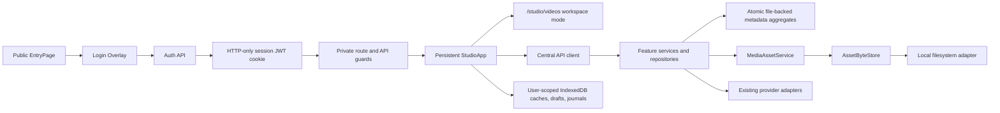
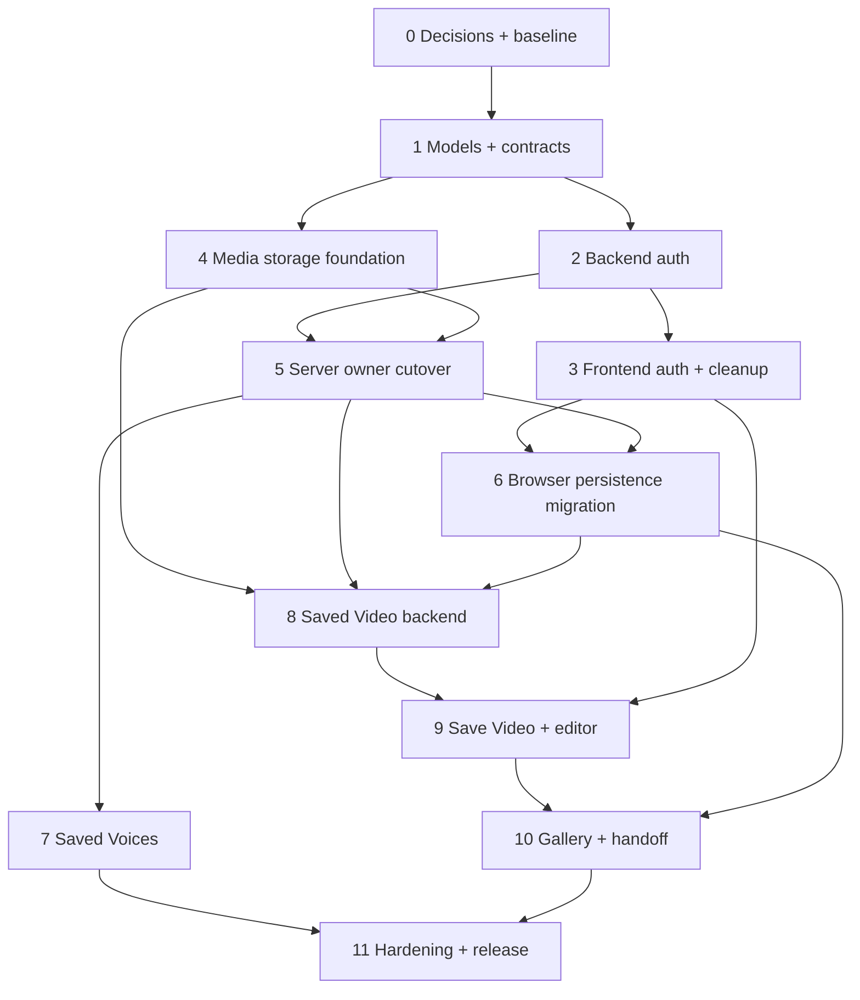

# User Accounts Phase 1: architecture audit and implementation plan

Status: historical implementation plan; Phase 1 is implemented, with manual and live-provider
validation remaining

Audience: product, engineering, security, QA

Planning date: 2026-08-05

Scope: one seeded demo user, structurally real authentication and ownership, user-scoped local
persistence, saved media, and a Video Gallery. A 2026-08-07 follow-up added configuration-gated
Drizzle/Neon and private R2 without changing the account or loopback boundary. Signup, billing,
and public deployment remain deferred.

This file preserves the original audit, sequencing, and cutover rationale, so proposed paths and
pre-migration findings remain in historical tense below. It is not current product positioning or
the product roadmap. Use the [README](../README.md), [Architecture](ARCHITECTURE.md),
[Product Vision](PRODUCT_VISION.md), [Product Roadmap](PRODUCT_ROADMAP.md), and
[cloud persistence runbook](CLOUD_PERSISTENCE.md) for current authority.

## Executive decision

Phase 1 should extend the current local-first architecture rather than create a parallel account
application. The recommended shape is:

- Keep `/` public and provider/media/API-free until the user submits Login. Protect `/studio` and
  `/studio/*`; use `/studio/videos`, `/studio/characters`, and `/studio/outfits` for saved
  libraries so the one `StudioApp` composition and one persistent `MediaStage` remain mounted.
- Add one server-seeded user and a session-specific JWT in a host-only, HTTP-only cookie. Verify
  the password hash and issue the JWT only on the API. A JWT belongs to one session; it is not an
  identifier permanently assigned to the user.
- Derive `ownerUserId` only from the verified session. Do not accept an owner ID from browser
  bodies, query parameters, multipart fields, or provider payloads.
- Replace the loopback Host hash as resource ownership. Retain the existing loopback Host/Origin
  boundary as defense in depth.
- Put canonical media bytes and authoritative protected-media metadata behind the API in
  `LIGHTFRAME_DATA_DIR`. Use IndexedDB only for user-scoped lightweight records, caches, drafts,
  migration journals, and browser-local operation state.
- Model a gallery item as `SavedVideo` plus immutable `VideoVersion` records. `Save as New Video`
  is the default. `Replace Existing Video` appends a version and changes the current pointer only
  after explicit confirmation; it never overwrites prior bytes.
- Model a saved voice as an app-owned `SavedVoice` relationship between a user and an ElevenLabs
  voice. Removing it deletes only that relationship. It must never call the provider delete API.
- Add a low-level `AssetByteStore` and feature-owned repositories. Do not create one generic
  repository spanning browser IndexedDB, file-backed aggregates, provider state, and media bytes.

This is a safe Phase 1 foundation, but it does not authorize LAN/public exposure. The current
loopback-only deployment boundary remains in force.

## Implemented product decisions and cutover notes

The approved implementation resolves the former open decisions as follows:

- Tombstoned saved-video and thumbnail bytes remain retained in every persistence mode pending a
  separately approved gallery/version GC policy. Reference images are narrower: authoritative
  Neon/private-R2 now treats canonical creative-library relationships as the saved set, deletes
  explicitly discarded or detached owner assets only after a relationship recheck, and purges
  unreferenced assets after 24 hours of inactivity on later library activity. Local reference
  storage keeps conservative whole-environment retirement.
- Demo sessions use a fixed 24-hour expiry and a persistent cookie `Max-Age`, so they may survive
  browser closure. Broker restart invalidates sessions in local/shadow mode; Neon sessions persist.
- Retired Guided records were not imported, exposed as gallery items, or retained as hidden
  versions. The compatibility repository and presentation are now removed.
- Development prefills both configured login and password through the loopback-only demo config.
  Production exposes neither and rejects checked development auth material.
- Saved Videos, Saved Characters, and Saved Outfits are authenticated routes in the same Studio
  runtime: `/studio/videos`, `/studio/characters`, and `/studio/outfits`.

Existing lightweight Recipe Shelf metadata remains in its sanitized, versioned browser repository
behind a stable-user namespace, with the legacy key retained for rollback; Character Builder uses
a user-scoped IndexedDB database. Canonical saved video bytes and authoritative aggregates are
server-side. Durable safe processing traces cover server-mediated video jobs rather than inventing
server jobs for browser-only UI/edit operations.

## Audit basis

The plan was derived from the current repository, including:

- `README.md`, `AGENTS.md`, all canonical documents under `docs/`, all observable user stories,
  `LESSONS.md`, and the Storybook catalog.
- Graphify queries and paths over `graphify-out/graph.json` for Studio composition, creative
  persistence, existing-video orchestration, API/provider boundaries, and cleanup ownership.
- Direct inspection of `AppRouter`, `EntryPage`, `StudioApp`, `StudioHeader`, `StudioExitGuard`,
  `OverlayPanel`, recording artifacts, the existing-video and editor controllers, voice-library
  orchestration, API clients, contracts, domain types, Fastify composition/security, reference
  image storage, video jobs, environment parsing, IndexedDB repositories, and their tests.
- Current Vitest, Playwright, Storybook, visual-test, security, provider-denial, and release gates.

No implementation code was changed during this audit.

## Current architecture: verified findings

### Runtime and route ownership

`apps/web/src/app/AppRouter.tsx` owns browser routing and lazy-loads Studio. `/` mounts only
`EntryPage`; `/studio` is the only active Studio route; unknown routes replace to `/`.
`apps/web/src/app/paths.ts` already treats `/studio/*` as Studio-owned even though no child route is
registered. `StudioExitGuard` also deliberately allows transitions within `/studio/*` without
discarding the shared runtime. That makes `/studio/videos` the least disruptive gallery route.

`apps/web/src/studio/StudioApp.tsx` is the composition boundary for:

- one persistent `MediaStage`;
- local/realtime media sessions;
- recording and object-URL ownership;
- existing-video processing;
- voice processing;
- the local video editor;
- Recipe Shelf, Character Builder, wardrobe, Workshop, and shared overlays;
- route-exit discard behavior.

This boundary must also own logout cleanup coordination. Moving Gallery to a separate application
tree or mounting a second video player would violate the current lifecycle design.

### Current authentication and authorization

There is no user model, login, cookie, JWT, server session repository, frontend auth state, or
protected route. The server is loopback-only and enforces exact loopback Host and trusted Origin
rules. Some provider mutations also require an app-owned provider-intent header.

`localOwnerIdForRequest()` currently hashes the exact loopback Host and port. That value scopes
reference images and video jobs, but it is a local namespace, not an authenticated identity. It
changes with the local origin and cannot safely represent a user.

Fastify routes do not share a deny-by-default authentication hook. Provider errors are already
normalized into app-owned safe codes, raw request URLs are not logged, and permanent credentials
remain server-only. Those security patterns should be retained.

### Current persistence inventory

| Resource                                                         | Current owner/persistence                                           | Verified behavior                                                                                             | Phase 1 issue                                                                                       |
| ---------------------------------------------------------------- | ------------------------------------------------------------------- | ------------------------------------------------------------------------------------------------------------- | --------------------------------------------------------------------------------------------------- |
| Saved prompts, outfits-as-prompts, recents, characters, variants | `localStorage`, creative schema v6                                  | Sanitized, capped, version-migrated whole-store JSON; session fallback                                        | Synchronous global browser namespace; no user ID; `localStorage` is the wrong long-term adapter     |
| Character Builder active draft and save journal                  | IndexedDB `lightframe.character-builder`, v1, one `active` envelope | CAS revisions, idempotent legacy import, durable/session-only degradation                                     | One global active draft; owner must become part of the key/envelope                                 |
| Retired Guided projects                                          | IndexedDB `lightframe.local-projects`, v1                           | Project metadata and original/audio/processed `Blob`s; list/download/delete; newest character-draft migration | Large canonical video copies in the browser; no user owner; must be promoted once to server storage |
| Reference image bytes and metadata                               | `LIGHTFRAME_DATA_DIR/reference-images/v1`                           | Immutable content, 0700/0600 permissions, atomic temp/rename, sidecars, idempotency map, recovery index       | Owner is a Host hash; asset model is reference-image-specific; no normal deletion/GC                |
| Video transform jobs                                             | process memory plus `.tmp/video-jobs`                               | Client UUID idempotency, one active job per owner, streaming upload/result, 60-minute TTL, safe errors        | Host-hash owner, no restart recovery, no durable trace, result disappears after delivery/expiry     |
| Saved voices                                                     | ElevenLabs account workspace                                        | Saved list is provider workspace; catalog save calls provider add; remove calls provider delete               | Global provider membership is incorrectly presented as per-user ownership                           |
| Recording/upload/visual/voice/edit artifacts                     | tab memory and object URLs                                          | Original/visual/processed slots; explicit cleanup; immutable original audio sidecar; download handoff         | No account save or gallery; superseded bytes are revoked after replacement                          |
| Editor drafts/render candidates                                  | browser memory and worker                                           | One editor session, history in memory, explicit replacement confirmation                                      | No persisted video/version relationship                                                             |

The existing `RecordingArtifact` already carries a useful runtime lineage (`id`, `kind`,
`parentArtifactId`, `createdAt`), but it embeds a `Blob` and object URL. It must remain a runtime
type and not become the persistence model.

### Existing repository and adapter patterns worth keeping

- Pure policy and sanitizers live in `packages/domain`; wire validation lives in
  `packages/contracts`.
- Fastify composition injects provider, service, and storage dependencies from `app.ts`.
- The reference-image store already uses server-selected keys, atomic filesystem writes,
  permissions, idempotency mappings, and index repair.
- Character draft persistence already has an async repository contract, CAS revisions,
  allowlist sanitation, and explicit durable/session fallback.
- API clients share `apiFetch`/`requestJson` and runtime-validate responses.
- Resource creators own idempotent cleanup; async controllers use abort/generation guards.
- `OverlayPanel` already supplies the focus trap, inert siblings, Escape behavior, scroll region,
  and return focus needed by Login and confirmations.

These are the seams to extend. A global state library, a second modal system, another media stage,
or a generic data-access framework is not justified.

### Existing user-generated resource map

| Resource                                  | Owning code today                                                | Related bytes/provider state                                                    | Current deletion/result behavior                                                                                        |
| ----------------------------------------- | ---------------------------------------------------------------- | ------------------------------------------------------------------------------- | ----------------------------------------------------------------------------------------------------------------------- |
| Saved prompt/recipe and VTO outfit prompt | `packages/domain/src/assets/*`; creative-assets repository/Shelf | Optional reference image asset ID                                               | Browser/Neon metadata deletion; authoritative Neon/R2 deletes the image only after its final saved relationship is gone |
| Saved character                           | Creative-assets repository; Character Builder save journal       | Original/uploaded/generated reference asset IDs; builder/guided prompt snapshot | Deleting parent cascades variants; authoritative Neon/R2 rechecks and clears unreferenced reference assets              |
| Character wardrobe variant                | Normalized child in creative store; wardrobe panel               | Derived reference image asset; source/garment lineage in server sidecar         | Delete child metadata and links; authoritative Neon/R2 clears only now-unreferenced result/source/garment assets        |
| Character Builder draft                   | Character draft repository and persistence hooks                 | Opaque asset IDs, no image bytes in draft                                       | Reset/complete writes a revisioned tombstone; session fallback can be non-durable                                       |
| Legacy Guided project                     | Guided project repository and Legacy Project Manager             | IndexedDB video/audio `Blob`s and reference asset ID                            | User can download or permanently delete project and all browser-local artifacts                                         |
| Reference image                           | Reference image service/store/routes                             | Server file/R2 object plus provider/model/prompt/lineage sidecar                | Authenticated owner-scoped discard; saved-relationship check; 24-hour inactive-orphan cleanup in authoritative Neon/R2  |
| Saved voice                               | Voice service/provider plus Voice Library controller             | ElevenLabs account-workspace membership; preview streamed                       | Remove calls provider voice DELETE today                                                                                |
| Local take/upload                         | Recording artifacts and existing-video controller                | In-memory Blob/File, optional original audio sidecar, object URLs               | Discard/unmount revokes URLs; Download is the only durable handoff                                                      |
| Visual/voice result                       | Existing-video and recording orchestration                       | In-memory validated/transcoded result; temporary provider job files             | Failure preserves last valid artifact; job/result expires/releases                                                      |
| Editor output                             | Video editor session + Studio commit                             | Worker candidate Blob and runtime child artifact                                | Explicit replace prompt; old runtime source may be downloaded, then revoked                                             |
| Video processing job                      | Video job routes/service                                         | Temp input/reference/output and provider job ID                                 | Owner-scoped by Host hash; process/TTL cleanup; no durable trace                                                        |
| Realtime/image/voice operation            | Feature service/controller                                       | Provider session/request and transient result                                   | Feature owner aborts/releases; no shared durable user-owned job record                                                  |

Outfits are not currently an independent persisted entity: Recipe Shelf represents them as saved
prompts using the VTO model/input fields. Phase 1 should owner-scope those records as they exist
rather than invent a second outfit store. A future normalized outfit entity can migrate behind the
repository if product behavior requires it.

### Current saved-content and video lifecycle

Saved creative content enters through Recipe Shelf or Character Builder and is sanitized before
browser persistence. Character save uses a caller-stable ID and a durable save journal so retries
do not duplicate. Reference images are separate immutable server assets linked by opaque IDs. There
is no API-backed user library for prompts, characters, variants, or voices.

The video lifecycle is deliberately short-form and memory-owned:

1. Camera recording or Upload publishes one authoritative original runtime artifact.
2. Optional Character/VTO produces a visual child; optional Voice starts from immutable original
   audio and produces a processed child.
3. The editor renders a candidate and asks before replacing the current runtime source.
4. Playback remains on the same `MediaStage`; replaced object URLs are revoked by their owner.
5. Download is the only durable creator handoff. A refresh/tab close loses the take/output.

`useExistingVideoWorkflow` coalesces one source and one visual/voice step, guards late async
results, and explicitly releases accepted provider jobs. `useVideoEditSession` owns its worker,
draft/history, candidate, and cancellation. Phase 1 Save must attach after a final valid artifact is
selected; it must not move provider submission, recording, or editor ownership into Gallery.

### Current state management and caching

- React component/hooks/reducers own all runtime state; there is no global state library.
- `StudioApp` composes feature controllers and holds cross-feature selection/presentation state.
- Creative assets use a synchronous repository snapshot with selector subscriptions and a
  whole-store localStorage write.
- Character drafts and Guided projects use explicit async IndexedDB repositories with memory
  fallback and storage-health state.
- Voice service caches provider pages/membership with bounded TTL; the browser voice controller
  caches bounded pages in memory and uses generation/abort guards.
- Provider availability is fetched after Studio mounts and kept in a Studio hook.
- Video jobs are cached only in the active controller/service process; no restart cache exists.
- Object URLs, media streams, audio contexts, workers, listeners, and provider clients are owned
  by feature lifecycle hooks and released on replace/reset/unmount.

Auth should therefore be a narrow application context, and Gallery should use a feature reducer
plus bounded owner-keyed cache. Re-rendering all Studio/media controllers for a display-name change
is unnecessary: expose stable auth actions and select the small user projection only where shown.

### Relevant frontend and backend touchpoints

Frontend entry/composition: `apps/web/src/main.tsx`, `app/AppRouter.tsx`, `app/EntryPage.tsx`,
`app/paths.ts`, `studio/StudioApp.tsx`, `studio/StudioHeader.tsx`, and
`studio/StudioExitGuard.tsx`.

Frontend persistence/orchestration: creative-assets repository/hooks, Character Builder draft/save
journal, Guided project repository/Legacy Project Manager, recording artifacts,
`useExistingVideoWorkflow`, `useVideoEditSession`, voice library/processing controllers, and shared
API clients. `OverlayPanel` and `ConfirmationDialog` are the existing accessible modal primitives;
no anchored menu/toast primitive currently exists.

Backend composition/security: `apps/api/src/app.ts`, `server.ts`, environment parsing,
`http/security.ts`, error normalization, and streaming/spooled-upload helpers. Feature boundaries are
realtime routes, reference image service/store/routes, video job routes/service, voice routes/service,
and their provider adapters. `packages/contracts` and `packages/domain` remain the cross-app
validation/policy boundaries.

### Risks discovered

1. **Host hash mistaken for identity.** All protected server ownership must move in one controlled
   cutover; a partial cutover could create cross-user reads or strand local assets.
2. **Provider-global saved voices.** The current DELETE route performs provider deletion. Reusing
   it for a user account would let one user affect every future user.
3. **Browser and server cannot share a transaction.** Legacy Blob promotion and ownership
   migration require journals, deterministic idempotency keys, verification, and restartability.
4. **Media authority is split.** Reference images are durable, video jobs are temporary, Guided
   videos are browser-canonical, and current takes are memory-only. Saved Video cannot be added as
   another isolated store.
5. **Editor replacement is currently memory-destructive.** It prompts about downloading the prior
   artifact, creates a child runtime artifact, then replaces and revokes the old source. Persistent
   replacement needs immutable versions and atomic current-pointer movement.
6. **Logout is a lifecycle event, not only navigation.** Recording finalization, MediaRecorder,
   local tracks, realtime/provider clients, workers, fetches, audio contexts, object URLs, dirty
   drafts, and caches have different owners. Scattered logout callbacks would be race-prone.
7. **IndexedDB upgrades cannot depend on an async auth request.** Legacy stores must remain
   readable while an authenticated, out-of-band migration copies data to owner-keyed stores.
8. **No backend metadata database exists.** File-backed aggregates need atomic replacement,
   serialized mutations, startup reconciliation, and explicit corruption behavior.
9. **Gallery video can defeat performance and stage ownership.** Cards must load only metadata and
   thumbnail assets. Playback and editing must be handed to the existing Stage/controller.
10. **Deletion dependencies span browser and server stores.** Until Phase 2 centralizes metadata,
    physical asset GC cannot safely infer every reference. Phase 1 must favor tombstones and a
    conservative reconciliation policy.

## Recommended Phase 1 target architecture



### Dependency and ownership rules

- `packages/domain`: pure account, entitlement, video-lineage, deletion, and migration rules; no
  React, Fastify, IndexedDB, filesystem, provider payload, or JWT dependency.
- `packages/contracts`: strict auth, user, entitlement, saved-voice, saved-video, gallery, and
  safe job schemas. Response schemas omit password hashes, JWTs, provider secrets, storage keys,
  paths, raw provider errors, and provider job IDs.
- API feature services: authenticate, derive the current user, authorize feature records, apply
  policy, and coordinate repositories/byte storage/providers.
- Feature repositories: expose business-shaped operations. The initial server adapters use
  atomic JSON files; the initial browser adapters use IndexedDB. Components never call either
  directly.
- `AssetByteStore`: knows how to store/open/head/delete/promote bytes but knows nothing about
  characters, voices, gallery items, or plans.
- `MediaAssetService`: validates metadata and state, chooses server storage keys, and verifies
  owner/resource access. The browser never supplies a storage key.
- React orchestration: owns loading/abort/status and calls typed API/repository ports. It does not
  decide ownership or inspect cookies.

### User, session, and entitlement models

```ts
type UserPlanId = 'free' | 'plus' | 'pro';

interface User {
  id: string; // server-created UUID; immutable
  login: string; // normalized and unique in the repository
  displayName: string;
  planId: UserPlanId;
  status: 'active' | 'disabled';
  createdAt: string;
}

interface SeededUserCredential extends User {
  passwordHash: string; // server-only Argon2id hash
}

interface AuthenticatedSession {
  jti: string;
  userId: string;
  issuedAt: string;
  expiresAt: string;
  revokedAt: string | null;
}

interface EntitlementSnapshot {
  planId: UserPlanId;
  capabilities: Record<CapabilityId, boolean>;
  limits: Record<LimitId, number | null>;
  evaluatedAt: string;
}
```

`EntitlementService.forUser(user)` is the only plan-to-capability mapping. Free, Plus, and Pro
return the same capabilities and limits in Phase 1. Components consume the snapshot; they do not
branch on `planId`.

### Authentication protocol

| Endpoint                | Authentication                          | Behavior                                                                                                                                                                   |
| ----------------------- | --------------------------------------- | -------------------------------------------------------------------------------------------------------------------------------------------------------------------------- |
| `POST /api/auth/login`  | Public, loopback Host + trusted Origin  | Validate a bounded `{ login, password }`; use one generic failure; verify Argon2id hash; create session/JWT; set cookie; return safe user + entitlements + expiry          |
| `GET /api/auth/me`      | Cookie required                         | Verify signature, issuer, audience, `exp`, `sub`, `jti`, user status, and active session; return safe user + entitlements + expiry; otherwise 401 and clear invalid cookie |
| `POST /api/auth/logout` | Cookie accepted even if expired/invalid | Revoke the known `jti` when verifiable, clear cookie idempotently, return 204                                                                                              |

Recommended JWT claims are `sub`, `jti`, `iss`, `aud`, `iat`, and `exp`; no profile or entitlement
payload should be trusted from the token. `GET /me` reloads the current user and entitlement
snapshot. The API keeps an in-process `SessionRepository` so logout revokes a `jti`; server restart
invalidates all Phase 1 sessions. A durable session repository is deferred with the database.

Cookie policy:

- host-only (no `Domain`), `HttpOnly`, `SameSite=Strict`, `Path=/`, bounded `Max-Age`;
- `Secure=true` whenever HTTPS is used; local HTTP loopback explicitly configures `Secure=false`;
- never put the JWT in JSON, a URL, `localStorage`, session storage, or IndexedDB;
- all state-changing cookie-authenticated routes require exact trusted Origin in addition to the
  existing provider-intent checks;
- use `Cache-Control: no-store` on auth responses and protected personalized metadata;
- log safe event type/request ID only, never credentials, cookies, JWTs, filenames, prompts, URLs,
  or provider bodies.

`DEMO_AUTH_ENABLED`, the stable seeded user ID/login/display name/plan, the password hash, JWT
secret, issuer/audience/TTL, cookie name, and secure-cookie flag are parsed in the server
environment schema. Startup fails closed if demo auth is enabled without a valid password hash or
signing secret. A password-hash script should accept an interactive value and output an Argon2id
hash; it must not write or commit the plaintext. Development Login may prefill the configured login
and password through a loopback-only, demo-only config response for the current local operator
workflow. Production returns neither. The password field clears when Login closes or succeeds,
and this temporary convenience must not be treated as a public-product credential design.

### Frontend authentication and route behavior

Use a small app-owned `AuthProvider`/`useAuth` store, not a general state library. Its states are
`unknown`, `unauthenticated`, `authenticating`, `authenticated`, and `logging-out`.

- `/` remains public and performs no bootstrap request on a fresh entry. Its creation actions are
  replaced by or gated behind a clear Login action. Submitting the centered Login `OverlayPanel`
  calls the API once; success stores only the safe in-memory user/session expiry and navigates to
  `/studio`.
- A direct or refreshed private path calls `/api/auth/me` before mounting Studio. Render an
  app-shell loading state, not protected UI, while status is `unknown`; 401 returns to `/` and
  opens Login with an expired-session status. This prevents private-route flashes.
- In the current browser session, returning to `/` can render `Enter Studio` for an authenticated
  user without a new request. A hard refresh of `/` still stays provider/API-free and shows Login;
  this is an intentional preservation of the entry-route contract.
- `/studio` and `/studio/*` are private. Unknown non-Studio routes continue to replace to `/`.
- The account button sits in the top-left header cluster immediately after the brand. It shows
  display name/initials, `aria-expanded`, and an anchored keyboard-operable menu with Logout.
- The minimum new shared UI is an anchored `MenuPopover`; Login, delete/replace confirmations, and
  route blockers reuse `OverlayPanel`/`ConfirmationDialog`. Feature status regions are sufficient;
  a global toast system is not required.

### Centralized logout cleanup

Logout is a coordinated transition with one idempotent promise:

1. If recording/finalization or local render is non-cancellable, block logout and tell the user
   which action must settle. If discardable work exists, confirm `Logout and discard temporary
work?` using the same policy language as route exit.
2. Freeze new provider/media/save actions and mark auth `logging-out`.
3. Abort registered fetches, polls, saves, thumbnail work, voice operations, and generation
   operations.
4. Stop/release realtime clients, owned camera/microphone tracks, recorder/timers/listeners, audio
   contexts, worker sessions, and provider delivery leases through their current owners.
5. Clear recording/existing-video/editor/session state and revoke owned object URLs exactly once.
6. Flush or close user-scoped repositories, clear in-memory user caches, and remove transient
   migration/upload state that is not safe to resume. Durable drafts/saves remain user-owned.
7. Call backend logout, clear in-memory auth regardless of an idempotent network failure, navigate
   to `/`, and restore focus to Login. If the backend was unreachable, the cookie is still
   overwritten/expired client-side by the next successful response; the UI explains that the
   local server session may persist until expiry.

Implement this as `SessionCleanupCoordinator` with registration handles. Existing feature owners
register their scoped cleanup; the coordinator orders and coalesces them. It does not reach into
feature internals or duplicate their cleanup logic.

### Authorization policy

All `/api/*` routes except health, Login, and the optional demo config are private. `/api/auth/me`
and logout have their special cookie behavior. Capabilities become private because they reveal
configured provider availability and are used only after Studio authorization.

Every private handler follows this invariant:

1. Verify the cookie/session and load the current user.
2. Derive `ownerUserId = request.auth.user.id`.
3. Load the requested feature record by resource ID.
4. Compare its immutable `ownerUserId` to the derived value.
5. Return the same safe 404 for missing and wrong-owner resources.
6. Only then touch bytes, mint a provider token, contact a provider, or enqueue cost-sensitive
   work.

The browser can send resource IDs and idempotency keys, never ownership. Child records repeat
`ownerUserId` for indexed authorization and validate that parent and child owners match.

### Media asset and local storage model

```ts
type MediaAssetKind = 'image' | 'video' | 'audio' | 'thumbnail';
type MediaAssetPurpose =
  | 'uploaded-input'
  | 'recorded-original'
  | 'generated-output'
  | 'edited-output'
  | 'voice-sidecar'
  | 'thumbnail';

interface MediaAsset {
  id: string;
  ownerUserId: string;
  kind: MediaAssetKind;
  purpose: MediaAssetPurpose;
  storageProvider: 'local-filesystem';
  storageKey: string; // server-only
  mimeType: string;
  originalFilename: string | null; // sanitized display metadata only
  sizeBytes: number;
  checksumSha256: string;
  width: number | null;
  height: number | null;
  durationMs: number | null;
  sourceAssetId: string | null;
  status: 'pending' | 'ready' | 'missing' | 'quarantined' | 'deleted';
  createdAt: string;
  deletedAt: string | null;
}
```

`AssetByteStore` should expose streaming operations equivalent to `putTemporary`, `promote`,
`openRead`, `head`, `exists`, and `delete`. `AssetAccessService` produces either the current
protected same-origin content route or a future short-lived remote grant; feature services never
manufacture paths or storage URLs. Thumbnail creation is a service/worker above byte storage.

Local layout (illustrative and server-owned):

```text
LIGHTFRAME_DATA_DIR/
  media/v1/objects/<prefix>/<uuid>.<server-derived-extension>
  media/v1/thumbnails/<prefix>/<uuid>.webp
  media/v1/tmp/<uuid>.part
  metadata/v1/media-assets/<uuid>.json
  metadata/v1/videos/<uuid>.json
  metadata/v1/saved-voices/<user-uuid>.json
  metadata/v1/jobs/<uuid>.json
  metadata/v1/migrations/<migration-id>.json
  metadata/v1/quarantine/...
```

Use UUID storage keys and server-derived extensions, stream uploads through bounded temporary
files, validate declared MIME plus inspected content, enforce duration/dimensions/size, compute a
checksum while streaming, `fsync`/atomic-rename where supported, and apply 0700 directories/0600
files. Original filenames never influence paths. Startup reconciliation marks missing records,
retries interrupted promotion, and quarantines orphan bytes; it never guesses a user owner.

File-backed business repositories use one atomic aggregate per logical video or user collection
and serialize mutations per aggregate. This is temporary metadata persistence, not the future
database. A corrupt aggregate is quarantined and surfaced as a safe `storage_unavailable` error;
it is never replaced with an empty record silently.

### Browser IndexedDB target

IndexedDB contains no cookie/JWT, provider credential, server path, provider-private URL, or
canonical saved video bytes.

| Database/store                    | Phase 1 use                                                                                  | User scoping                                                                                             |
| --------------------------------- | -------------------------------------------------------------------------------------------- | -------------------------------------------------------------------------------------------------------- |
| New `lightframe.creative-assets`  | Saved prompts/outfits, recents, characters, variants                                         | Compound keys/indexes include `ownerUserId`; repositories require the authenticated user at construction |
| `lightframe.character-builder` v2 | Active draft, save journal, applied migration IDs                                            | New owner-keyed store; legacy v1 store remains read-only until verified migration                        |
| `lightframe.local-projects` v2    | Legacy metadata and migration receipts only                                                  | Owner added to new records; canonical Blobs are removed only after verified server promotion             |
| New `lightframe.account-cache`    | Bounded gallery metadata/thumbnail response cache, local operation traces, migration journal | Every key begins with `ownerUserId`; logout closes/clears memory, not another user's durable records     |

Creative repository methods must become async because IndexedDB commit is the success boundary.
A whole-store write-through mirror is not sufficient for ownership/cross-tab safety. Keep existing
domain sanitizers/caps, use compound indexes, transactionally update parent/child character data,
and preserve session-only degradation with an explicit notice where durable storage is unavailable.

### Saved voice model and behavior

```ts
interface SavedVoice {
  id: string;
  ownerUserId: string;
  provider: 'elevenlabs';
  providerVoiceId: string;
  providerPublicOwnerId: string | null;
  source: 'workspace-migration' | 'shared-catalog' | 'private-workspace';
  displayNameSnapshot: string;
  metadataSnapshot: Record<string, string>;
  availability: 'available' | 'unavailable' | 'unknown';
  savedAt: string;
  removedAt: string | null;
}
```

Saved-tab listing reads the user's relationships, then hydrates provider metadata in bounded
batches. Missing or changed provider entries remain removable and show unavailable state. Browse
sets `saved` from the user relationship repository, not from provider-workspace membership.

Saving a shared voice first ensures the provider workspace has access (the existing add call is
idempotent), then upserts the user's relationship. Removing a voice only tombstones/deletes that
relationship. The current user-facing provider DELETE route and `removeWorkspaceVoice` service
path must be removed; any future provider-account deletion belongs to an explicitly authorized
admin operation outside this user API.

Voice preview and conversion authorize either a public browse preview or a current user's active
saved relationship as appropriate. Completed video versions snapshot voice ID/name/provider so
removing the saved relationship never damages an output.

### Saved video and immutable version model

Use a combination of a logical video record, immutable versions, and cross-video source lineage:

```ts
interface SavedVideo {
  id: string;
  ownerUserId: string;
  title: string;
  origin: 'recorded' | 'uploaded' | 'generated' | 'edited' | 'legacy-import';
  currentVersionId: string;
  createdAt: string;
  updatedAt: string;
  deletedAt: string | null;
}

interface VideoVersion {
  id: string;
  ownerUserId: string;
  videoId: string;
  versionNumber: number;
  parentVersionId: string | null;
  derivedFromVideoId: string | null;
  derivedFromVersionId: string | null;
  videoAssetId: string;
  thumbnailAssetId: string | null;
  immutableAudioAssetId: string | null;
  status: 'processing' | 'ready' | 'failed' | 'missing';
  operation: VideoOperationSnapshot;
  durationMs: number;
  width: number;
  height: number;
  mimeType: string;
  sizeBytes: number;
  createdAt: string;
}
```

`VideoOperationSnapshot` contains safe, bounded generation facts needed to understand a completed
output: operation kind; source IDs; character/outfit/voice display snapshots and opaque IDs;
prompt; provider/model; settings; and app job ID. It does not contain secrets, storage paths, raw
provider payloads, or mutable display objects.

Behavior:

- Saving a new recording/upload/generated result creates a new `SavedVideo` and version 1.
- Saving an already-saved artifact again with the same idempotency key returns the same record.
  Choosing Save again after success focuses/opens the existing gallery item rather than uploading
  duplicate bytes.
- `Save as New Video` from an edit creates a new video/version and records
  `derivedFromVideoId/VersionId`; the source remains unchanged.
- `Replace Existing Video` requires confirmation, optionally preserves the existing Download
  Original choice, uploads/validates a new asset, appends the next version, then atomically changes
  `currentVersionId`. Failure leaves the prior current version untouched.
- Prior versions and bytes remain addressable. A full version-history UI is deferred, but the
  repository and read contract can recover them.
- Loading a gallery record hands `{videoId, versionId}` to the existing controller. It uses the
  protected content route and creates a Blob/object URL only when editing or browser processing
  requires one. The persistent stage remains the playback owner.
- Deleting a source with derived videos removes it from the gallery but retains the hidden lineage
  and referenced bytes. Deleting a derived video never deletes its source.

### Video and gallery API surface

All routes below are authenticated, derive ownership from the session, require trusted Origin for
mutations, return safe non-enumerating errors, and set `Cache-Control: no-store` for personalized
metadata.

| Endpoint                                           | Purpose                                                                                                                                                                 |
| -------------------------------------------------- | ----------------------------------------------------------------------------------------------------------------------------------------------------------------------- |
| `POST /api/videos`                                 | Multipart save of a final video, optional immutable audio sidecar and thumbnail; requires `Idempotency-Key`; server inspects bytes and creates video/version atomically |
| `POST /api/videos/:videoId/versions`               | Explicit Replace Existing; append immutable version after expected-current-version check                                                                                |
| `GET /api/videos?cursor=&limit=`                   | Newest-first lightweight gallery summaries with opaque cursor; no video bytes                                                                                           |
| `GET /api/videos/:videoId`                         | Detail plus current version and safe lineage summary                                                                                                                    |
| `GET /api/videos/:videoId/versions`                | Bounded version metadata for recovery/integration; no automatic full history UI                                                                                         |
| `GET/HEAD /api/videos/:videoId/content?versionId=` | Authorized streaming with Range/conditional support for playback and download                                                                                           |
| `GET /api/videos/:videoId/thumbnail?versionId=`    | Authorized bounded thumbnail; placeholder behavior on 404/missing                                                                                                       |
| `PATCH /api/videos/:videoId`                       | Rename with bounded normalized title and expected `updatedAt`/revision                                                                                                  |
| `DELETE /api/videos/:videoId`                      | Idempotent soft delete/gallery removal; dependency-aware asset release                                                                                                  |
| `POST /api/videos/:videoId/restore-version`        | Change current pointer to an owned retained version; initially service/API tested, user-facing history UI deferred                                                      |

Content-Disposition uses a sanitized title generated by the server. The content route supports
Range so the stage can seek without downloading the full file. The gallery requests pages of
metadata and small thumbnails only.

Thumbnail generation is implemented without adding a second media element: the browser uses the
existing Mediabunny/WebCodecs canvas-frame path to sample and encode a bounded WebP thumbnail from
the final Blob, and the server validates/re-encodes it to fixed bounds. Thumbnail failure does
not fail the video save; it records `thumbnailAssetId=null`, shows a placeholder/broken-thumbnail
state, and allows a later retry while the source is loaded in Studio.

### Gallery product surface

`/studio/videos` is a private Studio workspace mode. The Studio header gains a `Videos` navigation
action without duplicating the stateful creation controls. Internal Studio routing does not trigger
the exit guard and does not remount `MediaStage`.

The surface uses:

- newest-first cursor pagination/incremental loading;
- metadata-first cards with thumbnail, title, duration, created date, status, and original/edited
  relationship label;
- responsive grid at 1440x960, 1280x720, and 834x1112; one-column list/cards at 390x844 and
  320x568; internal named scrolling only;
- skeleton, empty, saving, processing, failed, missing-file, broken-thumbnail, and retry states;
- Play/Load in Studio, Edit, Download, Rename, and Delete actions with one clear card menu and
  approximately 44px touch targets;
- inline rename with validation, Escape cancel, Enter submit, busy guard, and live status;
- destructive confirmation that explains derived-version retention; focus returns to the invoking
  card/menu or the next logical card after deletion;
- roving is unnecessary: use ordinary semantic links/buttons and document order so keyboard and
  screen-reader behavior remain predictable.

Play/Load returns to the stage workspace and selects the saved record. Edit explicitly fetches the
owned current version into the existing `useExistingVideoWorkflow`/`useVideoEditSession` path. The
gallery never mounts an inline full-video player; it may show only thumbnails. This preserves the
single-stage exception policy.

### Processing job ownership and traceability

```ts
interface ProcessingJob {
  id: string;
  ownerUserId: string;
  type: ProcessingJobType;
  execution: 'server' | 'browser';
  provider: string | null;
  providerJobId: string | null; // server-only
  status: 'created' | 'running' | 'succeeded' | 'failed' | 'cancelled' | 'expired';
  inputAssetIds: readonly string[];
  outputAssetIds: readonly string[];
  safeErrorCode: string | null;
  usage: { unit: string; amount: number } | null; // placeholder only
  metadata: ProcessingSnapshot;
  createdAt: string;
  completedAt: string | null;
}
```

Server/provider operations use an authoritative file-backed `ProcessingJobRepository`: realtime
token/session, reference generation/edit/composition/outfit, video Character Swap/VTO, voice
conversion, durable save validation, and any server thumbnail/reconciliation work. Provider IDs
and diagnostics stay server-only. Current video-job UUIDs can remain app job IDs after owner
cutover.

Browser-only work (recording finalization, local voice effects, editor render/export, client
thumbnail creation, browser transcode) records bounded user-scoped operation entries in IndexedDB.
When an output is saved, its safe operation snapshot and local operation ID are copied into the
server-owned version. Phase 1 does not create a fake server job for every animation or UI action.

No usage is deducted. All provider starts remain explicit, cancellable where supported,
intent-header protected, and subject to current no-fallback/no-automatic-billable-retry rules.

### Deletion and dependency policy

| User action                                 | Phase 1 result                                                                                                                                               |
| ------------------------------------------- | ------------------------------------------------------------------------------------------------------------------------------------------------------------ |
| Delete character                            | Soft-delete/hide the character and its variants in the user-scoped repository; release logical references; do not delete completed video assets or snapshots |
| Delete one wardrobe variant                 | Remove only that child; parent/original and completed outputs remain                                                                                         |
| Delete outfit/prompt used by a video        | Remove the library item; version operation snapshot remains; output does not change                                                                          |
| Remove saved voice                          | Delete/tombstone only `SavedVoice`; provider voice and completed video snapshots remain                                                                      |
| Delete source reference image               | Hide owning library relationship; physical byte deletion is blocked while referenced and conservative while browser metadata is authoritative                |
| Delete source video with derived videos     | Hide source gallery record; retain hidden versions/assets while derived lineage exists                                                                       |
| Delete derived video                        | Hide only that logical video; source remains                                                                                                                 |
| Delete gallery record with several versions | Tombstone aggregate; release all version asset references; quarantine only assets with no remaining server-known references                                  |
| Delete failed job                           | Remove/tombstone job metadata after its temp assets are released; never delete assets promoted to a saved record                                             |
| Record exists but file is missing           | Mark version/asset `missing`; show safe recovery/download-unavailable state; do not silently delete record                                                   |
| File exists but record is missing           | Quarantine as orphan; do not expose or guess ownership                                                                                                       |

Because character/recipe metadata remains partly browser-local in Phase 1, automatic physical GC
cannot prove every cross-store reference. The safe default is tombstone + quarantine. The product
must approve the final quarantine retention window before enabling automatic permanent deletion;
the implementation plan uses seven days as a proposed development default and requires that
decision at Phase 0.

## Existing-data migration

Migration ID: `accounts-phase-1-demo-owner-v1`. It is explicit, idempotent, resumable, and
non-provider-contacting at startup.

### Server migration

1. Run a dry scan and write a manifest containing counts, legacy IDs, byte sizes, and safe hashes,
   not prompts/filenames/provider bodies.
2. Acquire a process lock. Refuse mutation if the configured seeded user ID differs from an
   existing migration journal.
3. For every reference-image v1 sidecar, create/upgrade the owner field from `localOwnerId` to the
   seeded `ownerUserId`. Preserve asset IDs, storage keys, timestamps, provenance, and bytes. Do
   not move content solely for owner migration.
4. Rebuild/verify indexes from sanitized sidecars. Wrong/unknown schemas go to a report; they are
   not assigned or deleted silently.
5. Existing process-memory video jobs are not migratable across restart. Active jobs must settle
   or expire before the ownership cutover; new records use the authenticated user. Temporary job
   files with no live record are quarantined by the existing TTL/reconciler.
6. Commit the migration journal only after every accepted sidecar is owner-addressable and counts
   match. A rerun verifies rather than duplicates.

Expose dry-run/apply/verify as explicit scripts, not automatic paid/provider startup work.

### Browser migration after authenticated bootstrap

Use `BrowserAccountMigrationCoordinator` and a Web Lock (with an IndexedDB lease fallback) so tabs
cannot migrate concurrently. The authenticated user ID comes from `/api/auth/me`; it is never
entered by the user.

1. Sanitize localStorage creative schema v6 with the existing allowlist. Upsert records into the
   new owner-keyed IDB stores using deterministic migration keys. Commit the IDB journal, then
   leave the legacy key intact for the Phase 1 rollback window. Reads switch to IDB.
2. In Character Builder DB v2, create an owner-keyed store while retaining v1. Copy the sanitized
   envelope and applied migration IDs to `[ownerUserId, 'active']` using revision/CAS rules. Mark
   the receipt only after a read-back match.
3. In legacy-project DB v2, add owner-scoped metadata and per-artifact migration receipts. For each
   original and processed Blob, call the authenticated migration/save endpoint with a deterministic
   idempotency key. The server streams, validates, hashes, and returns the saved video/version/asset
   receipt. Read back metadata/content HEAD; then transactionally replace the Blob with the receipt
   and remove that canonical browser Blob. A crash before removal causes only temporary duplicate
   bytes; retry returns the same server record.
4. Original audio sidecars are promoted as audio assets and linked to the corresponding imported
   version. Guided original/processed relationships become versions or derived videos according to
   their `sourceArtifactId` and final-variant metadata.
5. Never delete an invalid/unreadable legacy record automatically. Mark it `needs-attention` and
   keep the current Legacy Projects download/delete surface available.
6. After all stores verify, mark the global browser migration complete for that seeded user. Do
   not interpret completion for one user as completion for another future user.

### Saved voice bootstrap migration

No local record enumerates current provider-workspace voices. Do not contact ElevenLabs during
server startup. On the seeded user's first explicit Saved Voices load, if the voice migration
journal is incomplete, list the provider workspace through the existing explicit provider-intent
flow, upsert relationships as `workspace-migration`, and mark the journal. Provider failure leaves
the migration resumable and does not remove anything. No provider DELETE occurs.

### Rollback

- Before the owner cutover, rollback uses unchanged code and legacy stores/sidecars.
- During dual-read migration, a feature flag selects legacy reads; new writes are paused rather
  than dual-written indefinitely.
- After browser Blobs are verified and removed, rollback must read the promoted media through the
  migration receipt/API; therefore the first Blob deletion is the irreversible compatibility
  boundary and must be a separate commit/checkpoint.
- No rollback may change the seeded user ID or reassign assets without an explicit reverse
  migration.

## Error-state strategy

Keep the existing app-owned safe error style. New contracts should use a small allowlist such as
`authentication_required`, `invalid_credentials`, `session_expired`, `forbidden`, `not_found`,
`conflict`, `validation_error`, `payload_too_large`, `unsupported_media`, `storage_unavailable`,
`asset_missing`, `migration_required`, and `feature_unavailable`. Do not forward causes, provider
codes/messages/bodies/URLs, paths, prompts, filenames, JWT failures, or database/storage details.

UI handling:

- 401 from a private request triggers one auth-expired transition and cleanup; concurrent 401s do
  not open several Login overlays.
- 404 is used for both missing and wrong-owner resources. Gallery shows missing-file only when an
  already-authorized video metadata response explicitly reports `missing`.
- 409 preserves the last valid revision/current video and invites a metadata refresh; it never
  silently overwrites.
- Save/upload unknown outcome retains the idempotency key and queries/retries the same operation.
- Storage/migration degradation is persistent, accessible status with Retry/Download fallback,
  not a transient toast.
- Provider failure preserves immutable originals and the last valid artifact under existing
  policies. Authentication does not add fallback or automatic billable retry.
- Offline/API-unreachable Login and Logout copy distinguishes local UI state from confirmed server
  state without exposing implementation details.

## Performance and memory strategy

- Gallery list responses contain bounded metadata only; thumbnails are separate lazy requests;
  video content is fetched only on Play/Load/Edit/Download and supports Range.
- Use opaque cursor pagination (`createdAt,id`) with a small default page and maximum. Never load a
  user's entire library because the demo dataset is currently small.
- Keep server repositories indexed in memory only by opaque ID/owner after bounded startup scan;
  do not nest every asset/version/job into a user object.
- Store media as streamed files, never base64/JSON or a normal user/IndexedDB record. Compute
  checksum/inspection during the streaming/promotion pipeline where possible.
- Creative IDB writes mutate only affected stores/records in one transaction; do not serialize the
  full user library on each use-count update. Debounce/batch recents/use-count updates within the
  current durability contract.
- Auth context uses stable actions and selected projections; a session-expiry/logout transition is
  allowed to tear down Studio, but profile/entitlement reads should not remount media controllers.
- Cache `/me` only in memory for the active tab; do not re-fetch unchanged account data on every
  feature route. Revalidate on private bootstrap, explicit refresh, session-age threshold, or 401.
- Bound voice/provider pages, Gallery metadata, thumbnails, migration journals, job histories, and
  idempotency receipts. Define eviction for caches only.
- Revoke every loaded gallery/edit object URL on replace, navigation, abort, and logout. Abort
  thumbnail workers/range requests and clear editor/media state through the centralized lifecycle.
- Filesystem and checksum work stays async/streaming; browser thumbnail/render work stays in the
  existing worker pattern. UI status remains responsive and double submissions coalesce.

## Security delivery levels

| Level                                      | Required controls                                                                                                                                                                                                                                                                                                                                                                                                                                                  |
| ------------------------------------------ | ------------------------------------------------------------------------------------------------------------------------------------------------------------------------------------------------------------------------------------------------------------------------------------------------------------------------------------------------------------------------------------------------------------------------------------------------------------------ |
| Must ship in Phase 1                       | Argon2id password hash; signed/expiring session JWT; HTTP-only host-only SameSite cookie; trusted Origin on mutations; central auth and resource authorization; client owner rejection; safe errors/logs; session expiry/revocation; upload/content/path validation; owner-scoped IDB/cache/idempotency; no token in URL/browser storage; no secret in frontend; provider intent; loopback binding                                                                 |
| Acceptable only for local/demo             | One seeded user; login-only no signup/recovery; process-memory sessions invalidated on restart; file-backed JSON metadata; local HTTP cookie `Secure=false` when explicitly configured; no production rate limiter/bot defense; single API process; conservative physical deletion                                                                                                                                                                                 |
| Required before production/public exposure | HTTPS and `Secure=true`; durable/rotating sessions and secret management; login/media/provider rate limits and brute-force/bot controls; final CSRF topology/token design; CSP/security-header review with provider SDKs; malware/upload scanning and moderation ownership; database constraints/transactions; R2/private grants; backups/restore; audit/monitoring/alerts; account recovery/export/delete; tenancy/privacy/retention/compliance/incident response |

SameSite/Origin reduce CSRF risk in Phase 1 but are not a blanket production conclusion. XSS would
act with the HTTP-only session even though it cannot read the JWT, so strict React escaping,
bounded text, no unsafe HTML, safe content dispositions, CSP review, and dependency hygiene remain
necessary. Production rate limiting is deferred because there is no public listener, but the auth
service/route boundary must allow it to be added without changing feature logic.

## File-by-file implementation map

This is the consolidated action map; the phase sections give sequence and tests. Proposed paths are
marked **new**. Exact exports may be split only at the ownership boundaries already described.

| Action    | Files/modules                                                                                                                             | Intended change                                                                                                                                  |
| --------- | ----------------------------------------------------------------------------------------------------------------------------------------- | ------------------------------------------------------------------------------------------------------------------------------------------------ |
| Modify    | `packages/domain/src/index.ts`, assets/recording types                                                                                    | Export account/entitlement/media/video/job policy; keep runtime artifact separate; add owner-aware pure inputs where persistence needs them      |
| Create    | **new** `packages/domain/src/accounts`, `entitlements`, `media-assets`, `saved-videos`, `processing-jobs`                                 | Pure models, invariants, deletion/version/entitlement rules and tests                                                                            |
| Modify    | `packages/contracts/src/index.ts`, `common.ts`, `voices.ts`, `video-jobs.ts`, `reference-images.ts`                                       | Add strict owner-safe projections and remove provider-global saved semantics                                                                     |
| Create    | **new** auth, entitlement, media asset, saved video, processing job contract files                                                        | Shared request/response schemas; explicitly exclude client owner/path/provider-private fields                                                    |
| Modify    | `.env.example`, `apps/api/src/config/environment.ts`, `server.ts`, `app.ts`, API package/lockfile                                         | Validate demo/auth/cookie/storage config; compose new services/plugins; remain loopback-only                                                     |
| Create    | **new** `apps/api/src/features/auth/*`, `features/entitlements/*`, `http/authentication.ts`                                               | Seeded user, hashing, JWT/session, auth routes/middleware, central entitlement snapshot                                                          |
| Modify    | `apps/api/src/http/security.ts`, errors/streaming helpers                                                                                 | Retain Host/Origin/intent; replace owner hash calls with verified request auth; safe auth/storage errors                                         |
| Create    | **new** `apps/api/src/features/media-assets/*` and `storage/*`                                                                            | Media catalog/service, local byte adapter, controlled access, reconcile/quarantine                                                               |
| Modify    | Reference-image asset store/layout/service/routes                                                                                         | Adapt immutable reference assets to media byte seam and migrate `localOwnerId` to `ownerUserId` without breaking IDs                             |
| Modify    | Video-job, realtime, voice, system routes/services                                                                                        | Require auth, derive owner, create job traces, preserve provider/cost/cleanup rules                                                              |
| Create    | **new** processing-job repository/service and owner migration scripts                                                                     | File-backed safe traces and explicit dry-run/apply/verify owner migration                                                                        |
| Create    | **new** saved-voice repository/migration                                                                                                  | Per-user relationship and lazy demo import                                                                                                       |
| Deprecate | User-facing `DELETE /api/elevenlabs/voices/:voiceId`, `VoiceService.removeWorkspaceVoice`                                                 | Remove from user API; do not call provider delete. Retain provider capability only if a future admin-only use is explicitly designed             |
| Create    | **new** `apps/api/src/features/saved-videos/*`                                                                                            | Atomic logical video/version repository, save/list/read/rename/delete/restore services and routes                                                |
| Modify    | `apps/web/src/main.tsx`, `app/AppRouter.tsx`, `EntryPage.tsx`, `paths.ts`                                                                 | Auth provider, Login, private bootstrap, `/studio/videos` using same Studio runtime                                                              |
| Create    | **new** frontend auth context/reducer/client, `ProtectedRoute`, Login, Account menu                                                       | Memory-only session UI and validated auth transport                                                                                              |
| Modify    | `StudioApp.tsx`, `StudioHeader.tsx`, `StudioExitGuard.tsx`, session/media controllers                                                     | Account/Videos actions, user cleanup coordination, saved-source handoff, no duplicate stage                                                      |
| Create    | **new** `MenuPopover`, `SessionCleanupCoordinator`                                                                                        | Minimum anchored menu and centralized ordered/coalesced cleanup                                                                                  |
| Modify    | Shared `apiClient.ts` and feature API clients                                                                                             | Explicit same-origin credentials, single 401 signal, safe contract parsing; never attach owner/JWT                                               |
| Modify    | Creative repository/types/hooks                                                                                                           | Replace localStorage adapter with async owner-scoped IDB while reusing sanitizers/caps                                                           |
| Modify    | Character draft repository/persistence/journal                                                                                            | Owner-keyed v2 store and out-of-band authenticated migration; retain v1 compatibility                                                            |
| Modify    | Guided project repository/Legacy Project Manager                                                                                          | Owner-keyed receipts and verified Blob promotion; retain manual recovery for invalid records                                                     |
| Create    | **new** browser migration coordinator, user-scoped IDB utilities, legacy migration client                                                 | Cross-tab, idempotent localStorage/draft/project migration                                                                                       |
| Modify    | Recording artifacts, take actions, existing-video workflow/action bar, video editor/session                                               | Add durable source identity/Save states; Save as New default; confirmed immutable version append                                                 |
| Create    | **new** saved-video Save controller/dialog/action/thumbnail worker                                                                        | Idempotent storage save, feedback/retry, optional bounded thumbnail                                                                              |
| Create    | **new** video-gallery components/hooks/styles/stories/tests                                                                               | Metadata-first responsive states/actions and existing-stage/editor handoff                                                                       |
| Modify    | E2E support/specs, visual matrix, Storybook, API/web tests                                                                                | Seed auth fixture, hidden second user, migration/storage/voice/video/cleanup/route coverage with no live provider traffic                        |
| Modify    | Canonical README/architecture/product/privacy/testing/QA/user stories                                                                     | Describe implemented account/storage/ownership/retention/support boundaries after behavior lands                                                 |
| Move      | No current source file is planned for an ownership-obscuring move                                                                         | Extract code through new adapters/services while preserving current feature directories; move only if implementation proves a lifecycle boundary |
| Remove    | Temporary auth bypass flags, Host-hash owner helper/callers, legacy creative write path after rollback window, user provider-delete route | Remove only after migration verification and focused tests; keep legacy read/export adapters until rollback criteria pass                        |

## Complete ordered implementation plan

The phases below are the implementation checklist. Phases are numbered by merge order, not by who
works on them. Keep each phase in a separate commit (or a short reviewable commit series named for
that phase). Do not start a later migration boundary merely because an independent UI task is
ready.

### Phase 0 — Decision lock, baseline, and fixtures

**Goal.** Freeze the Phase 1 contract and prove the existing branch is healthy before changing
storage or ownership.

**Why now.** User ID, cookie policy, deletion retention, migration mapping, and gallery route are
inputs to every later schema. Changing them after data is written would require another migration.

**Dependencies.** None.

**Existing files likely to change.** `README.md`, `.env.example`, `docs/README.md`,
`docs/ARCHITECTURE.md`, `docs/PRIVACY_AND_TEMPORARY_DATA.md`, `docs/TESTING.md`,
`docs/BROWSER_SUPPORT.md`, `docs/MANUAL_QA.md`, affected `docs/userStories/*.md`, and test harness
configuration under `e2e/support/`.

**Proposed new files.** `docs/userStories/14-user-login-and-session.md`,
`docs/userStories/15-saved-video-gallery.md`, and deterministic auth/media fixture helpers under
`e2e/support/` as their exact ownership becomes clear.

**Models and API/frontend/backend/IndexedDB/filesystem changes.** No product behavior. Record the
stable demo user UUID, route decision (`/studio/videos`), proposed seven-day development quarantine
window, JWT/cookie values, and exact migration ID. Add no credentials.

**Migration.** Run dry inventories only: localStorage schema/version, IndexedDB store counts and
Blob bytes, reference-image sidecar counts/bytes, temp job directories. Save only safe aggregate
counts in the planning/QA record.

**Security.** Confirm `.env`, `.lightframe-data`, traces, screenshots, and fixtures contain no
credential. Confirm the app is still loopback-bound.

**Tests/checkpoint.** Run `pnpm quality`; record any pre-existing failure. Run focused current
routing, persistence, reference asset, video job, voice, Studio, and exit-guard tests. No visual
baseline update.

**Acceptance criteria.** Product approves the stable user ID, session TTL, quarantine window,
gallery route, and the rule that demo password plaintext is never committed or served to the UI.
The baseline is reproducible.

**Risks and rollback.** No runtime risk. Revert documentation/fixture-only commit.

**Parallel work.** Baseline inventory and UX state/story drafting can run independently. Decisions
must merge before Phase 1.

### Phase 1 — Pure models, contracts, and safe errors

**Goal.** Define dependency-free policies and strict wire contracts before adapters or UI consume
them.

**Why now.** Backend and frontend can then progress against one validated contract, and ownership
fields cannot drift.

**Dependencies.** Phase 0 decisions.

**Existing files likely to change.** `packages/domain/src/index.ts`,
`packages/domain/src/assets/types.ts`, `packages/domain/src/recording/types.ts`,
`packages/contracts/src/index.ts`, `packages/contracts/src/common.ts`,
`packages/contracts/src/voices.ts`, `packages/contracts/src/video-jobs.ts`,
`packages/contracts/src/reference-images.ts`, and contract parity tests.

**Proposed new files.** `packages/domain/src/accounts/{types,rules,index}.ts`,
`packages/domain/src/entitlements/{types,rules,index}.ts`,
`packages/domain/src/saved-videos/{types,rules,index}.ts`,
`packages/domain/src/media-assets/{types,rules,index}.ts`,
`packages/domain/src/processing-jobs/{types,rules,index}.ts`,
`packages/contracts/src/auth.ts`, `entitlements.ts`, `media-assets.ts`, `saved-videos.ts`, and
`processing-jobs.ts`, plus colocated tests.

**Models and types.** Add the models and invariants described above. Distinguish runtime
`RecordingArtifact` from persistent `SavedVideo`/`VideoVersion`. Add safe public projections so
server-only `passwordHash`, `storageKey`, `providerJobId`, and diagnostics are unrepresentable in
responses.

**API changes.** Schemas only: auth endpoints, user/entitlement response, gallery cursor, video
detail/version/mutations, saved-voice relationship responses, safe processing job status, and
standard 401/403/404 codes.

**Frontend/backend/IndexedDB/filesystem changes.** None beyond compiling against types.

**Migration.** Define version constants and migration marker schemas; do not mutate data.

**Security.** Contract tests reject owner fields in create/mutation bodies, raw storage/provider
fields in responses, unbounded text, unknown keys, invalid UUIDs/cursors, and unsafe filenames.

**Tests/checkpoint.** Pure tests for title normalization, version append/CAS, cross-owner child
rejection, deletion blockers, entitlement equality, cursor bounds, and operation snapshot
allowlists. Run `pnpm build:packages`, focused package tests, typecheck, and contract parity.

**Acceptance criteria.** One imported source defines each wire/domain concept; no React/Fastify or
provider payload leaks into packages; all owner IDs in creation are server-assigned.

**Risks and rollback.** Premature abstraction. Keep ports limited to concrete Phase 1 consumers.
Revert before runtime use.

**Parallel work.** Auth schemas, video/media schemas, and entitlement rules are independent after
common identity types are merged. Commit shared identity first, then feature contracts.

### Phase 2 — Backend demo authentication and entitlement evaluation

**Goal.** Implement the real server authentication boundary with one seeded user.

**Why now.** Every ownership migration and private API requires a trusted subject.

**Dependencies.** Phase 1 auth/user/entitlement contracts.

**Existing files likely to change.** `apps/api/package.json`, root `package.json`, lockfile,
`.env.example`, `apps/api/src/config/environment.ts`, `environment.test.ts`,
`apps/api/src/app.ts`, `apps/api/src/app.test.ts`, `apps/api/src/http/security.ts`,
`apps/api/src/http/errors.ts`, `apps/api/src/server.ts`, and API test fakes.

**Proposed new files.** `apps/api/src/features/auth/{routes,auth-service,seeded-user-repository,
session-repository,jwt-session,password-hasher}.ts`, corresponding tests,
`apps/api/src/features/entitlements/{entitlement-service,phase-one-entitlements}.ts`,
`apps/api/src/http/authentication.ts`, and `scripts/hash-demo-password.mjs` with tests where
practical.

**Models and types.** `SeededUserCredential`, safe `User`, in-memory `AuthenticatedSession`,
Fastify `request.auth`, and entitlement snapshot. Store one Argon2id hash only.

**API changes.** Implement Login, me, and Logout. Register a deny-by-default private API hook with
an exact public allowlist (`/api/health`, Login, optional demo config). Capabilities and all provider
routes become private. Logout is idempotent and clears invalid/expired cookies.

**Frontend changes.** None; existing frontend tests will need authenticated harness cookies only
after the backend gate is enabled behind a temporary implementation flag for this phase.

**Backend changes.** Add Fastify cookie parsing/serialization and JWT signing/verification with
maintained packages; password verification; session `jti` registry/revocation; user status load;
trusted-Origin enforcement for authenticated mutations; normalized auth errors.

**IndexedDB/local-filesystem changes.** None. Session repository is deliberately process memory.

**Migration.** None. `DEMO_AUTH_REQUIRED=false` may exist only as a short-lived branch integration
flag and must be removed before Phase 3 completes; it must never enable public exposure.

**Security.** Constant-shape generic invalid-credential response, bounded input, hash cost test,
no credential/token logging, strict cookie attributes, issuer/audience/expiry checks, signing
secret minimum validation, disabled-user rejection, non-enumerating resource errors. Document
local HTTP `Secure=false` as loopback-only; production/public remains prohibited.

**Tests/checkpoint.** Correct/incorrect login, malformed body, generic response, Set-Cookie flags,
me success, tampered/expired/wrong-audience JWT, unknown/revoked `jti`, disabled user, duplicate
logout, Origin rejection, server restart/session invalidation, and private route 401. Run focused
API integration tests, `pnpm audit:prod`, then `pnpm quality`.

**Acceptance criteria.** The API never trusts a client user ID; every private request has a loaded
current user; JWT is session-specific; no secret reaches the browser bundle.

**Risks and rollback.** Cookie behavior can lock out the existing harness. Roll back the auth
commit and dependency additions; do not weaken Host/Origin checks or leave an allow-all bypass.

**Parallel work.** Password/session implementation and entitlement service can proceed
independently. Route registration waits for both. This is a dedicated security review commit.

### Phase 3 — Frontend auth bootstrap, Login, protected routes, account menu, and logout lifecycle

**Goal.** Make authentication observable end to end without mounting private Studio state early.

**Why now.** Subsequent client migrations need a verified current user and a centralized logout
lifecycle.

**Dependencies.** Phase 2 endpoints; Phase 1 contracts.

**Existing files likely to change.** `apps/web/src/main.tsx`, `app/AppRouter.tsx`,
`app/AppRouter.test.tsx`, `app/EntryPage.tsx`, `app/paths.ts`,
`adapters/api-client/apiClient.ts` and tests, `studio/StudioApp.tsx`, `studio/StudioHeader.tsx` and
tests, `studio/StudioExitGuard.tsx` and tests, `studio/StudioApp.styles.ts`, UI exports, Storybook
stories, and E2E support/routing specs.

**Proposed new files.** `apps/web/src/application/auth/{AuthProvider,useAuth,authReducer}.tsx`,
`apps/web/src/adapters/api-client/authApi.ts`, `apps/web/src/app/ProtectedRoute.tsx`,
`apps/web/src/features/auth/LoginDialog.tsx`, `apps/web/src/features/account/AccountMenu.tsx`,
`apps/web/src/ui/primitives/MenuPopover.tsx`,
`apps/web/src/orchestration/lifecycle/SessionCleanupCoordinator.ts`, and focused tests/stories.

**Models and types.** Frontend auth state machine, safe session snapshot, cleanup registration with
ordered phases and idempotent `run()`.

**API changes.** Central `apiFetch` explicitly uses same-origin credentials, normalizes 401 into a
session-expired signal, and never exposes cookie data. Login/logout/me clients validate contracts.

**Frontend changes.** Accessible centered Login overlay; no Sign Up; loading/invalid/expired/error
states; direct private bootstrap shell; private route guard; account button/menu in header;
logout/discard confirmation; focused return to Login. Preserve a fresh `/` with zero API requests.

**Backend changes.** Only harness/fixture support if needed; no auth-policy duplication.

**IndexedDB/local-filesystem changes.** None. Auth state is memory-only.

**Migration.** None. Do not start user data migration until protected routes are stable.

**Security.** Prevent double submit; do not retain password in state after response; password
input uses appropriate autocomplete; Login errors do not disclose account existence; account menu
has no token/user-ID mutation controls.

**Tests/checkpoint.** Reducer races, duplicate Login/Logout, me bootstrap, 401 during private API,
return location validation, refresh, Back/Forward, focus trap/return, Escape, menu keyboard,
recording/render logout blocking, confirmed cleanup order, unmount cleanup, zero API on fresh `/`,
one Stage on `/studio`. Add E2E auth fixture without external traffic. Test all canonical
viewports, 200% text, reduced motion, and axe. Add at most two intentional curated visual cases
(Login mobile and Gallery later); do not blindly change baselines.

**Acceptance criteria.** An unauthenticated user cannot mount Studio; successful Login enters it;
refresh restores it without a flash; logout cleans once and returns to Login; local camera remains
off and providers untouched until explicit Studio actions.

**Risks and rollback.** Auth/route races and cleanup deadlock. The rollback is the whole frontend
auth commit while backend auth can remain feature-flagged for integration; do not bypass the
private backend with frontend-only state.

**Parallel work.** Login/route UI and cleanup-coordinator unit work can proceed independently after
the auth client contract exists. Integration is sequential. Commit route/auth before account/menu
styling.

### Phase 4 — Media byte-store extraction and file-backed metadata foundation

**Goal.** Establish one backend-controlled storage seam for all durable media without changing
feature behavior yet.

**Why now.** Ownership migration, Saved Video, thumbnails, and durable output links all need this
foundation; adding a video-only filesystem store would create the prohibited parallel architecture.

**Dependencies.** Phase 1 media types; Phase 2 authenticated subject for new operations.

**Existing files likely to change.** `apps/api/src/features/reference-images/asset-store.ts`,
`asset-layout.ts`, associated tests/services/routes, `apps/api/src/app.ts`, environment schema/tests,
`docs/PRIVACY_AND_TEMPORARY_DATA.md`, and storage test fakes.

**Proposed new files.** `apps/api/src/features/media-assets/{media-asset-service,
media-asset-repository,file-media-asset-repository,asset-access-service,reconciler}.ts`,
`apps/api/src/features/media-assets/storage/{asset-byte-store,local-filesystem-byte-store,
local-layout}.ts`, and contract/security/integration tests.

**Models and types.** `MediaAsset`, pending/promotion state, storage descriptor kept server-only,
byte-store streaming input/output/head results, reconciliation findings.

**API changes.** No general public asset listing. Existing reference content routes keep their
URLs and safe response types; internal implementation resolves a media asset. Add HEAD/Range only
where current behavior can be preserved and tested.

**Frontend changes.** None.

**Backend changes.** Extract bytes below the reference-image business store. Keep specialized
reference provenance/idempotency in its feature repository. Add atomic metadata sidecars,
serialized writes, startup scan, temp cleanup, and quarantine. Never return raw paths.

**IndexedDB changes.** None.

**Local-filesystem changes.** Introduce the `media/v1` and `metadata/v1/media-assets` layout,
server-selected UUID keys, bounded streaming writes, checksums, content inspection, permission
tests, path containment, and safe promotion. During this phase reference content may remain in its
legacy path through a byte-store compatibility adapter; do not copy it unnecessarily.

**Migration.** Dry-run only for reference images. Establish a mapping layer so a legacy reference
asset can expose a `MediaAsset` without changing its public asset ID.

**Security.** Traversal/symlink defense, O_EXCL/atomic rename, original-filename separation,
declared-vs-inspected MIME, extension derived from MIME, size/duration/pixel limits, partial upload
cleanup, abort handling, safe logs, non-enumerating reads.

**Tests/checkpoint.** Store/read/head/promote/delete, duplicate/idempotent write, checksum mismatch,
truncated stream, abort, permission, restart recovery, corrupt sidecar, missing byte, orphan byte,
symlink/path attack, concurrent same-ID mutation, and compatibility reference reads. Run focused
storage tests, API tests, `pnpm quality`, and manual inspection of a temporary test data directory.

**Acceptance criteria.** Feature logic refers to asset IDs/services, not paths; local adapter is
the only module that knows the layout; reference workflows remain byte-for-byte behaviorally
equivalent.

**Risks and rollback.** Highest filesystem-corruption risk. Keep legacy reference data untouched
and dual-read behind the compatibility adapter. Revert before any move; never delete source bytes.

**Parallel work.** Byte-store contract/local adapter and file metadata repository can be built
independently, then integrated. This is a separate migration-foundation commit.

### Phase 5 — Server ownership cutover and durable job trace

**Goal.** Replace Host-hash ownership with authenticated `ownerUserId` for all existing server
resources and provider starts.

**Why now.** New saved resources must not coexist with unauthenticated legacy resources.

**Dependencies.** Phases 2 and 4; no active video jobs during apply.

**Existing files likely to change.** `apps/api/src/http/security.ts`,
`features/reference-images/{routes,reference-image-service,asset-store,asset-layout}.ts`,
`features/video-jobs/{routes,video-job-service}.ts`, `features/realtime/routes.ts`,
`features/voices/routes.ts`, `features/system/routes.ts`, `app.ts`, corresponding tests/fakes, and
API contracts where app job IDs are exposed.

**Proposed new files.** `apps/api/src/features/processing-jobs/{processing-job-service,
processing-job-repository,file-processing-job-repository}.ts`,
`apps/api/src/migrations/accounts-phase-one/{scan,apply,verify,types}.ts`, and explicit CLI scripts.

**Models and types.** Owner-bearing reference metadata v2, durable safe `ProcessingJob` record,
migration manifest/journal.

**API changes.** All existing provider routes require auth. Responses remain owner-free. Realtime
token responses include an app job/session ID if needed for lifecycle completion. Wrong owner and
missing return the same 404.

**Frontend changes.** API clients handle 401 centrally and carry returned app job IDs; no user ID
is sent.

**Backend changes.** Delete resource use of `localOwnerIdForRequest`; use `request.auth.user.id`.
Reference, realtime, video, image, voice, and provider operations create/update safe job traces at
explicit start/finish/failure/cancel/expiry points. Keep provider IDs in server metadata only.

**IndexedDB changes.** None yet.

**Local-filesystem changes.** Upgrade reference sidecars/index ownership in place; add job metadata
directory; do not change immutable byte keys. Startup refuses mixed/unverified ownership after the
cutover flag is enabled.

**Migration.** Run scan, approve manifest, apply all accepted legacy reference assets to the
stable demo user, verify counts/read access, then enable authenticated-owner reads. Active
temporary jobs settle/expire; they are not reassigned live. Rerun must produce zero mutations.

**Security.** Authenticate/authorize before file/provider access; no owner in client contracts;
avoid mixed owner fields; preserve provider intent; safe job errors only; migration script refuses
unknown schema or seeded-user mismatch.

**Tests/checkpoint.** Cross-owner unit fixtures even with one UI user; host/port change no longer
changes ownership; legacy sidecar scan/apply/rerun/partial-crash/corrupt record; every private route
401; wrong owner 404; provider not contacted before auth/authorization; job traces for success,
failure, cancel, expiration. Run focused API integration, `pnpm quality`, and a provider-free manual
restart with copied fixture data.

**Acceptance criteria.** No production code calls `localOwnerIdForRequest`; every server resource
and job has immutable owner; existing reference assets belong to demo user and still resolve.

**Risks and rollback.** This is the first server ownership migration boundary. Retain v1 sidecars
and a reversible owner manifest until verification; rollback switches the compatibility reader,
never guesses from Host after new writes begin.

**Parallel work.** Job repository and migration scanner can proceed independently. Route cutover
is sequential after both. Commit migration tooling, then data-format support, then owner switch.

### Phase 6 — User-scoped IndexedDB and browser data migration

**Goal.** Move lightweight browser persistence behind async user-scoped repositories and promote
legacy media Blobs to the server exactly once.

**Why now.** The verified authenticated user and server owner/storage boundary now exist.

**Dependencies.** Phases 3, 4, and 5.

**Existing files likely to change.** `features/creative-assets/{repository,types,
useCreativeAssetRepository,useRecipeShelfController}.ts`, Character Builder draft/persistence/save
journal files, `features/guided-flow/{projectRepository,types}.ts`,
`features/legacy-projects/LegacyProjectManager.tsx`, `studio/StudioApp.tsx`,
`studio/useLegacyProjectAvailability.ts`, IndexedDB adapter, and all repository/controller tests.

**Proposed new files.** `features/creative-assets/indexedDbCreativeAssetRepository.ts`,
`adapters/indexed-db/userScopedDatabase.ts`,
`application/migrations/BrowserAccountMigrationCoordinator.ts`, migration-specific source adapters,
`adapters/api-client/legacyMigrationApi.ts`, and focused migration tests.

**Models and types.** Owner-keyed creative records, draft v2 envelope, project/artifact migration
receipt, migration state (`pending/running/needs-attention/complete`), deterministic idempotency
input.

**API changes.** Add a narrow authenticated legacy media promotion endpoint or reuse `POST
/api/videos` with `origin=legacy-import` and required idempotency metadata. It never accepts an
owner ID and returns a typed receipt.

**Frontend changes.** Block affected library/draft/gallery operations behind a bounded migration
status surface; show progress, resumable failure, and manual download fallback. Studio local camera
and upload can remain usable if unrelated lightweight migration is degraded, but it cannot expose
unscoped saved data.

**Backend changes.** Validate/promote legacy video/audio like any owned upload; persist receipt;
support idempotent HEAD/verification.

**IndexedDB changes.** Create the stores in the target table above. Preserve legacy stores during
rollback. Make creative writes async/transactional. Remove promoted Blob only after server receipt
and read-back verification in the same receipt transaction.

**Local-filesystem changes.** Store promoted original/processed video, sidecar, and thumbnail if
available through MediaAssetService. No filename-derived paths.

**Migration.** Implement the full browser sequence described earlier, cross-tab lock/lease,
partial rerun, receipt verification, invalid-record quarantine, and global per-user marker.

**Security.** Current user is injected into repository construction and cannot be changed per
method call. Sanitize every legacy record. Clear in-memory caches on auth change. Never let a
future user read the demo prefix. Do not persist auth/session data.

**Tests/checkpoint.** v6 localStorage migration, unsupported/corrupt versions, IDB unavailable,
quota failure, cross-tab contention, draft revision conflict, project Blob upload crash at every
boundary, server duplicate receipt, hash/size mismatch, removal after verify, rerun, logout during
migration, and different-user isolation. Run focused browser repository/controller tests, API
migration tests, E2E fixture migration, `pnpm quality`, and manual migration of a disposable copy.

**Acceptance criteria.** All valid current local content is visible to the demo user; no canonical
saved video remains duplicated in IndexedDB after verified promotion; invalid data is preserved for
manual recovery; every new key is user-scoped.

**Risks and rollback.** Highest data-loss risk. The first legacy Blob removal is a distinct commit
and go/no-go checkpoint. Rollback reads promoted assets using receipts; never delete server copies
automatically.

**Parallel work.** Creative and Character Builder owner-scoping are independent. Legacy Blob
promotion is independent until final coordinator integration. Migrations merge sequentially so
only one coordinator owns the global marker.

### Phase 7 — App-owned Saved Voices

**Goal.** Make Saved Voices user-owned while preserving current browse, preview, and Voice apply
behavior.

**Why now.** Auth/owner/file metadata are ready; doing this before multi-user UI prevents a global
provider deletion vulnerability.

**Dependencies.** Phases 2, 3, and 5; file-backed metadata foundation.

**Existing files likely to change.** `packages/contracts/src/voices.ts`,
`apps/api/src/features/voices/{routes,voice-service}.ts`, provider ElevenLabs types only where add
is reused, `apps/web/src/adapters/api-client/voicesApi.ts`,
`orchestration/voice-library/useVoiceLibrary.ts`, voice UI/tests, `.env.example`, and privacy/live
provider docs.

**Proposed new files.** `apps/api/src/features/voices/{saved-voice-repository,
file-saved-voice-repository,saved-voice-migration}.ts` and tests.

**Models and types.** `SavedVoice` relationship and safe hydrated projection; per-user migration
journal; unavailable state.

**API changes.** Saved listing comes from app relationships; catalog `saved` is per user; save
upserts provider membership then relationship; DELETE/unsave removes relationship only. Preview
and conversion authorize relationship. Remove the user route/service call that deletes an
ElevenLabs workspace voice.

**Frontend changes.** Existing Saved/Browse UI remains; copy says saved to “your Lightframe
library.” Unavailable voices show retry/remove. Removing never implies provider deletion. Abort and
pagination cache keys include current user.

**Backend changes.** Per-user atomic relationship repository, provider hydration cache that cannot
leak saved flags between users, lazy explicit workspace migration, idempotent concurrent save/remove.

**IndexedDB changes.** Optional bounded hydrated page cache only, keyed by owner; authoritative
relationship stays server-side.

**Local-filesystem changes.** `metadata/v1/saved-voices/<user>.json`; no media bytes or preview URLs
persisted.

**Migration.** First explicit Saved load imports provider workspace entries to demo relationships;
resumable and never runs at startup. It does not claim other future users.

**Security.** Provider voice IDs stay opaque; provider delete is unreachable; user relationship
checked before conversion; no preview URL persistence; cache saved flags per owner; keep explicit
voice provider-intent.

**Tests/checkpoint.** Two-user repository fixtures, same provider voice saved by both, one removes
without affecting the other/provider, add already in workspace, provider missing/metadata change,
preview/convert authorization, migration partial/rerun, cache isolation, abort, and current Voice
original-preservation failure paths. Run voice unit/API/component tests and `pnpm quality`; no live
provider test unless explicitly authorized.

**Acceptance criteria.** The user-facing remove path cannot call provider delete; saved state is
derived from `ownerUserId`; current Voice apply still sends immutable original audio.

**Risks and rollback.** Provider-global assumptions may remain in caches. Roll back UI/service to
read-only provider listing only; do not restore provider DELETE.

**Parallel work.** Repository/service and UI unavailable-state work can proceed independently
against contracts. Commit the provider-delete removal separately for focused review.

### Phase 8 — Saved Video backend, versions, thumbnails, and content delivery

**Goal.** Make the API capable of idempotently saving, versioning, listing, streaming, renaming,
and deleting owned videos.

**Why now.** UI must not be built on temporary video-job files or browser-only records.

**Dependencies.** Phases 1, 4, 5, and migrated legacy receipts from Phase 6.

**Existing files likely to change.** `apps/api/src/app.ts`, multipart/spooled upload helpers,
video inspection helpers, error mapping, `packages/contracts/src/index.ts`, environment limits,
test fakes, and docs for privacy/memory.

**Proposed new files.** `apps/api/src/features/saved-videos/{routes,saved-video-service,
saved-video-repository,file-saved-video-repository,video-content-service,video-deletion-service}.ts`,
`apps/web/src/adapters/api-client/savedVideosApi.ts`, and comprehensive tests.

**Models and types.** `SavedVideoAggregate { video, versions, revision, idempotencyReceipts }`,
current-version CAS, media references, cursor, deletion result, content range descriptor.

**API changes.** Implement the complete video/gallery API table. `POST /api/videos` and version
append stream bounded multipart parts; server derives owner and metadata, validates the actual
video, and commits only after all required assets are ready. Add Range/HEAD/conditional delivery
and sanitized Content-Disposition.

**Frontend changes.** Typed API adapter only.

**Backend changes.** Serialize aggregate mutations by video ID; create asset then aggregate; on
failure release/quarantine pending asset; enforce expected current version for replace; paginate by
`createdAt,id`; missing asset marks status rather than dropping record.

**IndexedDB changes.** None authoritative. API response cache arrives with Gallery.

**Local-filesystem changes.** Video/audio/thumbnail bytes under media store; atomic video aggregate;
idempotency receipts; deletion tombstones; reconciler covers pending, missing, orphan, and
quarantine states.

**Migration.** Legacy-import endpoint writes the same aggregate model. Verify imported source
relationships. No new format after this phase without a migration version.

**Security.** Authenticate before multipart parsing where possible; total and per-part limits;
content inspection; Range bounds; no path in redirect/header; owner check before open; no public
directory/static mount; idempotency keys owner-scoped; safe errors and no content logs.

**Tests/checkpoint.** Save each origin; duplicate click/idempotency; partial upload; sidecar/thumbnail
optional failure; invalid MIME/container/codec/duration/size; append version CAS/conflict; prior
version retained after failure; list cursor stability; rename conflict; soft delete/derived blocker;
wrong-owner 404; Range/HEAD/download filename; missing/orphan reconciliation; restart and corrupt
aggregate. Run focused tests, `pnpm quality`, and local filesystem inspection with synthetic media.

**Acceptance criteria.** A saved video survives refresh/restart; prior versions remain; gallery
list loads no video bodies; wrong owners cannot learn existence; no duplicate save from repeated
clicks.

**Risks and rollback.** Cross-file transaction failure. Keep write-ahead receipt states and never
advance current pointer before new asset/metadata verifies. Rollback can leave new records unread
by old code but must not delete their bytes; provide an export script before format activation.

**Parallel work.** Content streaming and aggregate repository can be built independently, then
service integration follows. Commit byte upload, aggregate/version operations, and read delivery in
separate reviewable commits.

### Phase 9 — Save Video UI and non-destructive editor integration

**Goal.** Add clear Save Video actions to every final artifact flow and make editing non-destructive
by default.

**Why now.** The durable backend and idempotency semantics are established.

**Dependencies.** Phase 8 API; Phase 3 auth/cleanup.

**Existing files likely to change.** `studio/StudioApp.tsx`, `StudioTakeOverlays.tsx`, take review
actions/dock, existing-video action bar/panel/workflow, recording artifact orchestration/types,
video editor workspace/session/types, Studio tests, and Storybook stories.

**Proposed new files.** `apps/web/src/features/saved-videos/{SaveVideoAction,
SaveVideoDialog,useSaveVideo,thumbnail.worker,thumbnailClient}.ts(x)` and tests.

**Models and types.** Save state (`idle/preparing/uploading/succeeded/failed/cancelled`), stable
client idempotency key bound to artifact ID + requested save intent, persisted-source reference on
runtime artifact, replace expected-version input.

**API changes.** Consume Phase 8 only. Retry reuses the same key until the user changes source or
intent.

**Frontend changes.** Show distinct Download and Save Video actions for recorded, uploaded,
Character Swap, VTO, Voice, combined, and editor outputs. Title defaults are editable. Disable
duplicate submits; progress/status is accessible. After success offer View in Videos. Editor
defaults to Save as New; Replace is secondary, confirmed, and retains Download Original choice.

**Backend changes.** None beyond defects found through integration.

**IndexedDB changes.** Store only bounded pending-save operation metadata/receipt keyed by user so
a refresh can explain an unknown outcome and query by idempotency key; never store the video Blob.

**Local-filesystem changes.** Through API only. Thumbnail worker creates optional bounded WebP;
server remains canonical.

**Migration.** Runtime artifacts loaded from legacy receipts carry saved video/version IDs so edits
form correct lineage.

**Security.** No owner field; abort on logout/source change; do not automatically retry initial
billable generation (Save retry is only storage); never upload preview/provider URLs; title and
snapshot text bounded; preserve original audio on failures.

**Tests/checkpoint.** Every source flow; Save vs Download distinction; double click; retry after
unknown result; logout mid-save; thumbnail success/fallback/abort; Save as New lineage; Replace
confirm/cancel/download-original/no-download; server failure leaves source/current version; object
URL replacement order; touch/keyboard/focus/live status. Run focused component/controller tests,
E2E synthetic journeys, `pnpm quality`, and inspect any intentional visual change.

**Acceptance criteria.** Every completed video can save without downloading; saving is idempotent;
editing never overwrites by default; explicit replacement preserves prior version and current work
on failure.

**Risks and rollback.** Runtime/persistent identity confusion and large-memory pressure. Keep
runtime `Blob` lifecycle unchanged until server confirms; hide Save feature via demo flag if needed,
without changing existing Download.

**Parallel work.** Thumbnail worker and Save controller are independent; action placement across
flows can proceed after controller semantics. Editor replacement merges last. Use separate commits
for generic save and editor versioning.

### Phase 10 — Video Gallery and Studio load/edit handoff

**Goal.** Deliver the complete metadata-first, accessible gallery inside the existing Studio
runtime.

**Why now.** Saved data and safe playback/edit endpoints exist and Save can link to a stable item.

**Dependencies.** Phases 8 and 9; Phase 3 private routing.

**Existing files likely to change.** `app/AppRouter.tsx`, `app/paths.ts`, route metadata/tests,
`studio/StudioApp.tsx`, `StudioHeader.tsx`, `StudioExitGuard.tsx`, `CreativeWorkspace.tsx`,
existing-video workflow, recording restore types, `MediaStage` only if an explicit saved-source
contract is needed, Storybook and E2E/visual matrix files.

**Proposed new files.** `apps/web/src/features/video-gallery/{VideoGallery,VideoCard,
VideoCardMenu,GalleryStates,RenameVideoDialog,useVideoGallery,useSavedVideoHandoff,styles}.ts(x)`
and focused tests/stories.

**Models and types.** Paged gallery reducer, card action state, saved-video handoff intent, selected
owned version, missing/broken status.

**API changes.** Consume list/detail/content/thumbnail/rename/delete. No list endpoint may embed
full content URLs that bypass authorization.

**Frontend changes.** Register `/studio/videos` to the same lazy `StudioApp`; select workspace mode
from location. Add Videos header navigation. Implement every state/layout/action described above.
Play/Load hands the content to the persistent stage; Edit obtains the explicit Blob only then and
opens the current editor. Internal transition does not discard/remount.

**Backend changes.** Only integration fixes for conditional/range/download behavior.

**IndexedDB changes.** Bounded stale-while-revalidate metadata/thumbnail cache keyed by owner and
record revision; no video bodies. Clear memory and close cache on logout. Treat cache as untrusted
and contract-validate on read.

**Local-filesystem changes.** None outside existing services.

**Migration.** Imported legacy videos appear through the same list. Missing receipts render the
legacy recovery state, not a blank gallery.

**Security.** User-scoped cache; revoke loaded object URLs; abort pages/thumbnails on logout;
prevent return-location/open redirect abuse; confirmation for delete; safe title rendering; no
provider/storage data in card DOM or screenshots.

**Tests/checkpoint.** Empty/loading/saving/processing/ready/failed/missing/broken thumbnail; newest
cursor; incremental pages; rename; delete cancel/confirm/focus; source/derived labels; Load, Play,
Edit, Download; direct/refresh route; one stage; route-exit guard; no eager video requests; cache
isolation; canonical viewports, touch, 200% reflow, reduced motion, axe. Add only required unique
visual cases within the review budget. Run `pnpm quality`, `pnpm test:e2e`, and inspect visual
baselines if intentionally updated.

**Acceptance criteria.** Gallery is private, responsive, fully keyboard operable, metadata-first,
and never creates a second player/session. All actions operate only on the current user's records.

**Risks and rollback.** Route nesting can remount Studio; eager thumbnail/video loading can degrade
mobile. Add a test asserting `StudioApp`/Stage instance continuity across `/studio` and
`/studio/videos`. Roll back gallery route/UI while Saved Video remains usable through Save status.

**Parallel work.** Gallery cards/states and route/handoff orchestration can proceed independently
after the API adapter. Merge route continuity before card actions. Commit shell, actions, then
handoff.

### Phase 11 — Job coverage, deletion reconciliation, hardening, and release gate

**Goal.** Close all ownership/cleanup gaps, exercise failure recovery, and declare Phase 1 complete.

**Why now.** End-to-end resources now exist, so dependency reconciliation and regression evidence
can be tested against real relationships.

**Dependencies.** Phases 2 through 10 complete.

**Existing files likely to change.** All provider feature services at their operation boundaries,
video editor/voice/realtime orchestration, `SessionCleanupCoordinator`, media/video/job
reconcilers, environment/app tests, canonical docs/user stories/manual QA/visual coverage, and
release scripts if a safe migration preflight is added.

**Proposed new files.** `apps/api/src/features/media-assets/dependency-reconciler.ts`, explicit
`scripts/accounts-phase-one-preflight.mjs`, and any missing high-value integration tests; do not add
a general scheduler unless reconciliation proves it is required.

**Models and types.** Final safe job-type map, resource-reference findings, migration/reconciler
report, entitlement/usage placeholders (always zero/no deduction).

**API changes.** No new product surface unless a tested job completion/cancel endpoint is required
for realtime. Freeze the Phase 1 API after this gate.

**Frontend changes.** Finish local browser operation traces, centralized cleanup registrations,
expired-session handling in every active surface, and consistent safe status copy.

**Backend changes.** Ensure every provider/server operation creates/settles an owned trace;
reconcile missing/orphan/tombstoned resources; enforce equal entitlements centrally; remove all
temporary auth/storage bypass flags and unreachable provider-delete route.

**IndexedDB changes.** Verify all stores/keys/migration markers are owner-scoped and bounded;
enforce eviction only for caches, never drafts or canonical user records.

**Local-filesystem changes.** Run dry reconciliation, apply only approved temp/orphan quarantine,
verify permissions/checksums/counts. Permanent purge remains disabled until the Phase 0 retention
decision is recorded and test evidence is complete.

**Migration.** Run server and browser verification twice; second run must be a no-op. Produce a safe
counts-only report and test rollback from the last compatibility checkpoint.

**Security.** Threat-model auth/session fixation, CSRF, XSS, IDOR, upload/path attacks, range abuse,
idempotency replay, cross-user caches, sensitive logs, migration reassignment, provider cost starts,
and logout races. Confirm loopback binding and do not claim production readiness.

**Tests/checkpoint.** Full auth/ownership/storage/voice/video/gallery/logout matrices; unexpected
external HTTP/WebSocket denial; `pnpm quality`; `pnpm test:coverage`; `pnpm test:e2e`; build then
`pnpm test:production`; intentional `pnpm test:visual` with every changed baseline inspected;
`pnpm audit:prod`; `pnpm check:docs`; canonical manual QA at all viewports, touch, keyboard,
screen-reader smoke, 200% text, restart, disk-full/quota/missing-file simulations. Live providers
remain separately authorized smoke only.

**Acceptance criteria.** All Phase 1 completion criteria below pass; canonical docs describe actual
behavior; no unresolved bypass/mixed owner/provider-delete path exists; validation results and
manual/live limits are recorded accurately.

**Risks and rollback.** Late cross-feature races. Stop release, keep data formats readable, disable
new Save/Gallery entry points if necessary, and revert the smallest behavior commit. Never roll
back by deleting migrated user data or weakening auth/tests.

**Parallel work.** Threat-model/test audit, documentation, and dry reconciliation can run
independently. Final migration apply and release sign-off are sequential. This phase may use several
commits (job coverage, reconciler, docs/tests), but the release gate is one decision.

## Sequence, independence, and migration boundaries



Independent lanes after Phase 1 are backend auth, media byte storage, and frontend visual states
against mocks. The authoritative merge order remains the numbered sequence. Three explicit
migration boundaries require go/no-go review:

1. **Server owner switch (Phase 5):** new resources stop using Host hashes.
2. **First verified legacy Blob removal (Phase 6):** rollback must use server promotion receipts.
3. **SavedVideo v1 activation (Phase 8):** new video/version aggregates are durable and old code
   cannot interpret them.

At each boundary: run the preceding full checkpoint, export a safe inventory/manifest, prove
idempotent rerun, document rollback, and commit format support separately from enabling reads/writes.

## Phase 1 completion definition

Phase 1 is complete only when all of the following are true:

- One configured seeded demo user can log in through the backend; password hash and JWT signing
  stay server-only; a session-specific JWT is in a secure-as-configured HTTP-only cookie.
- Login/me/logout, private route bootstrap, expired-session behavior, account menu, and centralized
  logout cleanup pass automated and manual checks.
- Every private API authenticates; every user resource, media asset, and server job has immutable
  `ownerUserId` derived from the session; cross-owner access returns non-enumerating errors.
- Current reference assets and valid creative/draft content are assigned to the demo user through
  idempotent migrations. Retired Guided projects are intentionally cleared rather than migrated.
  Canonical saved video bytes are not duplicated in IndexedDB.
- IndexedDB records/caches/journals are user-scoped; no token/path/secret is present.
- Local filesystem storage is accessed only through MediaAssetService/AssetByteStore; uploads,
  validation, atomic promotion, reconciliation, missing/orphan behavior, and path security pass.
- Saved Voices are app-owned relationships; removal cannot call ElevenLabs delete; current voice
  processing still preserves originals on all failures.
- Every final video flow supports distinct Download and Save; repeated clicks are idempotent;
  editor Save as New is default and Replace appends a recoverable version after confirmation.
- `/studio/videos` provides all required responsive/accessibility/states/actions without eager
  video loading or a second media stage; saved videos load/play/edit in the existing runtime.
- `/studio/characters` and `/studio/outfits` expose the same user-scoped saved metadata through the
  existing character/outfit handoffs without remounting Studio or starting provider work.
- Free/Plus/Pro entitlement snapshots are equal and evaluated centrally; no billing, credits, or
  plan restrictions are shown or enforced.
- Full release validation passes or limitations are explicitly documented. No live provider claim
  is made without separately authorized smoke evidence.
- Canonical architecture, privacy, setup, testing, manual QA, user stories, and product-state docs
  match the implemented behavior.

## Historical Phase 2 prerequisites

The persistence seams named below were implemented on 2026-08-07 after the repository-level gates
were satisfied. Real staging rollback/restore evidence and the public product decisions in items
4–6 remain open; see `CLOUD_PERSISTENCE.md` and the deferred infrastructure roadmap. This section
is retained as the original Phase 1 acceptance rationale.

The original prerequisites were:

1. Phase 1 completion is signed off and the three migration boundaries have verified manifests and
   rollback evidence.
2. Stable IDs, owner rules, video/version semantics, deletion dependencies, safe job snapshots,
   and storage ports have contract tests.
3. Local-only saved-video/thumbnail bytes remain documented until whole-environment retirement.
   Explicit private-R2 Saved Video deletion and authoritative Neon/private-R2 reference-image
   deletion are now relationship-checked and retryable; blanket orphan/account cleanup is not.
4. A production authentication/authorization/tenancy/rate/retention/security design is separately
   approved; loopback controls are not treated as public authentication.
5. Database schema, R2 key strategy, backfill/dual-read plan, observability, backup/restore, and
   cost controls have an approved Phase 2 design and staging environment.
6. There is an explicit product decision for signup, email verification/recovery, multi-device
   sessions, account deletion/export, plan/credit semantics, and creator data ownership.

## Resolved Phase 1 decisions

The implementation retains local-only saved-video and thumbnail bytes pending whole-environment
retirement. Private-R2 Saved Video deletion physically removes unshared version/thumbnail objects
after an owner relationship recheck; authoritative Neon/private-R2 reference images use saved
creative relationships plus owner-scoped discard and 24-hour inactive-orphan cleanup. It also uses
a 24-hour persistent demo cookie, no Guided import, and development prefilling of both demo
credentials. These decisions do not justify client-chosen ownership, committed plaintext
credentials, provider deletion, destructive saved-version overwrite, or public exposure.
