# Guided character video: creation to voiced download

## Goal

This story defines the default Character AI workflow for every user, not only a first-time user. A creator chooses a character direction through visual, gender-aware controls, optionally generates a reference image, goes live with Character AI, records and reviews a take, optionally replaces its original audio with a workspace voice, and starts a truthful browser download.

The experience is organized into five stages:

1. **Create** — choose and save a reusable character direction.
2. **Live** — start a private local camera preview, then explicitly start Character AI.
3. **Record** — capture, finalize, and review one take.
4. **Voice** — keep the original audio or apply an available provider voice.
5. **Download** — download the selected result and choose what to do next.

Guided is the normal entry and resume experience. Advanced Studio remains available as an explicit destination for users who need the complete Character Transform editor or the unchanged Add, Replace, and Restyle intents.

## Entry points, rollout, and compatibility

The `VITE_CHARACTER_FLOW_ROLLOUT` setting controls entry behavior:

| Value    | Normal entry behavior                                                                                         |
| -------- | ------------------------------------------------------------------------------------------------------------- |
| `off`    | Open the existing Advanced Studio experience.                                                                 |
| `opt-in` | Preserve the existing entry while offering an explicit way to start Guided.                                   |
| `all`    | Open or resume Guided for every user. This is the default when the setting is absent or has an invalid value. |

The normal application route opens Guided when rollout is `all`. **Advanced Studio** and **Projects** are explicit URL and UI destinations. Entering Advanced does not persist it as the next default; returning through the normal entry resumes Guided. Deep links must preserve these destinations across refresh and browser navigation.

Backward compatibility is part of the story:

- Existing Character recipes hydrate with empty `skinTone`, `bodyShape`, and `hairColor` values. Legacy Appearance and Hair text are retained exactly; the migration never guesses that complexion text belongs in Skin Tone or splits a legacy Hair value into style and color.
- Existing Character Transform controls remain in Advanced, with new **Skin Tone**, **Body Shape**, and **Hair Color** text controls added to the same canonical draft.
- The existing Add, Replace, and Restyle forms, prompts, saved recipes, and execution paths are unchanged.
- Prompt-only and reference-backed characters both enter the same existing Character AI adapter.
- Recipe Shelf version 3 retains the complete canonical draft and may additionally store guided option IDs and profile provenance.

## End state

The creator has started a browser download for the selected video. The character and project checkpoint remain browser-local and can be reopened. The immutable original take remains the source for re-record and voice-processing decisions until the user explicitly closes or replaces it. Camera tracks, provider sessions, timers, object URLs, and temporary processing resources are deterministically released when their owning state ends.

## Guided state machine and safe checkpoints

The workflow is driven by a typed reducer. A stage changes only through a valid event; provider and media effects carry an operation ID and project revision so late responses cannot overwrite newer user work.

| Stage    | Stable checkpoint                                                | Forward transition                       | Recovery or backward transition                                     |
| -------- | ---------------------------------------------------------------- | ---------------------------------------- | ------------------------------------------------------------------- |
| Create   | Canonical draft, guided selections, prompt, and reference status | Saved character → Live                   | Resume any completed fields; retry local save or provider operation |
| Live     | Saved character and prepared session configuration               | Healthy AI session → Record              | Reconnect, return to Create, or open Advanced                       |
| Record   | Immutable original take plus review decision                     | Accepted take → Voice                    | Re-record from the immutable original/session setup                 |
| Voice    | Original take and optional processed treatment                   | Accepted audio treatment → Download      | Retry conversion, select another voice, or restore Original         |
| Download | Reopenable project with selected downloadable artifact           | Download dispatched → completion choices | Retry dispatch, return to Voice, or open Projects                   |

Only serializable, recoverable state is checkpointed. IndexedDB stores versioned project records and `Blob` media. It never stores object URLs, live streams, devices, provider tokens, credentials, or active session objects. Object URLs are recreated only for the current view and revoked when replaced or closed.

If IndexedDB is unavailable or a quota write fails, the user’s complete in-memory project and media are preserved. The blocking recovery panel offers **Retry Save**, **Download Original**, or an explicit **Continue for This Tab**. Retry Save reopens IndexedDB and atomically flushes the in-memory snapshot; a failed retry never discards the tab copy. Continuing for the tab is never presented as durable storage.

## Stage 1: Create a character

### Start from a character direction

The creator may begin from any of nine starter cards or build a direction field by field. The starter set includes the existing **Midnight Host**, **Botanical Explorer**, and **Retro Astronaut**, plus **Documentary Presenter**, **Friendly Teacher**, **Professional Host**, **Calm Narrator**, **Field Reporter**, and **Creative Storyteller**.

Before a gender direction is selected, starter art uses a diverse neutral montage. After selection, artwork with a person changes to the representative profile without silently changing the saved meaning of the starter.

The supported visual profiles are:

- **Woman**
- **Man**
- **Non-binary**
- **Not specified**, which maps to the `unspecified` catalog profile

Every character remains adult. Adult age retains the existing four values; the representative person changes with the selected profile, but the system does not invent two additional age values merely to fill a six-card layout.

### Choose visual characteristics

Applicable open-ended fields initially show exactly six profile-aware suggestions. Each suggestion has a stable ID, profile, label, prompt fragment, optimized local image, useful alternative text, and compatibility tags. Selecting a card produces both a visible checkmark and a textual selected state, and the complete interaction works by keyboard.

Each category lives in its own compact, independently collapsible drawer. A closed drawer summarizes the current choice, and expanding or collapsing one category does not open, close, reset, or otherwise mutate any other category. The control keeps completed choices visible at a glance while preventing the full catalog from becoming one oversized component or an unbroken wall of cards.

Each applicable section also provides:

- **Show All**, which reveals the complete catalog grouped by profile. Cross-profile suggestions remain selectable, and opening or selecting from Show All never changes the saved gender.
- **Describe My Own**, which reveals the original bounded text control. The entered text is stored exactly and hydrates as Custom when the character is reopened.

**Skin Tone** is a first-class canonical field rather than part of Appearance. Its shared visual row contains **Deep**, **Deep brown**, **Medium brown**, **Olive/tan**, **Light-medium**, and **Light**, plus Show All and Describe My Own. These choices are never filtered by gender. Appearance remains an independent styling and grooming direction.

#### Profile-aware catalogs

| Field          | Woman                                                                                 | Man                                                                                   | Non-binary                                                                            | Not specified                                            |
| -------------- | ------------------------------------------------------------------------------------- | ------------------------------------------------------------------------------------- | ------------------------------------------------------------------------------------- | -------------------------------------------------------- |
| Body shape     | Slender, Balanced, Athletic, Hourglass, Curvy, Full                                   | Lean, Balanced, Athletic, Muscular, Broad, Full                                       | Lean, Balanced, Athletic, Soft-curved, Broad, Full                                    | Slender, Balanced, Athletic, Curved, Broad, Full         |
| Hairstyle      | Pixie, Bob, Shoulder-length straight, Long waves, Natural curls, Braids               | Shaved/buzzed, Short crop, Fade, Side part, Textured medium, Shoulder-length          | Cropped, Undercut, Textured curls, Medium waves, Shoulder-length, Braids              | Short, Medium, Long, Waves, Curls, Braids                |
| Outfit concept | Professional, Casual, Outdoor, Creative, Formal, Minimal, using profile-specific cuts | Professional, Casual, Outdoor, Creative, Formal, Minimal, using profile-specific cuts | Professional, Casual, Outdoor, Creative, Formal, Minimal, using profile-specific cuts | Professional, Casual, Outdoor, Creative, Formal, Minimal |

Hair color is independent from hairstyle. It has a separate swatch row for **Black**, **Dark brown**, **Light brown**, **Blonde**, **Auburn/red**, and **Gray/silver**, plus a custom-color field. Changing hairstyle never changes hair color, and changing hair color never changes hairstyle.

Appearance and Accessories each show six profile-tailored suggestions, Show All, and custom text. Expression and Mood/Vibe keep shared meanings while changing the representative person in the artwork. Role, Style, and Background retain their shared six-option catalogs; artwork changes profile only when a person appears. **Match Current Portrait**, **Keep Unchanged**, and **Optional Custom Constraints** remain explicit controls instead of being forced into visual-card choices.

Local visual assets preserve the feature that a card is meant to communicate. Body-shape and outfit cards show the complete adult silhouette without cropping the head, hands, feet, or clothing outline; hairstyle cards retain the full defining haircut. Responsive image containers may letterbox or add neutral breathing room, but they must not use a crop that hides the relevant feature.

### Change gender without losing work

Changing gender recomputes the six suggested cards immediately. It does not reset hair, body shape, outfit, accessories, appearance, expression, mood, or custom text.

If a selected option is not one of the new profile’s six suggestions, it is pinned above the catalog as **Current Choice** with an **Outside current suggestions** explanation. The creator may keep it, locate it under Show All, replace it, or use Describe My Own. Recommendation tags are reevaluated and any generated reference becomes stale, but visible selections remain untouched.

### Review the direction preview

Before reference generation, the preview is labeled **Character direction preview**. It shows the selected starter/profile hero with the chosen hair, body, outfit, and background thumbnails. It is a truthful summary of direction and is not presented as an exact generated composite. Only a successfully generated reference image replaces this preview.

The deterministic prompt assembly includes Skin Tone and body shape after adult age/presentation and combines hairstyle with hair color. Legacy Appearance and Hair values are preserved verbatim rather than rewritten. Custom values and stable guided option IDs round-trip through save and reopen.

### Save and choose whether to generate a reference

Selecting **Save Character** first validates adult age and any revealed custom fields, then builds the complete structured character prompt. It opens a reference-choice panel with no preselected choice:

#### Continue with Prompt Only

- Save and activate the complete character prompt.
- Do not make an image-generation request.
- Store `referenceImageStatus: 'prompt-only'` and a null asset ID.
- If prompt optimization is enabled, disclose that it contacts OpenAI/the configured provider and may incur provider cost before the user starts it.

#### Generate Reference & Continue

- Reveal the existing framing, orientation, rendering, expression, background, custom-background, optimization, and editable-prompt settings.
- Treat prompt optimization and final image generation as separate explicit provider actions.
- Generate only after the user selects the final generation action.
- Store the resulting immutable local asset, attach it to the saved character, activate the character, and continue.

If generation fails, every selection and the complete prompt remain intact. The panel offers **Try Again** and **Continue with Prompt Only**.

#### Keep Existing Reference

This choice appears only while editing an existing character that has a valid, non-stale reference. It reuses the current immutable local asset without an image-generation request. A reference is marked stale when prompt-affecting direction changes; stale assets cannot be silently reused.

After any successful choice, the character is saved and activated, a Create checkpoint is committed, and the workflow moves to Live.

## Stage 2: Go live with Character AI

1. Review the active character name, prompt/reference status, and camera, microphone, and AI readiness indicators.
2. Select **Start Camera Preview**, review the permission primer, and explicitly grant camera and microphone permission if the browser asks. This step remains local and requests neither a provider token nor an AI connection.
3. Confirm that the local camera and microphone are ready, then select **Start AI Session**. Camera and AI start actions are single-flight, so repeated pointer or touch events cannot strand the workflow. A transient capability-check failure retries without releasing the local preview, and a missing transformed stream returns to the ready state with an actionable retry instead of waiting forever. A generated reference is shown with the saved character and is passed to the existing Character AI adapter; a prompt-only character follows the same connection path without an image.
4. Wait for a healthy transformed preview. **Continue to Record** remains unavailable until real provider video is usable; a token response alone is not treated as a connected session.
5. Speak naturally and verify that the character responds as intended, then select **Continue to Record**.
6. **Stop AI** cancels or disconnects the provider while retaining the local preview for a deliberate retry. **Stop Camera** disconnects the provider, stops every owned camera and microphone track, and returns to the safe Live start state. Stop Camera remains reachable as soon as camera startup begins and throughout every state in which an owned camera can still be active.

Guided realtime sessions have a seven-minute active-session cap. The short-lived start token and the active session duration are separate controls. If less than 5:15 of active time remains before countdown, Guided reconnects before recording so a complete five-minute take is possible. Advanced Studio retains its existing five-minute session behavior.

Stopping the camera, switching routes, completing a recording, or entering a terminal state closes the provider session and stops owned media tracks. Stopping only AI closes the provider session while clearly retaining the local preview. A late response from an older operation or project revision is ignored.

## Stage 3: Record and review the take

1. Select **Record Your Take**.
2. The existing 3–2–1 countdown runs before capture begins. Recording controls remain keyboard accessible, announce state changes, and respect reduced-motion preferences.
3. Perform while watching the live duration. At 4:30 the UI announces the remaining time; at 5:00 recording stops automatically.
4. Select **Stop Recording** earlier when desired and wait for finalization. **Stop AI** and **Stop Camera** remain available during recording; either safely finalizes the active take before closing AI and the owned camera/microphone tracks. Stop Camera also remains available while the take is finalizing.
5. Review the immutable original take. Choose **Use This Take** to continue or **Re-record** to make another attempt.

Finalization creates a valid original video and, where supported, its original-audio sidecar. Re-record never overwrites the accepted immutable source until the replacement is finalized successfully. If the provider disconnects, the app offers the existing recovery path and does not pretend that an invalid artifact is ready.

## Stage 4: Add or keep a voice

The Voice stage makes provider boundaries explicit. The original captured audio is always available as a treatment and does not contact a voice provider.

1. Select **Original** to keep the take unchanged, or select **Load My Voices** to contact the configured voice provider.
2. Read the disclosure before loading or applying a provider voice. Voice previews do not upload the take. Applying a voice sends only the immutable original audio sidecar, may consume provider credits, and never sends the video for voice conversion.
3. Search, page through, refresh, and preview workspace voices as needed. Public voices retain the existing explicit import step.
4. Select a workspace voice, then select the explicit **Apply Voice** action.
5. Wait for conversion and local audio/video remuxing. Playback and download stay locked until processing succeeds.
6. Review the result. Retry, choose another voice, or restore **Original** without changing the immutable source.

The workflow never uploads a processed voice track for another conversion: every provider treatment starts from the original audio sidecar.

## Stage 5: Download and finish

1. Review the chosen video, duration, voice, quality, and size.
2. Select **Download Video**.
3. Confirm the UI reports that a browser download was started. This is a dispatch confirmation; the application does not claim that the browser or file system finished writing the file.
4. Choose **Create Another Character**, **View My Projects**, or **Back to Studio**.

Projects are reopenable from the explicit Projects destination. Reopening reconstructs object URLs from validated saved Blobs and resumes from a safe state; it never attempts to restore a camera stream, device, credential, timer, or expired provider token. A missing reference falls back to the complete prompt, a missing processed variant falls back to the immutable original, and a missing original returns to Live with the character intact instead of opening an unusable downstream stage.

## Failure and recovery behavior

| Failure point                  | Required behavior                                                                                                       |
| ------------------------------ | ----------------------------------------------------------------------------------------------------------------------- |
| Invalid or incomplete draft    | Keep all selections visible, focus the first invalid field, and provide a useful validation message.                    |
| Prompt optimization failure    | Preserve the structured prompt and editable prompt; offer retry or an explicit non-optimized path.                      |
| Reference generation failure   | Preserve every field and offer Try Again or Continue with Prompt Only.                                                  |
| Stale existing reference       | Explain why it is stale; permit regeneration or prompt-only continuation, but not silent reuse.                         |
| IndexedDB/quota failure        | Keep media in memory and offer Retry Save, Download Original, or explicit Continue for This Tab.                        |
| Camera or microphone denied    | Explain how to restore browser permission and allow another start attempt.                                              |
| Guided session near expiry     | Reconnect before countdown when less than 5:15 remains; do not begin a take that cannot receive the guaranteed window.  |
| Recording/finalization issue   | Preserve any valid immutable original and expose the existing re-record/recovery behavior.                              |
| Voice conversion/remux failure | Preserve the original, unlock retry/cancel/another voice/Original, and do not present the processed treatment as ready. |
| Download dispatch failure      | Keep the review and artifact available and offer retry.                                                                 |

## Advanced Studio path

**Advanced Studio** remains continuously visible as an explicit navigation choice. It contains the full Character Transform editor, including all preexisting controls plus manual Body Shape and Hair Color fields. It also retains the Add, Replace, and Restyle intents without guided filtering or behavioral changes.

Advanced keeps its existing five-minute realtime session limit. Visiting Advanced does not replace the user’s Guided checkpoint, and it does not make Advanced the next default entry. A character edited in either experience round-trips through the same canonical draft, so custom or legacy values are not lost when moving between them.

## Privacy, ownership, and cleanup

- Character drafts, guided provenance, generated references, projects, and media Blobs are stored locally in the browser. They are not cloud projects.
- Camera and microphone tracks are acquired only after explicit user action and stopped when their owning session ends.
- Image generation contacts the configured provider only after the user explicitly chooses Generate Reference & Continue and confirms the final generation action.
- Prompt optimization has its own provider/cost disclosure and does not imply image generation.
- Voice loading is explicit. Applying a workspace voice sends only the immutable original audio sidecar; video is remuxed locally.
- Provider credentials, client tokens, streams, devices, and object URLs are never written to IndexedDB.
- Session tokens expire independently of the active-session cap and are never treated as reusable project data.
- Object URLs, timers, event listeners, media tracks, audio graphs, recorders, and provider connections are released deterministically on replacement, route change, close, or unmount.

## Accessibility and responsive behavior

- Every visual option has a useful image description rather than repeating only its visible label.
- Cards, swatches, tabs, Show All, and custom controls are fully keyboard operable, have visible focus, and expose selected state through checkmark and text as well as color.
- Dynamic changes—profile suggestions, outside-suggestion pins, validation, generation, session readiness, countdown, time warnings, processing, and download dispatch—use appropriate live announcements without excessive repetition.
- Interactive targets are at least 44×44 CSS pixels and maintain readable contrast in all documented states.
- Reduced-motion preferences remove nonessential animation while retaining state meaning.
- Desktop, narrow mobile, touch, and keyboard layouts keep the primary action and recovery choices reachable without obscuring media review.
- Six-card rows reflow into smaller grids rather than creating page-level horizontal overflow. Drawer content owns any necessary internal wrapping, the sticky direction preview becomes an in-flow block on narrower layouts, and the document remains viewport-bound at every supported size and text zoom.

## Component boundaries

- Keep the stage orchestrator focused on stage transitions and side effects. Starter selection, an individual choice drawer, option cards, the direction preview, reference choice/settings, and project recovery remain small, independently testable components.
- Keep catalog resolution, prompt compilation, reducer transitions, and persistence sanitation in pure or narrowly scoped modules instead of embedding them in a large render function.
- Reuse one configurable choice-drawer component for applicable categories while preserving specialized Hair Color swatches and the explicit Preserve/Constraints controls. A new catalog field should not require copying the entire builder.
- Prefer focused component tests for drawer independence, option selection, summaries, keyboard behavior, preview rendering, and failure panels; reserve whole-flow tests for cross-stage contracts.

## Verification coverage

The story is complete only when deterministic tests cover all of the following:

### Character model and catalogs

- Migration and exact round-trip of `skinTone`, `bodyShape`, `hair`, `hairColor`, custom values, and guided option IDs, without splitting legacy Appearance or Hair text.
- Exactly six suggested hairstyles, body shapes, and outfit variants for Woman, Man, Non-binary, and Not specified.
- Independent hairstyle and hair-color selection.
- First-class shared Skin Tone choices remaining unfiltered and independent from Appearance.
- Independent category drawers retaining their own expanded state, selection, and summary without changing another drawer.
- Show All exposing cross-profile options without changing gender.
- Describe My Own for every applicable field, including hydration of saved unrecognized values as Custom.
- A gender change preserving and pinning an outside-suggestion current choice.
- Deterministic profile-specific prompt fragments and prompt assembly, including legacy Hair preservation.
- All nine starter cards and profile-variant artwork.
- Full-feature asset containment: body/outfit silhouettes and defining hairstyle details remain visible without semantic cropping.

### Save and reference decisions

- The reference-choice panel opens with no selection.
- Prompt-only save makes zero image-generation requests and stores a null asset ID.
- Generate Reference makes one idempotent generation request for the current operation and revision.
- Keep Existing Reference appears only for valid, non-stale assets and makes no generation request.
- Generation failure preserves the complete draft and supports retry or prompt-only continuation.

### Workflow, media, and persistence

- Valid typed-reducer transitions, invalid-event rejection, operation-ID handling, and stale-revision protection across Create, Live, Record, Voice, and Download.
- Versioned IndexedDB migration, Blob persistence, reopen/resume behavior, quota failure, Retry Save, Download Original, and Continue for This Tab.
- Seven-minute Guided sessions, pre-countdown reconnect below 5:15, and unchanged five-minute Advanced sessions.
- The 3–2–1 countdown, 4:30 warning, 5:00 auto-stop, immutable original, finalization, and re-record fallback.
- Explicit provider voice loading, original-audio-only conversion, local remux, restoration of Original, and processing failure recovery.
- Truthful download dispatch, reopenable projects, object-URL revocation, track/session/timer cleanup, and route/unmount cleanup.
- Existing Advanced Character behavior and the Add, Replace, and Restyle regression suites remaining unchanged.

### Product quality gates

- Accessibility checks for descriptions, keyboard selection, checkmark/text selection state, live announcements, contrast, 44px targets, and reduced motion.
- Responsive component and end-to-end coverage in Chromium, WebKit, and mobile viewports, including zero document overflow with drawers open at supported text zoom.
- Formatting, lint, typecheck, unit, API, component, production-build, and Playwright suites.
- Deterministic screenshots for all five stages, save/reference branches, every profile catalog, Show All/custom states, outside-suggestion preservation, failure recovery, Projects, and Advanced.
- Updated project knowledge graph after implementation.

## Completion criteria

This story is complete when:

- Normal entry opens or resumes Guided for all users under the default rollout.
- A creator can save and activate a complete adult character as prompt-only, generated-reference, or valid existing-reference without losing any structured or custom choice.
- Gender-aware visual suggestions, first-class Skin Tone, Body Shape, Hair Color, independent drawers, Show All, Describe My Own, and gender-change preservation behave as specified.
- A healthy Character AI session can produce a reviewed take with the required timing and recovery guarantees.
- The creator can keep original audio or explicitly apply and review a workspace voice derived only from the original audio.
- The browser download is truthfully dispatched and the project can be reopened from local durable storage.
- Advanced Studio and its Character, Add, Replace, and Restyle behavior remain available and regression-free.
- Media, session, provider, URL, and timer resources are released deterministically without persisting secrets or live browser objects.

## Guided implementation screenshots

These deterministic 1440×960 browser captures use optimized local artwork and a synthetic local media/provider harness. They never contact an external camera, image-generation provider, realtime provider, or voice provider.

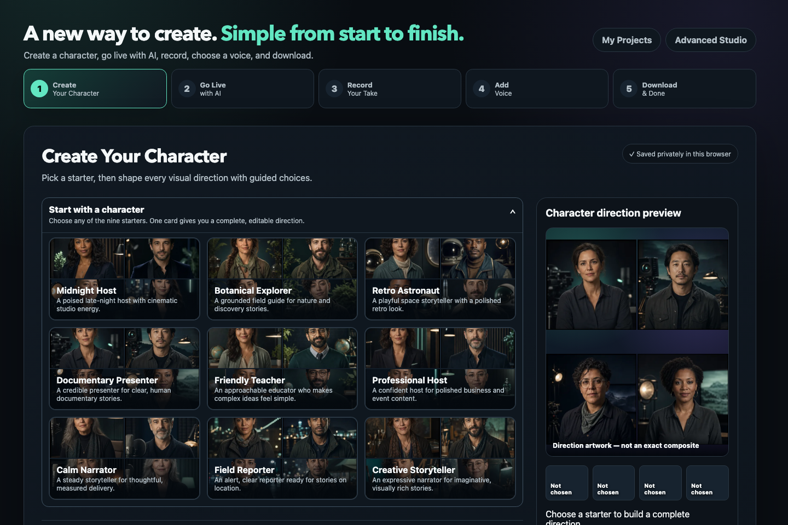

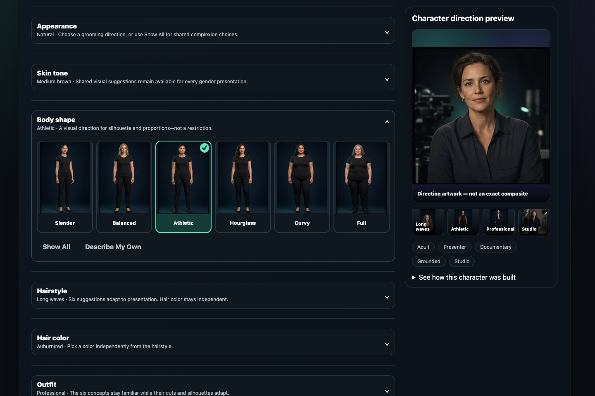

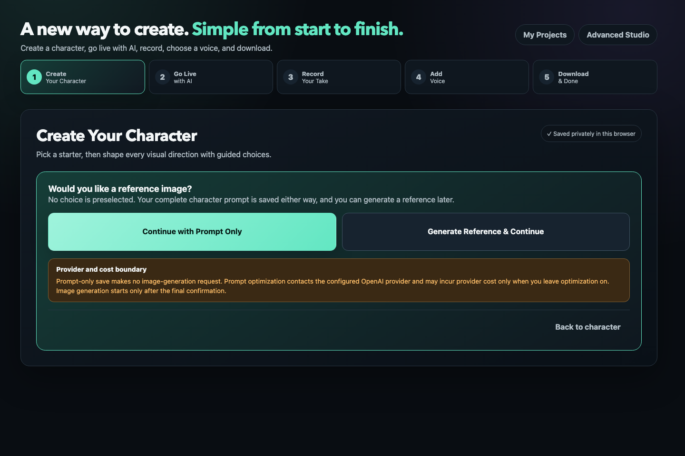

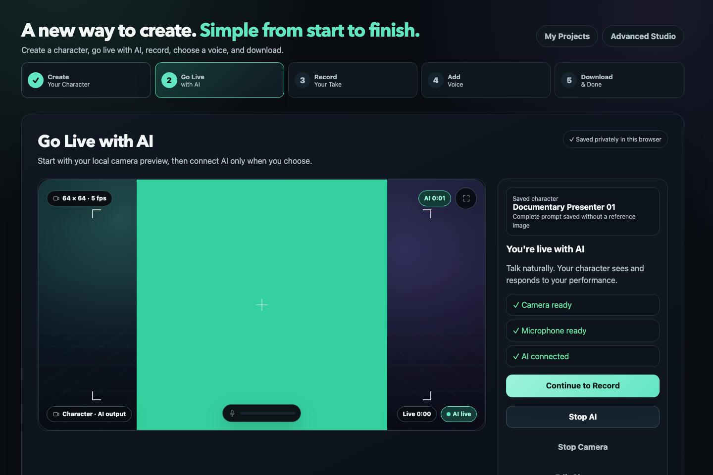

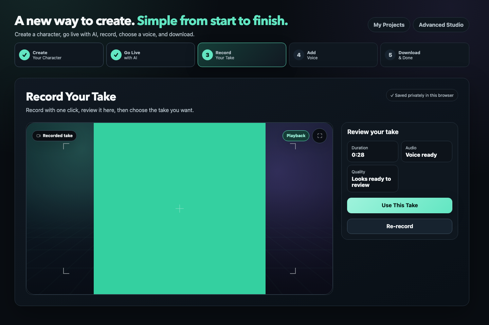

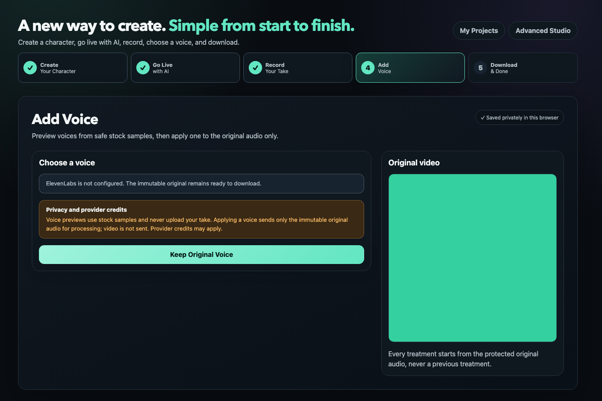

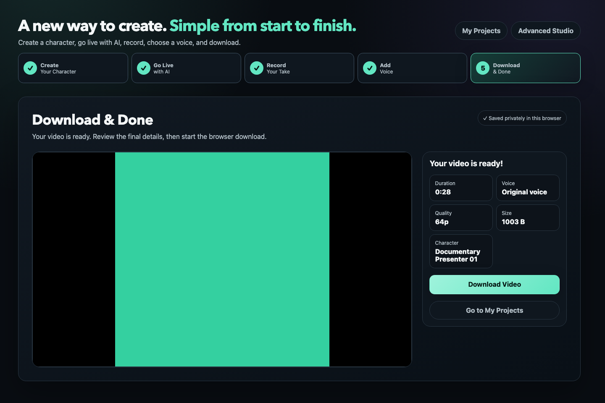

## Legacy baseline screenshots

The following images document the pre-redesign Workshop/Shelf/Studio workflow and are retained only for regression comparison. They are not the acceptance reference for the new five-stage Guided interface; the deterministic screenshot suite must replace them with current Guided captures.

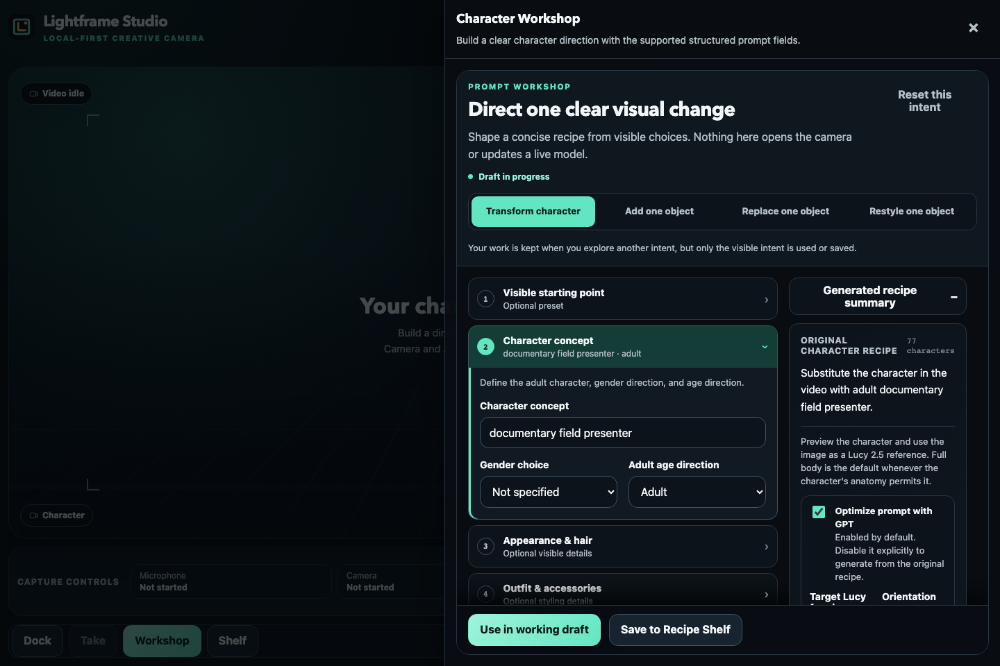

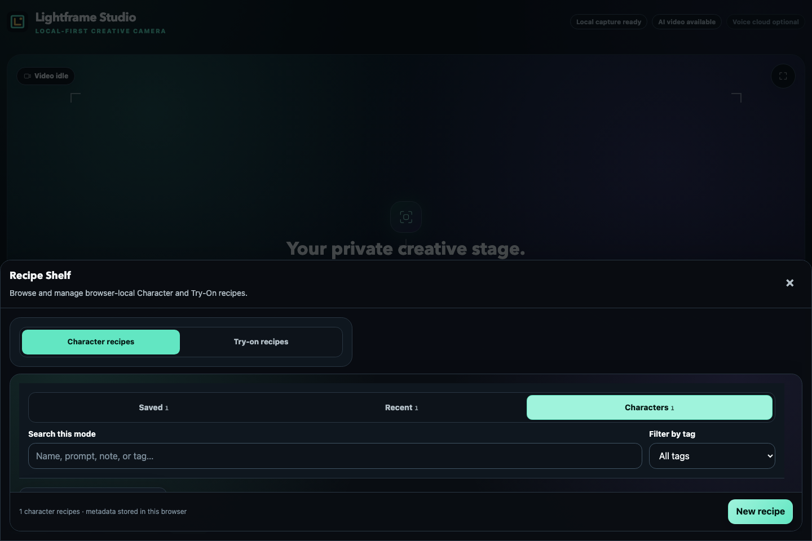

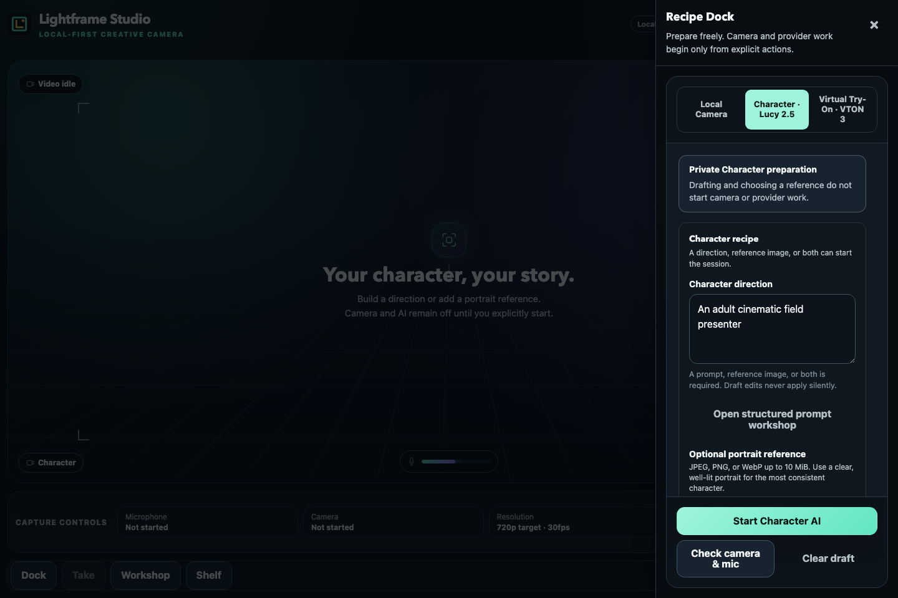

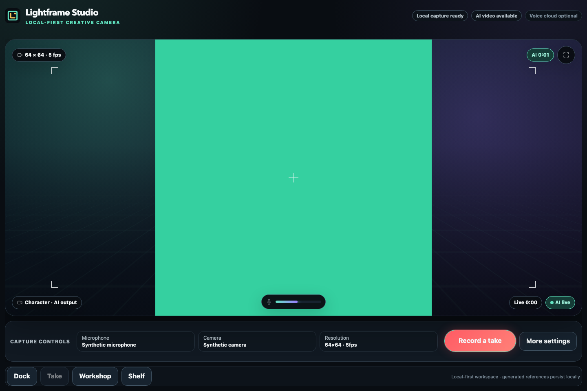

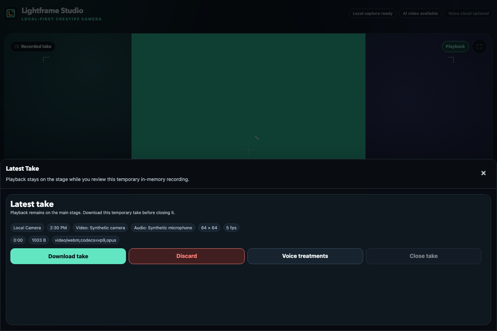

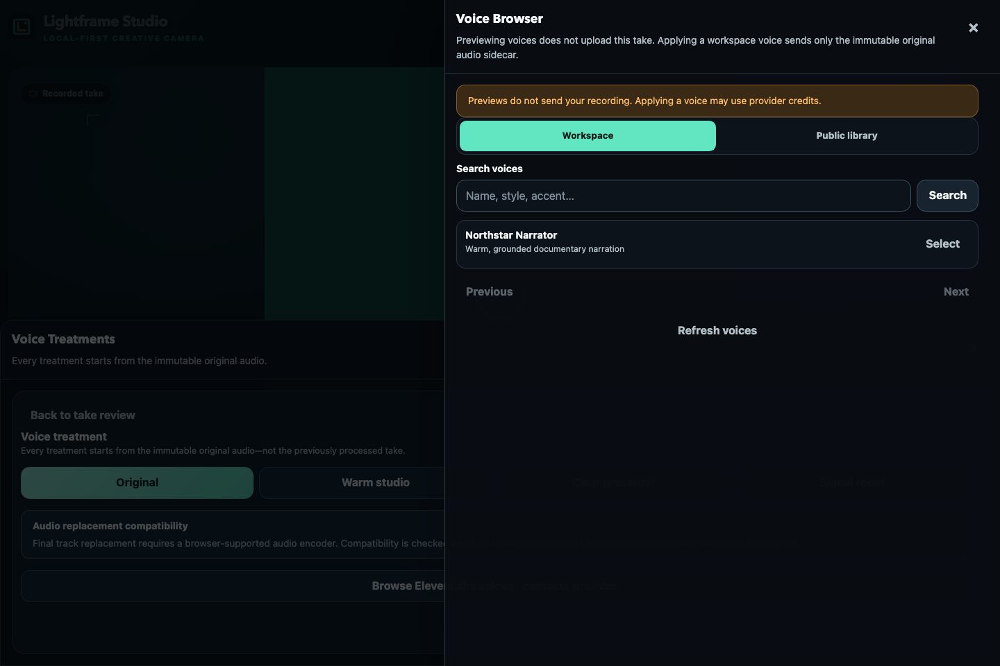
